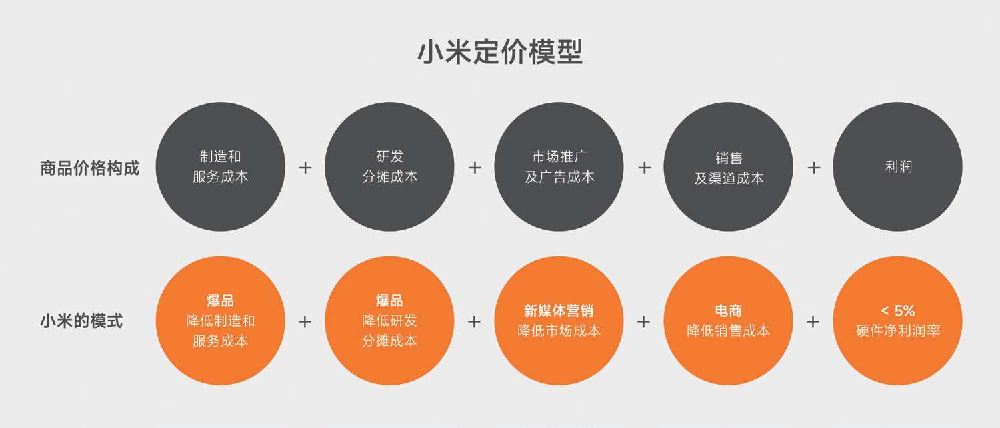

## 阅读目的

- 理解小米的商业模式
- 小米的成功做对了什么？

## 章节摘要

### 第一部分 小米的创业历程

#### 1. 奇迹时代

一个梦想：**_“想做一家伟大的公司，相对社会有贡献”_**

巨大的机会：智能手机

战略：铁人三项 **_硬件+软件+互联网_**

> 做全球最好的手机，只卖一半的价钱，让每个人都能买得起，这就是小米梦想的原点。

> 找有共同的愿景、有能力、有责任心的人，找不需要管理者盯着就能自驱动、自己干的人。因为做“铁人三项”这么复杂的模式，靠管理是管不出来的，只能靠巨大的能动性。同时，信任是极其强大的力量，我们愿意相信每一位同事，所以找人时一定要认真、谨慎。

第一把扳手：

从软件做起，从手机系统的最常用的几个功能开始

> 目标聚焦，进展就快

> 在创业最初期，短期内有太多的用户其实也没用，关键是要和你的核心用户一起把产品打磨好，做这件事一定要有耐心。

互联网开发模式：

**_用户参与感_**、

产品的不妥协，做**_爆品_**

**_成本定价_**，赚取合理的利润

超越用户预期**_口碑传播_**

#### 2. 低谷

当增长放缓时被高速增长遮盖的问题集中爆发

瓶颈：  
完全依赖电商，而电商只占市场份额的 20%，直到今天（2024）线上占比也仅有 35%  
交付、创新、质量的不足

迅速而深刻的反思、复盘、学习、迭代

#### 3. 重回增长

> **_优秀的公司赚取利润，伟大的公司赢得人心！_**

全球化

高端市场

“三大铁律”：技术为本、性价比为纲、做最酷的产品。

全场景智能

### 第二部分 小米的方法论

#### 1.互联网七字诀： **专注、极致、口碑、快。**

它的核心表达为“效率”​，体现为“信任”​。

**专注**

> 在任何时候，任何商业实体的资源都是有限的，将有限的资源投入足够聚焦的业务线中，才可能形成最大化的竞争力，拿出足够好的产品与服务。

> 边界在哪：清晰的使命、愿景

> 一家公司怎么可能没有边界？没有边界的组织必将走向盲目和混乱。

> 不要试图用一款产品解决太多问题，能最大化满足一项迫切需求，就是巨大的成功。

**极致**

> 极致不是自嗨和自我感动

**口碑**

> 良好的口碑从何而来？我的理解是，好产品不一定能带来口碑，便宜的产品不一定能带来口碑，又好又便宜的产品也不一定能带来口碑，**只有超过预期的产品才能带来口碑**。

**快**

> 不要用战术上的勤奋掩盖战略上的懒惰

> ​“战略积累快不得，战术演进慢不得”​，为了更底层的坚定原则和更长远的发展，有时候，有局部的、阶段性的慢，才有全局的快。

### 第三部分 小米方法论的实践

#### 1. 技术为本

#### 2. 和用户交朋友

参与感

> “和用户交朋友”其实就是互联网思维指导下的“群用路线”：一切为了群众，一切依靠群众，从群众中来，到群众中去

> 如果有一天你得知你的朋友用黄金价把稻草卖给了你，他是你的朋友吗？他绝对不是你的朋友。

> 感动人心，价格厚道

> “闭着眼睛买”​，信任才是唯一

#### 爆品模式

> “爆”是“品”的结果，**_爆品是打造出来的，不是营销出来的_**

> 性价比高的前提是高品质，没有技术的创新、设计的进步、体验的提升，就会陷入片面追求低价的低水平竞争，这是“制造业的低效内卷”​，会消耗大量的资源，导致制造业和消费者都无法获得更大的收益。

> 如果一个产品具有四个特征：单款、精品、海量、长周期，我们就可以说它是爆品。

#### 高效率模型

> 小米模式看起来复杂，但只要抓住一条主轴，就可以理解透彻。这条主轴就是效率。**效率是小米模式的基石**，也是理解小米模式的一把钥匙。小米模式的出发点，就是要提高效率。

> 采用性价比模型的公司少，不仅仅是意愿问题，更多的是能力问题，只有极少数优秀的公司能够驾驭它。

> **分摊成本是关键**

### 第四部分 小米方法论与产业生态

> 小米模式没有改变商业发展规律，而是抓住时机加速了这一进程，速度还非常惊人。

> 小米生态链1.0的主要任务是，验证小米方法论和小米模式的普适性，初步改变100个行业的面貌，寻找、扶持、成就一批志同道合的优秀创业者；小米生态链2.0的主要目标是，在小米生态链1.0的基础上，为合作创业团队提供更强健、全面、深入的能力支撑平台，推动小米“以人为中心、连接人与万物”的科技生态持续、健康、繁荣地发展，帮助相关行业进一步提升效率，提升整个行业的产品技术和体验水准。

#### 智能制造

通常对智能制造设备的认识，是它们能够大幅度提高生产效率，从而给企业带来更低的成本、更好的利润和更强的竞争优势，企业当然会趋之若鹜。换言之，中国制造向智能制造转型升级应该是水到渠成的事。但事实却相反，这些核心设备在制造业中的使用比率并不高。原因也不复杂，制造设备高昂的成本成了推广智能制造最大的制约因素。

智能化赋能传统制造业

优化机械臂生产线，自研控制算法极大降低成本

通用生产线，而非定制生产线，更加灵活调整产线

### 第五部分 小米方法论的演进思考

#### 警惕“规模不经济”陷阱

> 要支撑企业的高速发展，必然要获取更多的流量和用户。此时，企业稍不留神，就容易陷入“规模不经济”的陷阱：对流量的渴求压倒一切，导致忽略了真实的用户增长，规模越大，效率反而越低，最终也就无法为用户提供真正有价值的产品和服务。

**_关注用户，而不是流量；追求闭环，而不是扩张_**

#### 无可回避的生死之战

为什么小米非要做高端？

> 消费电子行业过去的实践证明，尽管高端市场本身的容量相对市场大盘而言不算大，但高端成功会为整个品牌提供极强的虹吸效应，会极其显著地吸引其他品牌用户的换机需求。换言之，当下的安卓手机市场，谁在6000元以上的区间形成了显著优势，谁就有机会在总体份额上快速形成巨大的整体优势。如果没有高端的优势，再大的中端和入门级市场份额也迟早会丢失。

## 总结

**理解小米的商业模式**

极致的效率，爆品策略来实现紧贴成本的定价方式。

极致的性价比和产品力来打造用户口碑，用以支撑“闭眼买”的信任，形成用户自发推荐给身边的朋友传播效果，进一步助力爆品策略

和用户做朋友，构建参与感，让用户参与到产品的研发，给予用户极大的参与感

员工在企业使命愿景的感召和直接的用户的反馈中，感受自身价值，自发驱动向更好的产品和服务努力

**小米的成功做对了什么？**

群众路线

极致的的效率

极快的战略反应

深刻洞察的战略
