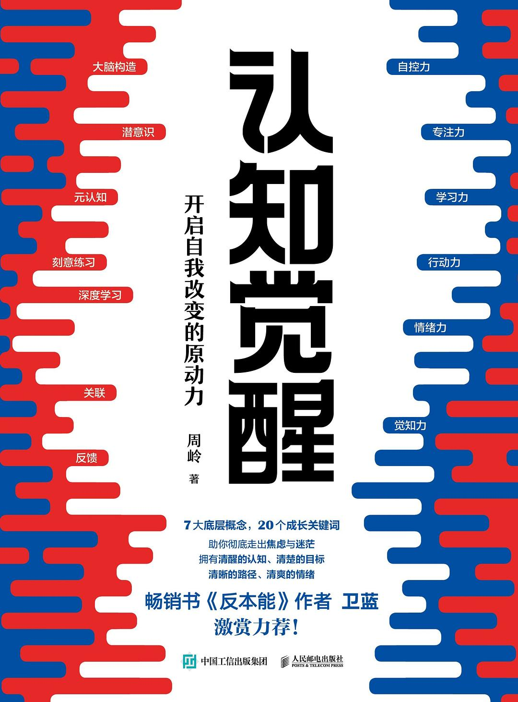
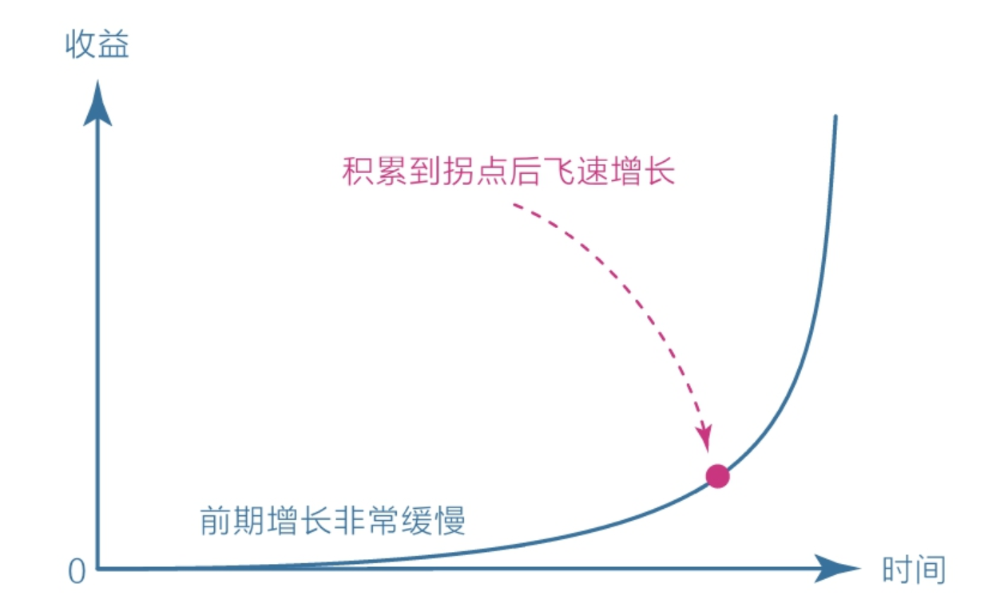
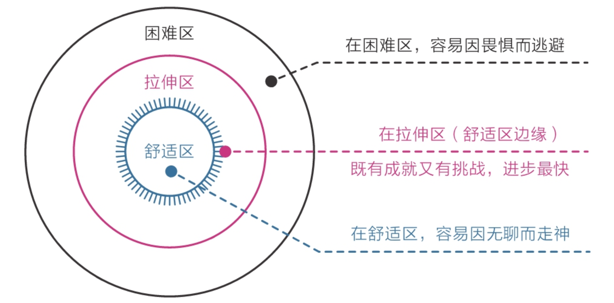
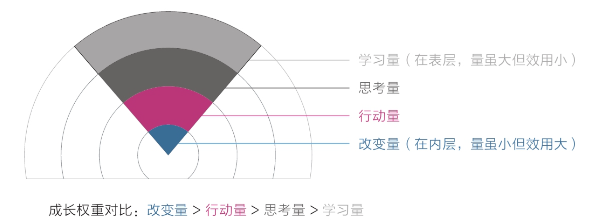
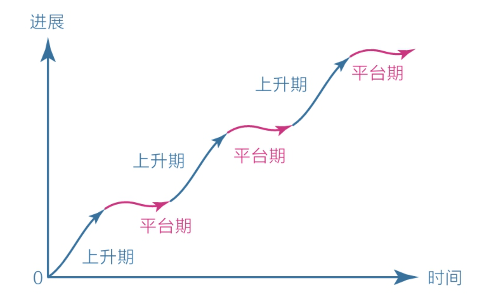
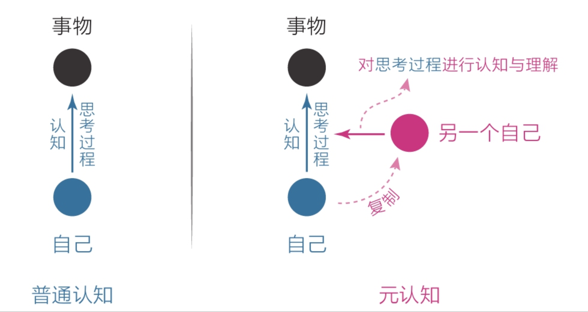
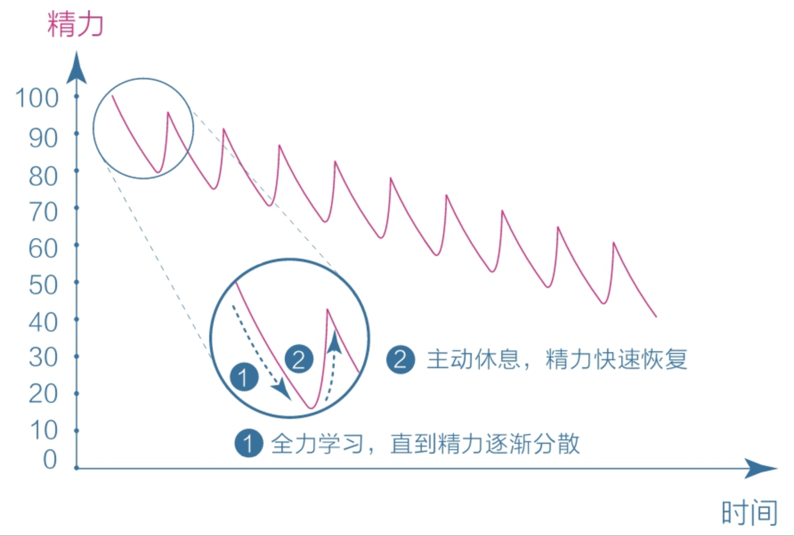
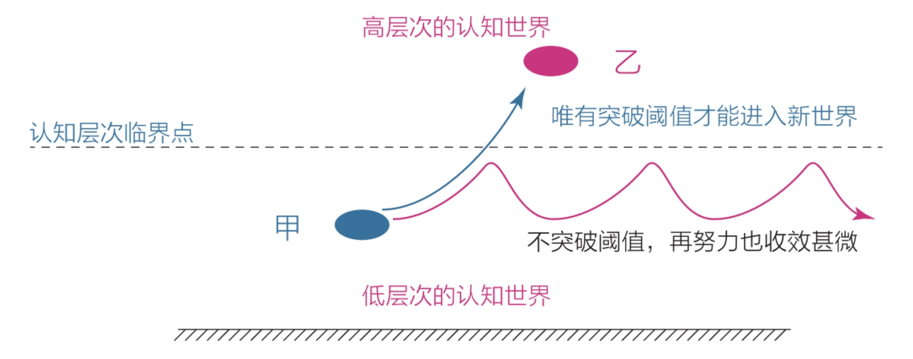
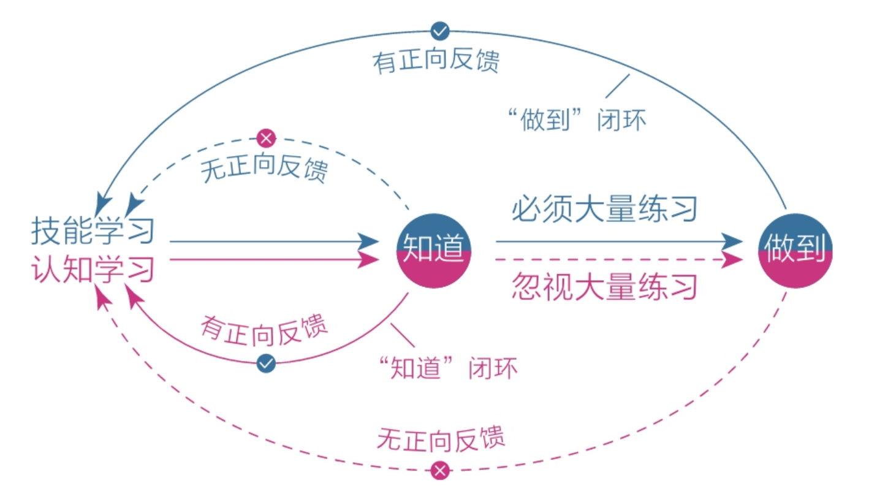

## 核心观点

- 认知影响选择选择改变命运
- 认知可以通过训练提升

## 关键问题

**如何改变自身提升认知？**

拆分为两部分进行分析：

第一部分是认识人类的客观条件，第二部分是从主观能动性出发讨论如何改变

第一部分讨论大脑的思考结构、潜意识、元认知

第二部分讨论专注力训练、高效学习、拆解行动力、情绪力、方法分享

## 章节摘要及思考

### 第一章 大脑

#### 第一节 大脑的结构

**观点：**

将人脑简单的划分为了三个层面力量由强到弱（按照在生物进化中出现的顺序）分别是，本能脑 > 情绪脑 > 理智脑，高级程度相反

本能脑主管本能，情绪脑主管情绪，理智脑主管认知。

**思考：**

主要是讲了大脑的结构及运行机制，人类本身对大脑的认识并不全面作者也不是脑科学相关方面的专家，参考性不大

类似的观点《思考快与慢》也有提及

我认为更多的是要锻炼自己的思考习惯，思考和其它活动并无显著区别，依然遵循孰能生巧的定律

当我们经常思考习惯思考以后，也会形成大脑的“肌肉记忆”或者说“思考回路”从而降低后续再次遇到同类问题时的思考成本

#### 第二节 焦虑

**观点：**

作者认为人类的安全感来自独特的优势（能力、财富、权利、影响力）

将焦虑根据来源划分了几个类型：

- 完成焦虑
  - 日程安排太满，每件事情都卡在 deadline 前。
  - 想做的事情太多，时间不够分配。每日例行事务太多，可支配时间少。被突发事件打乱节奏。
- 定位焦虑
  - 看的目标太远，与自己所处阶段不匹配。
- 选择焦虑
  - 面对多个选项时，不知道什么是重要的。
- 环境焦虑
  - 受外部环境影响大，归因多从外部找。
- 难度焦虑
  - 面对需要长期耐心投入的任务，定力不足。

焦虑的根源：

急于求成，想做的事太多，又想立即看到效果。  
欲望与能力不匹配，想要的太多，能力又太少。

**思考：**

我认为独特的优势更多支撑起的是自信，安全感主要是来自于确定性

关于焦虑来源，可以进一步简化为两类：

一类是由于没有掌握正确的方法，如：

将事情按照重要和紧急程度进行分类  
对不重要也不紧急的事情尽可能不做  
不重要但紧急的事情交给他人去做  
重要但不紧急的事情（通常是产生长期价值的投入）坚持去做  
重要且紧急的事情优先去做

一类是对自身的认识不清晰产生，如：

目标不清晰导致的选择焦虑

#### 第三节 耐心

**观点：**

要想有所成就，必须保持耐心，延迟满足。  
缺乏耐心是人类的天性，要克服天性训练耐心。  
通过认知规律来增强耐心：

1. 复利曲线

前期增长缓慢，但在拐点后会飞速增长

2. 舒适区边缘

始终保持在舒适区边缘活动，既可以保证一定的挑战也不会打击信心

3. 成长权重

学习一定要经过思考和实践的沉淀才能有效的内化  
如果不重视内层的改变量，表层投入再多的学习量也会事倍功半

4. 平台期

处于平台期时，可能付出大量的努力也毫无进步，甚至可能会退步  
这是正常规律，要注意调节情绪，不被平台期打击积极性

最佳策略：通过建立正反馈机制，让情绪脑和本能脑从解决困难中获得乐趣并上瘾

**思考：**

认知规律也是在消除未知，当我们能够认识到成长过程中会面对的困难时，就可以提前做好预期管理，从而减少焦虑

尽可能的降低自己维持耐心时的意志力损耗，一是通过认知规律管理预期，二是通过刻意练习养成习惯，三是改善环境削减环境中的干扰

### 第二章 潜意识

#### 第一节 模糊

**观点：**

模糊是人生困扰之源，学习的目的是消除模糊

人们总是习惯在模糊区域打转，在舒适区兜圈，重复做已经掌握的事情，对真正的困难视而不见，这背后是受潜意识的支配，因为基因认为这样做耗能更低

受苦比解决问题来的容易，承受不幸比享受幸福来的简单。因为解决问题需要动脑，而受苦只需要陷在那里不动。

事情一旦变模糊，边界就会无限扩大，原本并不困难的小事也会在模糊的潜意识里变得难以解决。

恐惧就是一个欺软怕硬的货色，你躲避它，它就张牙舞爪，你正视它，它就原形毕露。

行动力不足的真正原因是选择模糊

在诸多可能性中建立一条单行通道，让自己始终处于“没得选”的状态。

**思考：**

我的观点是：

受苦的人并不一定是不想解决问题，而是面对了太多的不确定性，缺少对问题的认识，缺少对改变难度的认识，进而导致的主观能动性不足陷入恶性循环

想要打破循环也很简单，无条件的采取行动获取最直接的反馈，进而调整自己的认知和下一步行动，经过一轮正反馈冷启动后改变的阻力就会减弱许多

#### 第二节 感性

**观点：**

一个人过了40岁就应该为自己的面孔负责

潜意识的反应速度是极快的，而理性思考处理信息的速度极慢，这导致了“认知错位”，要善用潜意识，如：

一旦看到有启发的内容，就触发熔断，立即停止读书，然后围绕这个触发点进行思考对自己提问：

- 为什么这个内容会让我有启发？
- 这个启发点可以应用到哪三个场景？
- 有没有其他类似的知识？

先用感性的能力帮自己选择，再用理性的能力帮自己思考

“凭感觉”可以帮我们感知真正适合自己并需要的东西，让自己处于学习的“拉伸区”

目标是我们存放热情和精力的地方

捕捉感性的方法：

- "最"字法，最触动自己的点
- “总”字法，总是不自觉跳出的念头
- 无意识的第一反应，需要刻意练习对第一反应的觉察
- 梦境，（有点玄学）
- 身体，生理和心理的不适是身体对环境的最直接反应
- 直觉，直觉是潜意识对感性的一种反馈

**思考：**

人对自己认知到的任何事情负责，认知和年龄就像职级和年龄一样存在一定的匹配关系

### 第三章 元认知

元认知是对自身思考过程的思考

**观点：**

元认知让我们站在更高的视角审视自己的行为，不至于迷失在生活的细节中，未来视角指导当下行动

通过冥想训练元认知

元认知需要不断的刻意练习

成长就是逐步掌握自我控制权的过程

元认知能力强的一个突出表现是：对模糊零容忍

**思考：**

元认知的训练可以通过和 AI 对话来进行，也可以看 AI 的深度思考过程来反思自己的思考过程  
与 AI 对话的过程也可以是修炼元认知的过程

关于“对模糊零容忍”，我的理解是：  
当我们在做一些创造性的工作时很难做到事无巨细的清晰，甚至连阶段目标的清晰都难以保证  
但是换一个角度，知道自己对什么的认识不够清晰，也是一种清晰  
当我们有了一定方案/框架后还是要通过实践来进行验证，但是我们也要做好风险的对冲，控制获得认知的成本，不断消除模糊

### 第四章 专注力

“得道前，砍柴时惦记着挑水，挑水时惦记着做饭；得道后，砍柴即砍柴，担水即担水，做饭即做饭”

专注力就是行动和思维的匹配度

要让思维使用专注在行动上，否则就会产生一些不必要的焦虑

人会因为信息过载和欲望过到感到焦虑和痛苦

获取专注的方法：

1. 明确目标
2. 刻意练习
3. 获得有效反馈
4. 始终在拉伸区练习

### 第五章 学习力：学习不是一味的地努力

始终维持在拉伸区学习

“会做但特别容易错，或者不会做但稍微努力就能懂”

距离太远的事情我们通常都无法把握，无论它们是令人痛苦还是令人享受

做选择是一个极为耗能的事情，如果没有与之匹配的清醒和定力，很容易会被天性支配，去选择消遣和娱乐。  
在有约束的环境下，我们反而效率更高生活更充实

理想的状态是持续获取与自己当前能力相匹配的财富或自由。

费曼学习法，深度的学习，实践最重要

深度之下的广度才是有效的，浅学习和深度学习并不冲突

知识的获取不在于多少，而在是否与自己有关联，以及这种关联有多充分

建立个人的知识体系，只有知识能够帮你做决策的时候，它才是你的知识

> **思考：**
>
> 与自己已有知识框架的关联度，也可以表达为接受能力，只有懂得每个名词背后具体的潜在信息，才能更好的接受新知识

个人成长的目的是判断和选择

我们要抓住能够触动我们的点，那才是我们的拉伸区，他人的知识再有道理也距离我们的需求太远。

复盘每日触动自己的点

当时很受触动，但需要用的时候完全想不起来的知识，就是“伪触动”​。说明它们离我们的真实需求很远，所以放弃也罢。

学习不是为了知道，而是为了发生真实改变

#### 关于打卡

打卡不代表任务完成

一件事若迟迟没有完成，心里就总是记挂，期盼着早点结束；此事一旦完成，做这件事的动机就会立即趋向于零。

打卡心态的特性：学不到，假装一下；学到了，立即停止

用记录代替打卡

设置下限，不设上限

#### 反馈

无反馈不学习

痛苦也是一种反馈

所有的痛苦都是我们成长的提示，无论身体不适、情绪低落还是学业落后、事业受挫，痛苦说明有问题出现。

#### 休息

主动休息，将精力维持在高效范围

极度专注 + 主动休息，如此反复

番茄时钟法

### 第六章 行动力

增强回路，最初的选择会影响行为自动增强的方向。  
早上起来第一件事是看手机信息，注意力很容易会被有趣好玩的信息吸引，之后每次点击都会产生更强的点击欲望，回路不断增强

在初始阶段，强迫自己先做重要的事情，一旦进入正向的增强回路，便能拥有强大的行动力——这正是增强自制力、提升行动力的秘密。

行动力只有在清晰力的支撑下才能得到重构，把目标细化、具体化

把目标写下来，会让脑子变得更清晰，人与人之间的差距可能就体现在这一点点的差距上

规划的目的是为了让自己心中有数，而不是严格地按计划执行

想先看到结果再行动的人往往无法看到结果。

只要道理正确，就别在乎太多，带着不计得失的心态向前走，你会发现目标越来越清晰

当我们绞尽脑汁都想不清楚时，就先依据前人的假设行动起来

思考很重要，但是光想不做，贻害无穷

因为付出的努力必须达到某种程度才能影响一个体系，而努力程度低于这个阈值时，行动就会收效甚微。

有理有据的假设是进步的开始，有理有据的假设可以确保方向的正确，方向正确后可以通过实践来不断矫正目标

知行合一，知道没做等于不知道

认知学习时，知道就会产的正反馈，而这会导致误以为自己完成了对认知的掌握，进而导致实践的缺失

把认知当做技能，知道或想通一个道理时，不要高兴得太早，想想后面还要做大量的练习，这样就不浮躁了。

认知也需要刻意练习

懂百点不如改变一点

### 第七章 情绪力

贫困造成的（耐心、长远规划、行动力、注意力等）稀缺俘获了人们的注意力，进而降低了人们的心智带宽

只要我们的注意力被某一巨大的事物吸引，我们就有可能进入稀缺状态

急于求成，焦虑从生

当一个人同时面临很多任务的时候，他的心智带宽就会降低，反而没有了行动力和自控力。

行动力和脑中想法的数量成反比

总有一个更好的视角

运动有助于提升体内的多巴胺水平，多巴胺对于创意和多角度思考都很重要

### 第八章 早冥读写跑，人生五件套—成本最低的成长之道

#### 关于早起

要提前想好早起要做的具体事项，如：学习哪些内容，跑步多少分钟。只有目标清晰起床才不会犹豫

明确哪些情况可以不早起

#### 关于读书

真正读好一本书，往往需要花费数倍于阅读的时间去思考和实践，并输出自己的东西—可能是一篇文章，也可能是养成一个习惯—这个过程比阅读本身要费力得多。

#### 写作：费曼学习法

用自己的语言概括阅读过程中获得的观点和思考，并形成输出

#### 运动

运动可以激活人体细胞，刺激神经元生长

运动后的 1~2 小时进行高强度、高难度的复杂脑力活动，有助于神经元生长

