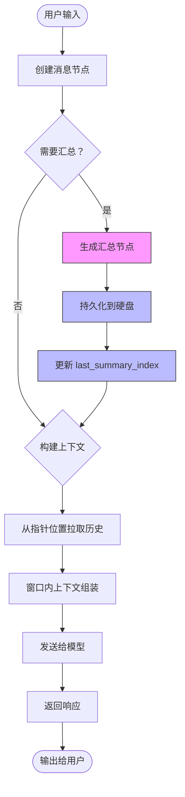
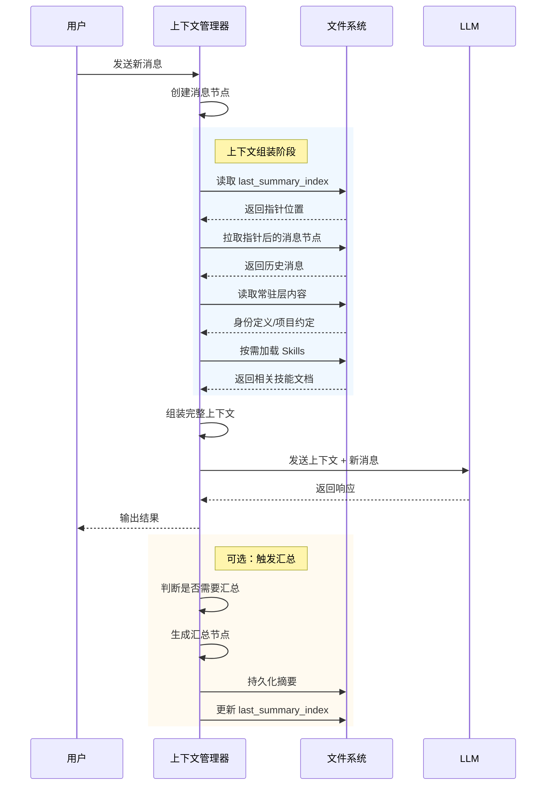
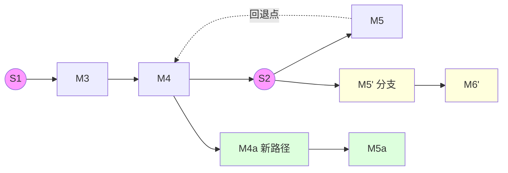

## 上下文工程

### 上下文分层

上下文分层的第一目标是提升**信息密度**，其次才是解决上下文窗口有限的问题

临时性的信息和长期性信息混在一起会使得模型看到的内容过多，导致模型无法聚焦在重要的信息上

上下文分为五层：

常驻层：身份定义、项目约定、安全围栏，每次会话都必须遵守的内容，

按需加载层：skills、领域知识、使用说明等，需要时才加载的内容

运行时注入层：时间、通道 id、用户偏好等信息，按需注入

记忆层：MEMORY.md 跨会话累计的知识，需要时读取

永不进入层：Hooks 逻辑，明确的规则，不应该进入模型上下文，通过工具来约束

### 对话流工程

对话流工程的核心目标是**在有限的上下文窗口内，实现对话状态的可持续追踪和历史信息的按需访问**。通过节点化的消息管理和分层汇总机制，让长程对话也能保持上下文的一致性。

#### 核心概念

**1. 消息节点（Message Node）**

对话中的每条消息都是一个独立的节点，包含：
- 消息内容（用户输入或模型输出）
- 时间戳和序列号
- 与前序节点的连接关系
- 节点类型标记（普通消息/汇总节点/分支节点）

**2. 汇总节点（Summary Node）**

汇总节点是对话流中的关键锚点，承担三个职责：
- **状态压缩**：将之前的对话内容提炼为关键信息
- **持久化存储**：将摘要写入硬盘（如 MEMORY.md），跨会话保留
- **指针标记**：通过 `last_summary_index` 记录最后处理位置

**3. 上下文窗口管理**

```
┌─────────────────────────────────────────────────────────────┐
│                    完整对话历史 (硬盘)                        │
│  ┌─────┐ ┌─────┐ ┌─────┐ ┌─────┐ ┌─────┐ ┌─────┐ ┌─────┐   │
│  │ M1  │─│ M2  │─│ S1  │─│ M3  │─│ M4  │─│ S2  │─│ M5  │   │
│  └─────┘ └─────┘ └─────┘ └─────┘ └─────┘ └─────┘ └─────┘   │
│                              ↑                       ↑       │
│                              last_summary_index     当前     │
└─────────────────────────────────────────────────────────────┘
                            ↓
┌─────────────────────────────────────────────────────────────┐
│              活动上下文窗口 (内存/Token)                      │
│  ┌─────┐ ┌─────┐ ┌─────┐                                     │
│  │ S2  │─│ M5  │─│ ... │                                     │
│  └─────┘ └─────┘ └─────┘                                     │
│    ↑       ↑                                                   │
│  锚点    最新                                                  │
└─────────────────────────────────────────────────────────────┘
```

#### 对话流程



#### 上下文加载策略

对话流的上下文采用**分层加载**策略，不同层次的信息在不同时机进入上下文：



#### 回退与分支机制

对话流支持**回退到任意历史节点**并开启新的分支：



#### 实现要点

1. **指针管理**：`last_summary_index` 必须原子更新，避免指针与摘要内容不一致
2. **节点 ID 生成**：使用时间戳 + 哈希确保唯一性，支持快速定位
3. **软连接实现**：通过引用节点 ID 而非复制内容来保持上下文精简
4. **汇总触发条件**：可基于 token 数、消息数量、时间间隔等维度决策
