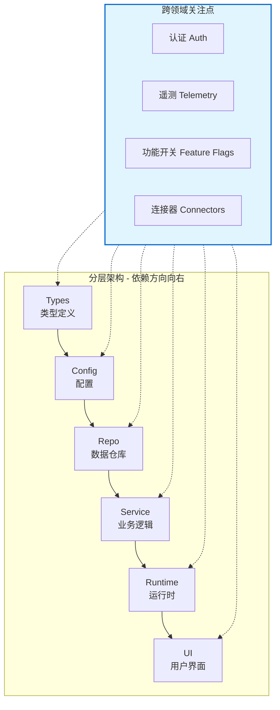

# Harness Engineering - 在 Agent 优先时代利用 Codex

> OpenAI 团队进行了一项大胆实验：**5 个月内构建一个产品，0 行人工编写的代码**。所有代码（应用逻辑、测试、CI 配置、文档、工具链）全部由 Codex 生成。

## 📊 关键数据

| 指标 | 数值 |
|------|------|
| 团队规模 | 3 人 → 7 人 |
| 代码量 | 约 100 万行 |
| PR 数量 | 1500 个 |
| 吞吐量 | 3.5 PR/工程师/天 |
| 效率提升 | 约 10 倍 |

---

## 🎯 核心哲学

**人类不再写代码，而是设计环境、指定意图、构建反馈循环。**

主要工作是让 Agent 能够高效完成有用的工作。

---

## 🔧 六大有效措施

### 1️⃣ 知识管理策略

**问题**：最初尝试"一本大 AGENTS.md"失败
- 上下文是稀缺资源，大文件挤占任务空间
- 太多指导等于没有指导
- 文件迅速过时，变成"规则墓地"
- 难以机械验证

**解决方案**：

```
AGENTS.md（~100 行）→ 仅作为目录/地图
    ↓ 指向
docs/ 目录 → 结构化知识库（系统记录）
```

**具体做法**：
- **设计文档**：catalog + index，包含验证状态和核心原则
- **架构文档**：顶层领域映射和包层级关系
- **质量文档**：给每个产品域和架构层打分，跟踪差距
- **执行计划**：轻量计划用于小改动，复杂工作用带进度日志的执行计划
- **文档园艺 Agent**：定期扫描过期文档，自动开 PR 修复

---

### 2️⃣ 架构约束设计

**分层模型**（每个业务域固定）：



**执行机制**：
- 自定义 Linter（Codex 生成）强制执行依赖方向
- 结构测试验证边界
- Linter 错误消息包含**修复指令**，直接注入 Agent 上下文

**品味不变量**（Taste Invariants）：
- 结构化日志
- Schema 和类型命名规范
- 文件大小限制
- 平台特定可靠性要求

**技术选型原则**：
- 优先选择"无聊"的技术（API 稳定、可组合、训练数据丰富）
- 有时让 Agent 重新实现子集比绕开不透明库更便宜

---

### 3️⃣ 让上下文对 Agent 可读

**核心洞察**：Agent 无法访问的上下文 = 不存在

**具体做法**：
- **Slack 讨论** → 必须转化为仓库内的版本文档
- **应用 UI** → 接入 Chrome DevTools Protocol，Agent 可直接操作 DOM、截图、导航
- **日志/指标** → 本地可观测性栈，每个 git worktree 独立实例
  - Agent 可用 LogQL 查日志、PromQL 查指标
  - 提示词示例："确保服务启动&lt;800ms"、"关键用户旅程 span 不超过 2 秒"
- **可启动应用**：每个 git worktree 可独立启动，Agent 每改动可独立验证

---

### 4️⃣ 工作流程变革

**人类-AI 协作模式**：

```
人类描述任务 → Agent 执行 → Agent 开 PR
    ↓
Agent 自审（本地 + 云端）→ 响应反馈 → 迭代
    ↓
人类可选审查 → Agent 可自合并
```

**关键转变**：
- **审查**：从人工审查 → Agent 对 Agent 审查
- **QA 瓶颈**：通过让 Agent 直接访问 UI、日志、指标来突破
- **长时任务**：单个 Codex 运行可连续工作 6+ 小时（人类睡觉时）

**合并策略**：
- 最小化合并阻塞门
- PR 短生命周期
- Test Flake 用重试而非无限阻塞
- "等待很贵，修正便宜"

---

### 5️⃣ 技术债务管理

**问题**：Codex 会复制仓库中已有的模式（包括次优模式）→ 随时间漂移

**初期方案**（失败）：
- 每周五花 20% 时间人工清理"AI 垃圾"
- 不可持续

**最终方案**（垃圾回收机制）：
- **黄金原则**（Golden Principles）编码进仓库：
  1. 优先共享工具包，避免手写助手（集中不变量）
  2. 不"YOLO 式"探测数据 → 用边界验证或类型化 SDK
- **定期后台任务**：Codex 扫描偏差 → 更新质量评分 → 开针对性重构 PR
- **审查成本**：大部分 PR 可在 1 分钟内审查并自动合并

**理念**：
> "技术债务像高利贷：持续小额偿还远好于复利累积后痛苦 bursts"

---

### 6️⃣ Agent 自主能力演进

**成熟 Agent 可端到端完成**：
1. 验证代码库当前状态
2. 复现报告的 Bug
3. **录制失败演示视频**
4. 实现修复
5. 驱动应用验证修复
6. **录制解决演示视频**
7. 开 PR
8. 响应 Agent 和人类反馈
9. 检测并修复构建失败
10. 仅在需要判断时升级给人类
11. 合并变更

---

## 🎓 核心教训对比

| 传统工程规范 | Agent 优先时代的调整 |
|------------|-------------------|
| 严格合并门 | 最小阻塞，快速迭代 |
| 人工代码审查 | Agent 自审为主 |
| 测试 Flake 零容忍 | 重试优先于阻塞 |
| 人工清理技术债 | 自动化垃圾回收 |
| 知识在人脑/文档 | 知识仓库化、可机械验证 |

---

## 💡 最终洞察

> "构建软件仍然需要纪律，但纪律更多体现在**脚手架、工具、抽象和反馈循环**而非代码本身。"

人类最稀缺资源是**时间和注意力**，应投入到设计让 Agent 高效工作的环境中，而非直接写代码。

---

## 📚 参考资料

- [OpenAI 原文：Harness engineering: leveraging Codex in an agent-first world](https://openai.com/index/harness-engineering/)
- [Architecture Documentation Best Practices](https://matklad.github.io/2021/02/06/ARCHITECTURE.md.html)
- [Codex Execution Plans](https://cookbook.openai.com/articles/codex_exec_plans)
- [Parse, Don't Validate](https://lexi-lambda.github.io/blog/2019/11/05/parse-don-t-validate/)
- [AI Is Forcing Us To Write Good Code](https://bits.logic.inc/p/ai-is-forcing-us-to-write-good-code)
