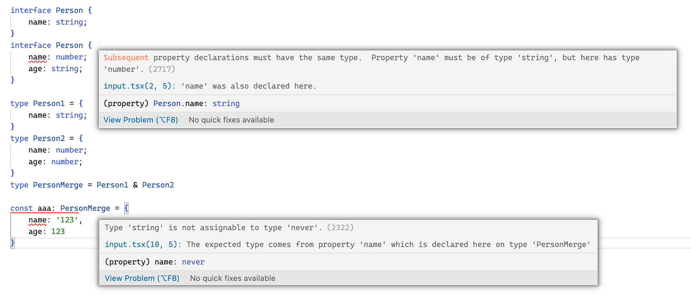

最近使用 ts 时大部分精力都放在了怎么写完整的类型上，反而基础知识框架有些遗忘现象，导致项目搭建时遇到了一些问题，写这篇文章来重新梳理下我的 typescript 知识框架，也是通过实践来巩固理论知识。

## 知识结构

### 基础（The Basics）

#### 静态类型检查

```ts
const message = 'hello!';

message();
// Error: 'message' is not a function
```

#### 非异常故障

```ts
const user = {
  name: 'Daniel',
  age: 26,
};

user.location;
// Error: Property 'location' does not exist on type '{ name: string; age: number; }'
```

不做重点展开，详见[文档](https://www.typescriptlang.org/docs/handbook/2/basic-types.html)

...

#### Downleveling 降级

typescript 会将高版本的代码降级为低版本的代码，比如 es6 降级为 es5。

### 基础类型

#### 原始类型（primitives）：`stirng`, `number`, `boolean`

`String`, `Number`, `Boolean` 也是合法的语法，但是引用了一些很少出现在代码中的特殊内置类型。始终使用 `string`,`number`,`boolean` 就可以。

以 `String` 和 `string` 为例：

`string` 是原始类型，而 `String` 是非原始类型装箱对象

```ts
const Str: String = '';

const newStr: string = Str;
// Type 'String' is not assignable to type 'string'.
// 'string' is a primitive, but 'String' is a wrapper object. Prefer using 'string' when possible.(2322)

/* WRONG */
function reverse(str: String): String;

/* OK */
function reverse(s: string): string;
```

#### 类型别名和接口（type and interface）

从一个例子开始：

```ts
function greet(person: { name: string; age: number }) {
  return 'Hello ' + person.name;
}
```

这个函数中的参数 `person` 的类型是一个匿名类型，我们可以使用 `type` 或者 `interface` 给这个类型起一个名字

```ts
type Person = { name: string; age: number };
// or
interface Person {
  name: string;
  age: number;
}

function greet(person: Person) {
  return 'Hello ' + person.name;
}
```

`type` 和 `interface` 有很多相似之处，但是也有一些不同：

- `type` 可以是任何类型的别名，而 `interface` 只能命名对象类型

```ts
type Point = { x: number; y: number };
type ID = string | number;
type Name = string;
type Greet = (name: string) => string;
```

- `interface` 可以扩展，而 `type` 不行

```ts
interface Person {
  name: string;
}
interface Person {
  age: number;
}
```

```ts
type Person = {
  name: string;
};
type Person = {
  age: number;
};
// Duplicate identifier 'Person'.(2300)
```

- `interface` 合并时会创建一个扁平的 `object` 类型来检测属性冲突，而 `type` 只会进行简单的递归合并，往往会产生 `never` 类型
  

- 对于编译器来说，[使用带有扩展的接口通常比带有交集的类型别名具有更高的性能](https://github.com/microsoft/TypeScript/wiki/Performance#preferring-interfaces-over-intersections)

- `interface` 始终以原始形式出现在错误信息中（以名字的形式使用时），在 4.2 版本之前 `type` 可能会出现在错误消息中，有时也会以等效的匿名类型替换

综上，大部分情况下使用 `interface` 即可直到需要使用 `type` 的特性时再使用 `type`

此外 typescript 只关心类型结构，不关心名称。

#### strictNullChecks 严格空检查

开启后访问可能为空的的属性时会报错，有利于减少运行时错误

typescript 在某些情况下，当确定访问属性不为空时可以使用 `!` 断言

### 类型缩小（Narrowing）

typescript 的类型分析叠加在 javascript 的运行时控制流结构之上，可以通过控制流语句来缩小类型范围。

#### `typeof` 类型守卫

常见的类型守卫有 `typeof`, `instanceof`, `in`, `==`, `===`, '&&', '||', '?:' 等

大部分情况下 `typeof` 都可以按照正常的预期的来缩小类型范围

但是，需要注意的是在 javascript 中有一个历史遗留的问题 `typeof null === 'object'`，好在 typescript 也对这种情况进行了兼容依然可以正确的识别出可能为 `null` 的情况

```ts
function printAll(strs: string[] | null) {
  if (typeof strs === 'object') {
    for (const s of strs) {
      // Error: strs is possibly 'null'.
      console.log(s);
    }
  } else if (typeof strs === 'string') {
    console.log(strs);
  } else {
    const _: never = strs; // 只有 never 类型可以赋值给 never 类型
  }
}
```

#### 类型谓词 （predicates）

类型守卫可以完成大部分的类型缩小，但是有时候我们需要更直接的控制类型的缩小，这时候就需要使用类型谓词

```ts
function isFish(pet: Fish | Brid): pet is Fish {
  return (pet as Fish).swim !== undefined;
}

const pet = getSmallPet();
if (isFish(pet)) {
  pet.swim();
} else {
  pet.fly();
}
```

`this` 类型守卫

当类的方法返回 `this` 类型时，所有继承该类的子类的实例方法都会返回 `this`，而接受 `this` 类型只能接受他所指向的类的实例，而不能接受其他类的实例包括父类

```ts
class Box {
  content: string = '';
  sameAs(other: this) {
    return other.content === this.content;
  }
}

class DerivedBox extends Box {
  otherContent: string = '?';
}

const base = new Box();
const derived = new DerivedBox();
derived.sameAs(base);
// Argument of type 'Box' is not assignable to parameter of type 'DerivedBox'.
// Property 'otherContent' is missing in type 'Box' but required in type 'DerivedBox'.
```

同样 `this` 作为方法中隐含的参数也可以用作类型谓词

```ts
class FileSystemObject {
  isFile(): this is FileRep {
    return this instanceof FileRep;
  }
  isDirectory(): this is Directory {
    return this instanceof Directory;
  }
  isNetworked(): this is Networked & this {
    return this.networked;
  }
  constructor(
    public path: string,
    private networked: boolean,
  ) {}
}

class FileRep extends FileSystemObject {
  constructor(
    path: string,
    public content: string,
  ) {
    super(path, false);
  }
}

class Directory extends FileSystemObject {
  children: FileSystemObject[];
}

interface Networked {
  host: string;
}

const fso: FileSystemObject = new FileRep('foo/bar.txt', 'foo');

if (fso.isFile()) {
  fso.content;

  const fso: FileRep;
} else if (fso.isDirectory()) {
  fso.children;

  const fso: Directory;
} else if (fso.isNetworked()) {
  fso.host;

  const fso: Networked & FileSystemObject;
}
```

#### 区分联合（Discriminated unions）

当联合类型中的每个类型都包含相同的具有字面量类型的属性时，typescript 会认为这个联合是可区分的，并且可以缩小联合的成员范围

```ts
interface Circle {
  kind: 'circle';
  radius: number;
}

interface Square {
  kind: 'square';
  sideLength: number;
}

type Shape = Circle | Square;

function getArea(shape: Shape) {
  switch (shape.kind) {
    case 'circle':
      return Math.PI * shape.radius ** 2;
    case 'square':
      return shape.sideLength ** 2;
  }
}
```

详尽性检查

可以利用只有 never 类型能给分配给 never 类型的特性，确保 switch 语句的完整性

当我们扩充联合类型时，typescript 会给出错误提示

```ts
interface Triangle {
  kind: 'triangle';
  sideLength: number;
}

type Shape = Circle | Square | Triangle;

function getArea(shape: Shape): number {
  switch (shape.kind) {
    case 'circle':
      return Math.PI * shape.radius ** 2;
    case 'square':
      return shape.sideLength ** 2;
    default:
      const _: never = shape; // Type 'Triangle' is not assignable to type 'never'.
      return _;
  }
}
```

### 函数

#### 调用签名（Call Signatures）

在 javascript 中，函数除了可以调用外还可以具有属性，带有属性的类型签名写法

```ts
type DescribableFunction = {
  description: string;
  (someArg: number): boolean;
};
function doSomething(fn: DescribableFunction) {
  console.log(fn.description + ' returned ' + fn(6));
}

function myFunc(someArg: number) {
  return someArg > 0;
}
myFunc.description = 'takes a number and returns a boolean';
doSomething(myFunc);
```

#### 构造函数签名（Construct Signatures）

使用 `new` 关键字调用的函数称为构造函数，构造函数签名的写法

```ts
interface ClockConstructor {
  new (hour: number, minute: number): ClockInterface;
}
```

#### 类型约束（Constraints）

typescript 中的泛型可以约束类型，比如约束一个泛型类型必须具有 `length` 属性

```ts
function longest<Type extends { length: number }>(a: Type, b: Type) {
  if (a.length >= b.length) {
    return a;
  } else {
    return b;
  }
}

const longerArray = longest([1, 2], [1, 2, 3]);
const longerString = longest('alice', 'bob');
const notOK = longest(10, 100); // Argument of type 'number' is not assignable to parameter of type '{ length: number; }'.
```

#### 编写良好的泛型

##### 类型参数（泛型）

泛型实际上是一种类型参数，通常是用来关联多个值的，当一个泛型没有关联多个值时它通常是不必要的

```ts
function greet<Str extends string>(s: Str) {
  console.log('Hello, ' + s);
}
```

这里创建的泛型 `Str` 仅在参数中出现了一次，没有关联多个值，所以是不必要存在的

```ts
function greet(s: string) {
  console.log('Hello, ' + s);
}
```

##### 下推类型（Push Type Parameters Down）

**类型参数**（泛型）应该用在更具体的位置，而不是在更高的层次上过度泛化

```ts
function firstElement1<Type>(arr: Type[]) {
  return arr[0];
}

function firstElement2<Type extends any[]>(arr: Type[]) {
  return arr[0];
}

// a:number (good)
const a = firstElement1([1, 2, 3]);
// b:any (bad)
const b = firstElement2([1, 2, 3]);
```

`firstElement2` 中的类型约束 `Type extends any[]` 使得 typescript 必须使用约束类型解析返回值，而不是等待元素调用时再解析。

#### 函数重载（Function Overloads）

在 Typescript 中，可以通过重载签名来指定可以以不同方式调用的函数，函数重载类型定义由两部分组成 `重载签名(Overload Signatures)` 和 `实现签名(Implementation Signature)`

实现签名是不能被直接调用的，例如：

```ts
function makeDate(timestamp: number): Date;
function makeDate(m: number, d: number, y: number): Date;
function makeDate(mOrTimestamp: number, d?: number, y?: number): Date {
  if (d !== undefined && y !== undefined) {
    return new Date(y, mOrTimestamp, d);
  } else {
    return new Date(mOrTimestamp);
  }
}
const d1 = makeDate(12345678);
const d2 = makeDate(5, 5, 5);
const d3 = makeDate(1, 3); // No overload expects 2 arguments, but overloads do exist that expect either 1 or 3 arguments.(2575)
```

这里的 `d3` 的调用方式虽然符合实现签名的类型定义，但依然会得到错误。

#### 编写好的函数重载

优先考虑联合类型能否满足需求，不能时再考虑函数重载

```ts
function len(s: string): number;
function len(arr: any[]): number;
function len(x: any) {
  return x.length;
}

len(Math.random() > 0.5 ? 'hello' : [0, 1, 2]);
// No overload matches this call.
//   Overload 1 of 2, '(s: string): number', gave the following error.
//     Argument of type '"hello" | number[]' is not assignable to parameter of type 'string'.
//       Type 'number[]' is not assignable to type 'string'.
//   Overload 2 of 2, '(arr: any[]): number', gave the following error.
//     Argument of type '"hello" | number[]' is not assignable to parameter of type 'any[]'.
//       Type 'string' is not assignable to type 'any[]'.(2769)
```

`len` 函数的多个重载具有相同的参数数量和相同的返回类型，所以可以使用联合类型来替代

```ts
function len(s: string | any[]): number {
  return s.length;
}
```
