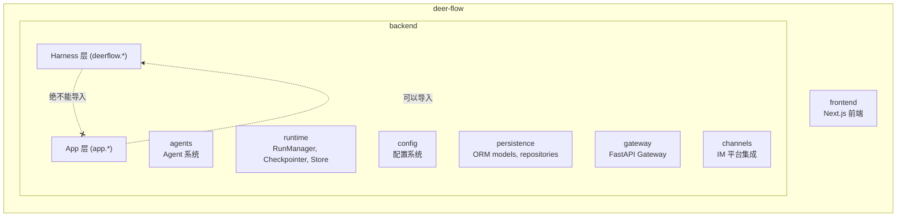
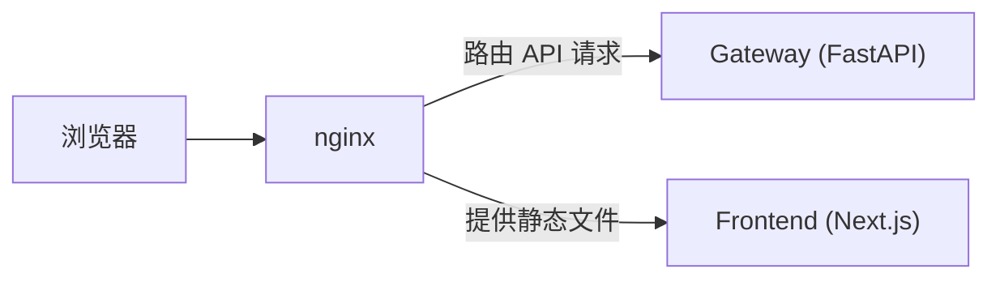
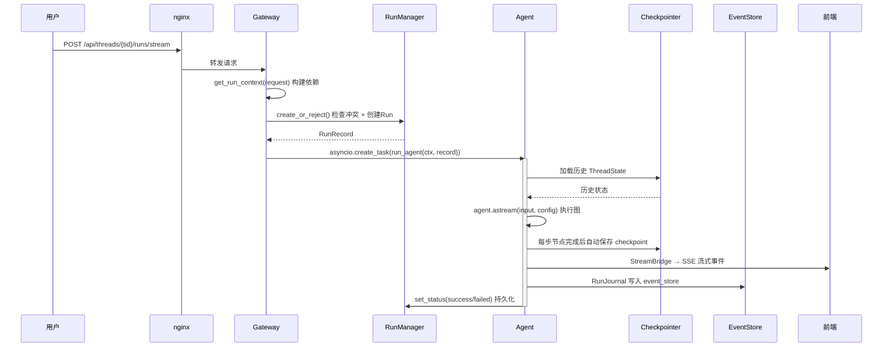
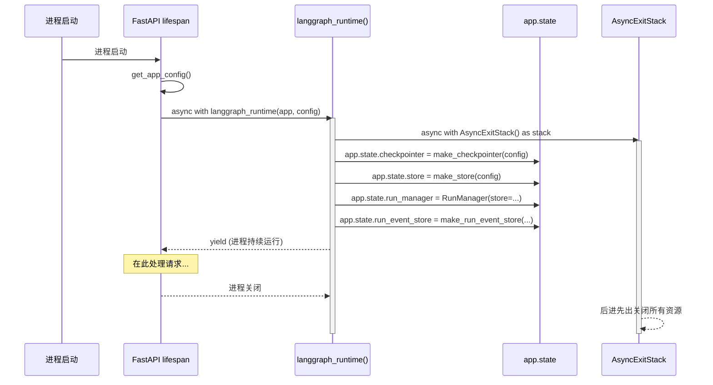
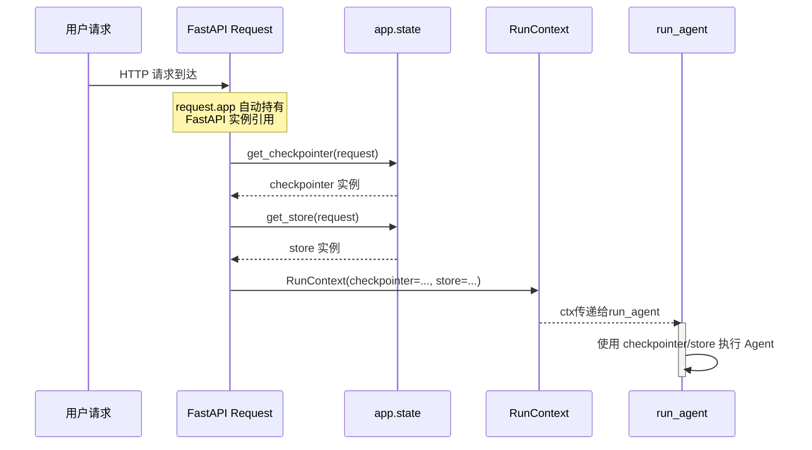

## 项目分层



**依赖规则**：App 可以导入 Harness，但 Harness 绝不能导入 App。

---

## 请求处理流程



### 单次对话请求的完整路径



---

## 五种存储各司其职

DeerFlow 的运行时数据分散在五个独立的存储中：

| # | 存储 | 存什么 | 隔离单位 | 写入者 |
|---|------|--------|---------|--------|
| 1 | **Checkpointer** | ThreadState 版本快照 | thread_id | LangGraph 自动 |
| 2 | **Store** | 跨线程 KV 键值对 | namespace 元组 | 业务代码手动 |
| 3 | **RunStore** | Run 元数据 | run_id + thread_id | RunManager |
| 4 | **RunEventStore** | 事件流（AI chunk、工具调用等）| thread_id + run_id + seq | RunJournal |
| 5 | **ThreadMetaStore** | 线程元数据（标题、状态） | thread_id + user_id | Gateway 路由 + worker |

### 存储之间的关系图

```mermaid
graph TD
    FE["前端 (Next.js)"] -->|HTTP 请求| GW["Gateway (FastAPI)"]

    subgraph Gateway
        direction TB
        TMS["ThreadMetaStore<br/>(SQL 或 Store)<br/>线程列表、标题、状态"]
        RM["RunManager + RunStore<br/>Run 状态、token 用量"]
        RES["RunEventStore<br/>(SQL/JSONL/Memory)<br/>事件回放、断线重连"]
    end

    GW -->|run_agent(ctx, ...)| LG["LangGraph Agent 执行"]

    subgraph Agent["LangGraph Agent 执行"]
        CP["Checkpointer<br/>(SQLite/Postgres)<br/>对话状态快照<br/>自动保存/恢复"]
        ST["Store<br/>(ThreadMeta 底层)<br/>跨线程共享数据"]
    end

    style TMS fill:#e1f5fe,stroke:#0288d1
    style RM fill:#e1f5fe,stroke:#0288d1
    style RES fill:#e1f5fe,stroke:#0288d1
    style CP fill:#fff3e0,stroke:#f57c00
    style ST fill:#fff3e0,stroke:#f57c00
```

### 为什么不合并成一个数据库？

- **Checkpointer** 由 LangGraph 驱动，表结构由 LangGraph 定义
- **RunStore / RunEventStore / ThreadMetaStore** 由 DeerFlow 定义
- 职责分离：对话状态（可回滚）vs 运行记录（只追加）vs 列表元数据（频繁查询）

---

## 依赖注入链路

### 启动时：lifespan → langgraph_runtime → app.state



### 请求时：request → app.state → RunContext



---

## 配置热重载边界

| 类别 | 字段 | 行为 |
|------|------|------|
| **每次请求热重载** | models、tools、summarization、memory、subagents | 通过 `get_app_config()` 检查 mtime 自动重载 |
| **启动时冻结** | checkpointer、database、run_events、sandbox.use | 持有连接/句柄，重启才生效 |

`get_run_context()` 故意让 `app_config` 走热重载，`event_store` + `run_events_config` 走冻结快照——避免"新配置 + 旧实例"的不一致。
