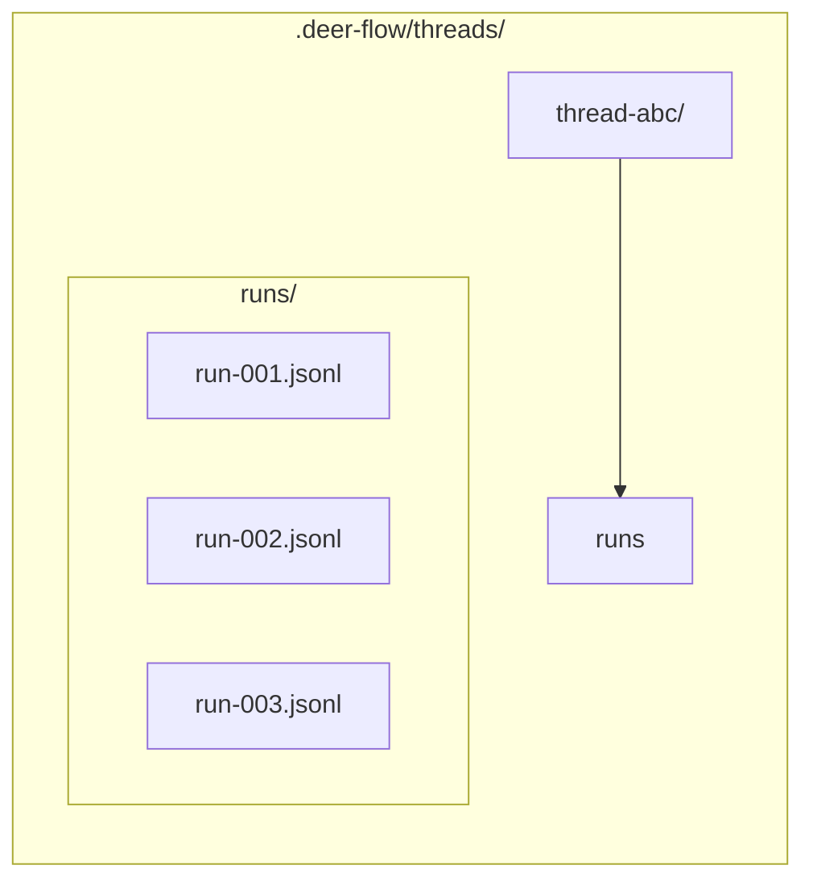
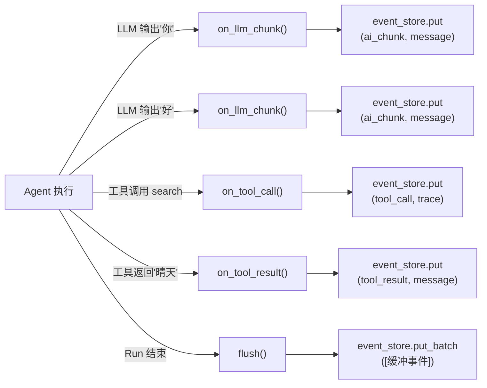
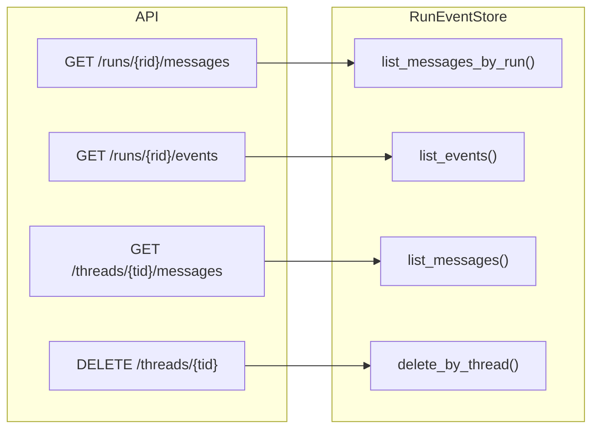

## 核心定位

RunEventStore 记录 Agent 执行过程中发生的每一个事件（AI 输出的每个文字片段、工具调用、工具结果等），按顺序持久化。

| 场景 | 为什么需要 Event Store |
|------|----------------------|
| 断线重连 | 浏览器掉线后重放历史事件 |
| 运行回放 | 查看"AI 一个字一个字怎么说出回复的" |
| 多客户端 | 多个窗口监听同一个 Run |
| 分页消息 | 前端"加载更多"功能 |

---

## 抽象接口

`RunEventStore` 定义了 8 个方法：

```python
class RunEventStore(abc.ABC):
    async def put(...) → dict                        # 写入单条事件
    async def put_batch(events) → list[dict]         # 批量写入
    async def list_messages(...) → list[dict]        # 查消息 (category=message)
    async def list_events(...) → list[dict]          # 查全部事件
    async def list_messages_by_run(...) → list[dict] # 查某次 Run 的消息
    async def count_messages(...) → int              # 计数
    async def delete_by_thread(...) → int            # 按线程删
    async def delete_by_run(...) → int               # 按 Run 删
```

### 事件的数据结构

```python
{
    "thread_id": "thread-abc",
    "run_id":   "run-xyz",
    "event_type": "ai_chunk",
    "category":  "message",            # message / trace / lifecycle
    "content":   {"content": "你"},
    "metadata":  {"id": "msg-001"},
    "seq":       42,                   # 线程级严格递增
    "created_at": "2026-06-04T..."
}
```

### category 三种值

| category | 含义 | 典型 event_type | 用途 |
|----------|------|----------------|------|
| `message` | 面向用户的消息 | `ai_chunk`、`human_message`、`tool_result` | 前端聊天界面展示 |
| `trace` | 调试/审计信息 | `tool_call`、`llm_start`、`llm_end` | 开发者调试 |
| `lifecycle` | 生命周期事件 | `metadata`、`end`、`error` | Run 级别状态变更 |

### seq 的保证

**`seq` 在同一个 thread_id 内严格递增**，无论属于哪个 Run。前端用 seq 做游标分页，保证消息顺序正确。

---

## 三种实现

### MemoryRunEventStore

```python
class MemoryRunEventStore(RunEventStore):
    def __init__(self):
        self._events: dict[str, list[dict]] = {}     # thread_id → 事件列表
        self._seq_counters: dict[str, int] = {}       # thread_id → 当前最大 seq
```

- 两个字典，O(n) 列表过滤
- 进程重启数据消失

### JsonlRunEventStore

每个 Run 一个 `.jsonl` 文件：



关键设计：
- **所有 IO 通过 `asyncio.to_thread` 推到线程池**——避免阻塞事件循环
- **per-thread `asyncio.Lock`** 串行化写入——防止 JSONL 行交叉
- **路径校验**防止 `../` 路径穿越
- **冷启动**：进程重启后首次写入前扫描所有文件恢复 max seq

### DbRunEventStore

SQL 数据库存储，生产级实现。

ORM 模型：

```python
class RunEventRow(Base):
    __tablename__ = "run_events"
    id: int                         # 主键自增
    thread_id: str(64)
    run_id: str(64)
    user_id: str(64) | None         # 多租户
    event_type: str(32)
    category: str(16)
    content: Text                   # JSON 字符串
    event_metadata: JSON
    seq: int
    created_at: DateTime(tz)

    UniqueConstraint("thread_id", "seq")
    Index("thread_id", "category", "seq")
    Index("thread_id", "run_id", "seq")
```

### seq 原子性

多个请求可能同时写同一个线程的事件，seq 必须不重复：

```python
async def _max_seq_for_thread(session, thread_id):
    if dialect == "postgresql":
        # Postgres 用 advisory lock 在事务级别串行化
        await session.execute(
            text("SELECT pg_advisory_xact_lock(hashtext(:thread_id))"),
            {"thread_id": thread_id},
        )
    else:
        # SQLite: SELECT ... FOR UPDATE 行锁
        return await session.scalar(stmt.with_for_update())
```

写入流程：

```python
async with session.begin():
    max_seq = await _max_seq_for_thread(...)
    seq = (max_seq or 0) + 1
    session.add(RunEventRow(seq=seq, ...))
# 事务提交 → 锁释放 → 下一个事务可以拿到 seq+1
```

---

## 三种实现对比

| 维度 | Memory | JSONL | DB |
|------|--------|-------|----|
| 重启后数据 | ❌ 丢失 | ✅ 保留 | ✅ 保留 |
| 多进程共享 | ❌ | ❌ (seq 不单调) | ✅ (事务锁) |
| seq 原子性 | 单线程保证 | asyncio.Lock | 数据库事务锁 |
| 批量写入 | 内存操作 | N 次 to_thread | 一次事务 |
| 分页查询 | 列表过滤 | 扫描文件 | SQL LIMIT |
| 用户隔离 | 无 | 无 | user_id 过滤 |

---

## 谁在读写

### 写入者：RunJournal

RunJournal 作为 LangChain CallbackHandler 挂在 `run_agent` 里：



### 读取者：Gateway 路由


