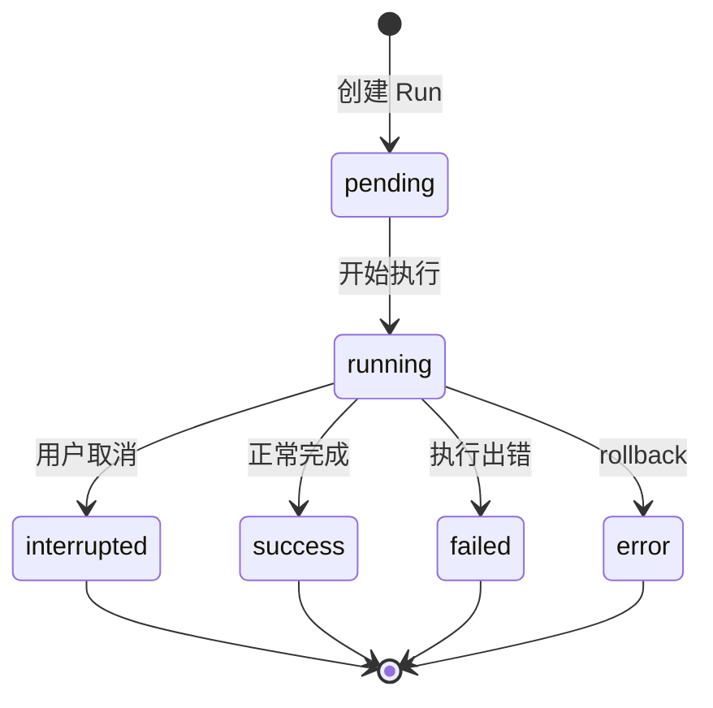
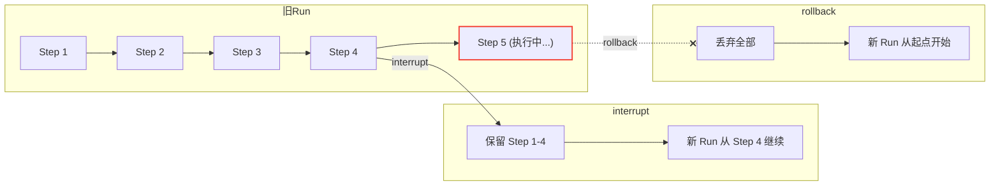

## 核心定位

RunManager 是一个 **内存注册表 + 可选持久化存储** 的双层架构：

```python
class RunManager:
    def __init__(self, store=None, *, persistence_retry_policy=None):
        self._runs: dict[str, RunRecord] = {}     # 内存：run_id → 记录
        self._lock = asyncio.Lock()                 # 保护并发修改
        self._store = store                          # 可选持久化 (RunStore)
```

所有对 `_runs` 字典的修改都必须在 `self._lock` 保护下进行。

---

## RunRecord 数据结构

每个 Run 在内存中对应一个 `RunRecord`：

```python
@dataclass
class RunRecord:
    run_id: str
    thread_id: str
    assistant_id: str | None

    status: RunStatus                    # pending / running / success / failed / interrupted
    on_disconnect: DisconnectMode        # cancel / continue
    abort_action: str                    # interrupt / rollback

    task: asyncio.Task | None            # 后台协程（不可序列化）
    abort_event: asyncio.Event           # 取消信号（不可序列化）

    multitask_strategy: str              # reject / interrupt / rollback
    metadata: dict
    kwargs: dict
    model_name: str | None

    total_input_tokens: int
    total_output_tokens: int
    lead_agent_tokens: int
    subagent_tokens: int

    store_only: bool                     # 从持久化层恢复的只读记录
```

**关键区分**：
- 活跃 Run（当前进程有 task/abort_event）→ `_runs` 字典中
- 历史 Run（其他进程创建或已完成的）→ 从 RunStore 按需恢复

---

## 生命周期

### 状态转换



### 创建

```python
record = await run_manager.create(thread_id, multitask_strategy="reject")
# 1. 生成 UUID 作为 run_id
# 2. 创建 RunRecord (status=pending)
# 3. async with self._lock: self._runs[run_id] = record
# 4. 如果有 store → 持久化
# 5. 如果持久化失败 → 回滚内存记录
```

### 清理

```python
await run_manager.cleanup(run_id, delay=300)
# 延迟 300 秒后从 _runs 字典移除（保留 store 中的历史记录）
```

---

## 多任务冲突策略

核心方法 `create_or_reject()` 在同一把锁内完成"检查冲突 + 创建新 Run"：

### 三种策略

| 策略 | 旧 Run 处理 | Checkpoint 处理 | 用户体验 |
|------|------------|----------------|---------|
| `reject` | 拒绝新请求（抛 ConflictError） | — | "上一条还在处理，请等待" |
| `interrupt` | 取消旧 Run（保留 checkpoint） | 保留 | 旧任务停止但已完成的工作不丢 |
| `rollback` | 取消旧 Run（回滚到执行前） | 丢弃 | 旧任务彻底撤销 |

### interrupt vs rollback



### 原子性保证

```python
async def create_or_reject(self, thread_id, *, multitask_strategy="reject"):
    async with self._lock:
        inflight = [r for r in ... if r.status in (pending, running)]
        if multitask_strategy == "reject" and inflight:
            raise ConflictError(...)
        self._runs[run_id] = record
        await self._persist_new_run_to_store(record)
        if multitask_strategy in ("interrupt", "rollback") and inflight:
            for r in inflight:
                r.abort_event.set()
                r.task.cancel()
                r.status = RunStatus.interrupted
```

---

## 取消机制

```python
await run_manager.cancel(run_id, action="interrupt")
# 1. record.abort_event.set()     → 通知 worker 停止
# 2. record.task.cancel()          → 取消 asyncio.Task
# 3. record.status = interrupted
# 4. _persist_status(interrupted)  → 同步到 store
```

幂等设计：对已 interrupted 的 Run 再次调用 cancel 仍返回 True。

---

## 孤儿 Run 回收

进程重启后，store 中可能有 `pending/running` 状态的 Run，但当前进程没有对应的 asyncio Task：

```python
async def reconcile_orphaned_inflight_runs(self, *, error, before=None):
    rows = await self._store.list_inflight(before=before)
    for row in rows:
        if live_record is not None and live_record.status in (pending, running):
            continue
        record.status = RunStatus.error
        record.error = error
        await self._persist_status(record, RunStatus.error, error=error)
```

防止 UI 显示永远活跃的"僵尸 Run"。

---

## 查询策略：内存优先 + Store 补偿

```python
async def get(self, run_id):
    # 1. 先查内存
    async with self._lock:
        record = self._runs.get(run_id)
    if record is not None:
        return record

    # 2. 内存没有 → 查 store
    if self._store is None:
        return None
    row = await self._store.get(run_id)

    # 3. store 查询期间可能有并发 create()，再检查一次
    async with self._lock:
        record = self._runs.get(run_id)
    if record is not None:
        return record

    # 4. 真的是历史 Run → 反序列化
    return self._record_from_store(row)
```

`store_only=True` 的记录是只读的——没有 task/abort_event，无法被取消。
