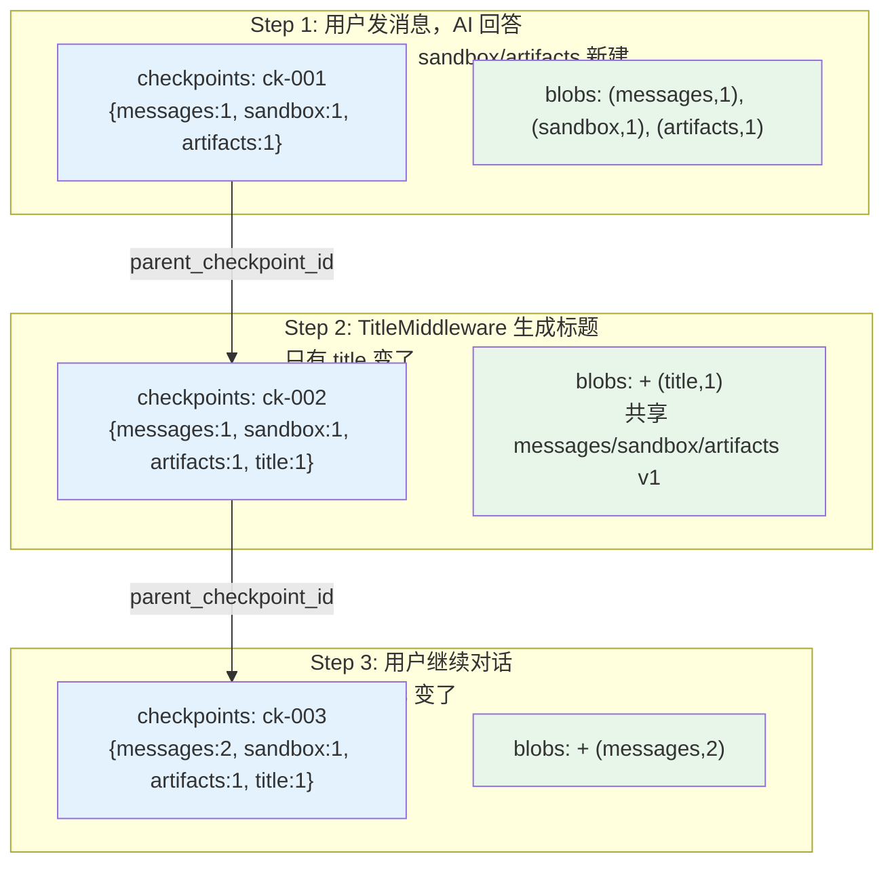
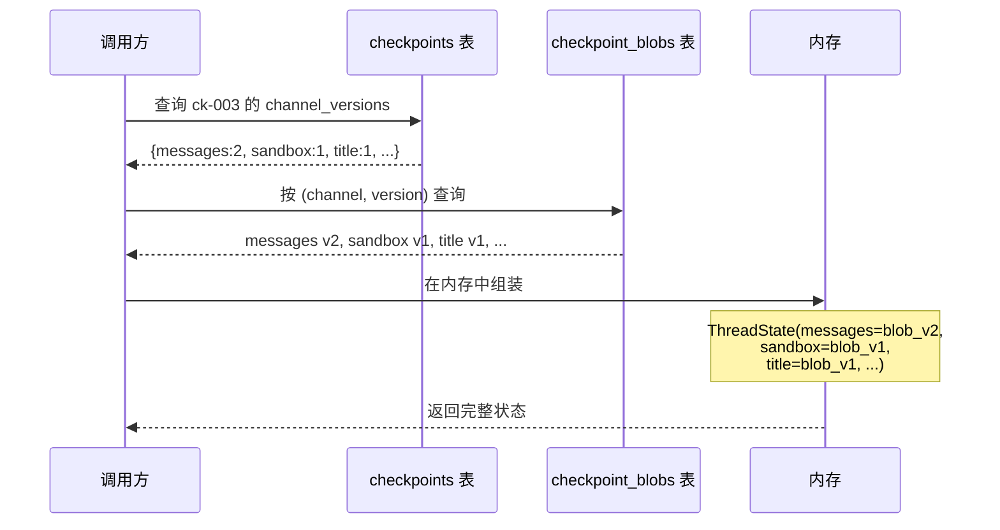

## 一句话定义

**Checkpointer = 对话状态的版本管理系统**——LangGraph 每执行完一个图节点就自动保存完整 ThreadState 快照，支持恢复、回滚和分叉。

类比游戏的"自动存档系统"：每打完一关自动存档，下次启动从最近的存档继续，还能回到任何一个旧存档。

---

## Checkpointer 存什么

### ThreadState 的全部字段

```python
class ThreadState(AgentState):
    messages: list[BaseMessage]     # 对话消息
    sandbox: SandboxId | None       # 沙箱 ID
    thread_data: dict               # 线程级数据
    title: str                      # 自动生成的标题
    artifacts: list                 # 输出文件
    todos: list                     # 任务列表 (plan mode)
    uploaded_files: list            # 上传文件
    viewed_images: list             # 查看的图片
```

### 一个 Checkpoint 的完整结构

```python
CheckpointTuple(
    config={
        "configurable": {
            "thread_id": "thread-abc",
            "checkpoint_id": "01HXY...004",   # ULID，含时间戳
        }
    },
    checkpoint={
        "id": "01HXY...004",
        "ts": "2026-06-04T10:15:23.123456Z",
        "channel_values": {                   # ★ ThreadState 的内容
            "messages": [HumanMessage("你好"), AIMessage("你好！"), ...],
            "title": "代码请求对话",
            "sandbox": "sb-xyz-123",
            "artifacts": [],
        },
        "channel_versions": {                 # 每个字段的版本号
            "messages": 4,
            "title": 1,
            "sandbox": 1,
        },
    },
    metadata={
        "source": "loop",
        "step": 3,
        "writes": {"agent_node": {"messages": [AIMessage(...)]}}
    },
    parent_config={                           # 指向上一个 checkpoint
        "configurable": {"checkpoint_id": "01HXY...003"}
    },
)
```

---

## 三张表的结构

### 表 1：`checkpoints` —— 快照清单（轻量索引）

```
┌────────────┬──────────────┬──────────────────┬─────────────────────────────────┐
│ thread_id  │ checkpoint_id│ parent_cp_id     │ channel_versions                │
├────────────┼──────────────┼──────────────────┼─────────────────────────────────┤
│ thread-abc │ ...001       │ NULL             │ {messages:1, sandbox:1, ...}    │
│ thread-abc │ ...002       │ ...001           │ {messages:1, sandbox:1, title:1}│
│ thread-abc │ ...003       │ ...002           │ {messages:2, sandbox:1, title:1}│
└────────────┴──────────────┴──────────────────┴─────────────────────────────────┘
```

**不存任何实际数据**，只存 `channel_versions` 映射（每个字段对应哪个版本）。`parent_checkpoint_id` 形成链表，记录快照之间的先后关系。

### 表 2：`checkpoint_blobs` —— 真实数据（去重存储池）

```
┌────────────┬────────────┬─────────┬──────────────────────────────────────────┐
│ thread_id  │ channel    │ version │ blob (序列化数据)                         │
├────────────┼────────────┼─────────┼──────────────────────────────────────────┤
│ thread-abc │ messages   │ 1       │ <[Human("你好"), AI("你好！")]>           │
│ thread-abc │ messages   │ 2       │ <[..., Human("帮我写代码"), AI("好的")]> │
│ thread-abc │ sandbox    │ 1       │ "sb-xyz"                                │
│ thread-abc │ title      │ 1       │ "代码请求对话"                           │
└────────────┴────────────┴─────────┴──────────────────────────────────────────┘
```

按 `(thread_id, channel, version)` 三元组唯一标识。

### 表 3：`checkpoint_writes` —— 待合并的增量写入

存执行过程中产生但还没完成合并的写入，用于崩溃恢复。

---

## Channel 版本化 + Blob 共享 = 自动去重

LangGraph 把 ThreadState 的每个字段叫做一个 **Channel**。每个 Channel 独立维护版本号。**只有发生变化的 Channel 才会产生新版本的 blob**。

### 完整例子



### 两张表的关系

- **`checkpoints`** 是"目录页"——记录每个时间点引用了哪些版本
- **`checkpoint_blobs`** 是"正文页"——存放实际数据
- 关联方式：`checkpoints.channel_versions` 中的 `{messages: 2}` 指向 `blobs WHERE channel='messages' AND version=2`
- 多个 checkpoint 可以共享同一个 blob（多对多关系）

### 存储节省效果

假设 10 步对话，每步只有 messages 变化：

| 方案 | 数据量 |
|------|--------|
| 朴素（每步完整拷贝全部字段） | 10 × 9 字段 = 90 份数据 |
| Channel 版本化 | messages × 10 + 其他 8 字段 × 1 = 18 份 |

**节省 80%**。

---

## 查询过程

获取 `ck-003` 时刻的完整状态：



---

## Rollback 实现

Rollback 本质是"创建一个新 checkpoint，其内容是旧 checkpoint 的副本"：

```python
async def rollback_to_pre_run_checkpoint(checkpointer, pre_run_snapshot):
    checkpoint_to_restore = copy.deepcopy(pre_run_snapshot["checkpoint"])

    marker = new_checkpoint_marker()
    checkpoint_to_restore["id"] = marker["id"]
    checkpoint_to_restore["ts"] = marker["ts"]

    await checkpointer.aput(config, checkpoint_to_restore, metadata, versions)

    for task_id, writes in writes_by_task.items():
        await checkpointer.aput_writes(config, writes, task_id)
```

为什么不能直接删旧 checkpoint？因为 checkpoint 链表式存储（`parent_checkpoint_id`），删除会破坏链结构。

---

## 三种后端对比

| 后端 | LangGraph 类 | 适用场景 |
|------|-------------|---------|
| `memory` | `InMemorySaver` | 开发/测试，重启即失 |
| `sqlite` | `SqliteSaver` / `AsyncSqliteSaver` | 单机生产，开箱即用 |
| `postgres` | `PostgresSaver` / `AsyncPostgresSaver` | 多实例/企业级部署 |

### SQLite vs Postgres

| 维度 | SQLite | Postgres |
|------|--------|---------|
| 部署复杂度 | 零依赖，一个文件 | 需独立数据库服务 |
| 并发写入 | 受限（WAL 模式改善但仍有限） | 高并发 MVCC |
| 多实例共享 | ❌ 文件锁冲突 | ✅ 多实例读同一库 |
| 适合规模 | 个人/小团队 | 企业/SaaS |

不是冗余，是覆盖不同的部署场景。
