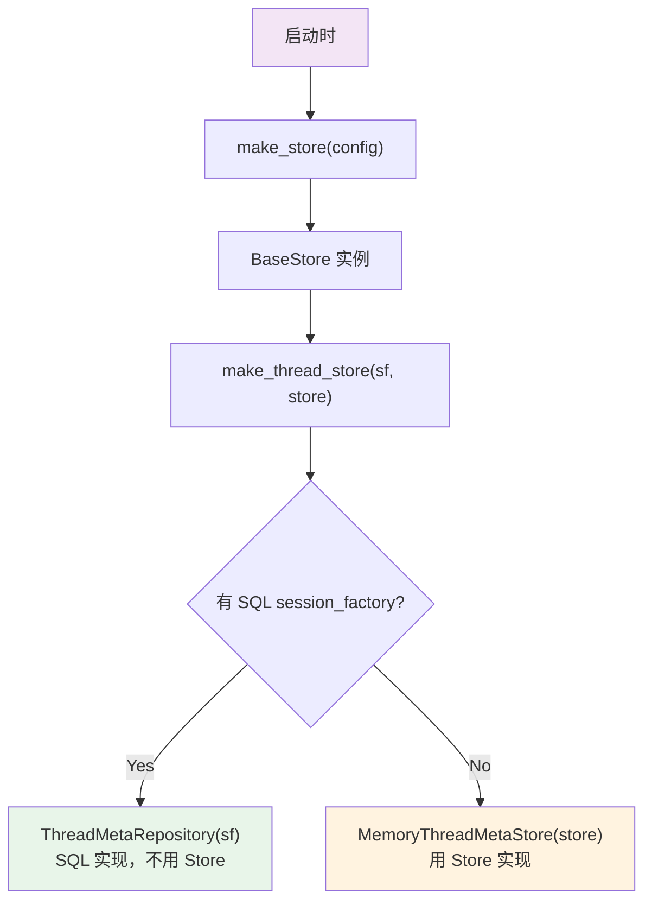

## Store vs Checkpointer

两者都是 LangGraph 提供的存储机制，但解决不同问题：

| | Checkpointer | Store |
|---|---|---|
| **隔离单位** | 按 `thread_id`（每个线程独立） | 按 `namespace`（任意元组路径） |
| **数据模型** | 完整 ThreadState 快照（多版本链表） | 简单 KV 键值对（单版本覆盖） |
| **写入方式** | LangGraph 自动（每个图节点后） | 业务代码手动 |
| **核心用途** | 对话状态持久化 + 恢复 | 跨线程共享数据 |

类比：
- **Checkpointer** = 每个学生的"作业本"（按人隔离，保存每次作业版本）
- **Store** = 教室的"公告栏"（共享空间，按栏目组织）

---

## Store 的 API

```python
class BaseStore:
    async def aput(namespace, key, value)          # 写入
    async def aget(namespace, key) -> Item          # 读取
    async def adelete(namespace, key)               # 删除
    async def asearch(namespace, *, filter, limit)  # 搜索
```

### Namespace（命名空间）

Namespace 是一个字符串元组，用来组织数据层级——类似文件夹路径：

```python
("threads",)                         # 线程元数据
("users", "alice", "preferences")    # 用户偏好
("agents", "lead-agent", "config")   # Agent 配置
```

---

## 三种后端

| 后端 | LangGraph 类 | 适用场景 |
|------|-------------|---------|
| `memory` | `InMemoryStore` | 开发/测试，嵌套字典 |
| `sqlite` | `AsyncSqliteStore` | 单机生产 |
| `postgres` | `AsyncPostgresStore` | 多实例生产 |

Store 和 Checkpointer **共用同一个配置段**，保证两者始终使用相同的后端——不会出现 checkpointer 用 SQLite、Store 用 Postgres。

---

## 在项目中的使用场景

Store 的核心角色是**当没有 SQL 数据库时，作为 ThreadMetaStore 的底层存储**。

### 调用链



### MemoryThreadMetaStore 如何使用 Store

```python
THREADS_NS = ("threads",)

class MemoryThreadMetaStore:
    def __init__(self, store: BaseStore):
        self._store = store

    async def create(self, thread_id, ...):
        record = {"thread_id": thread_id, "display_name": ..., "status": "idle"}
        await self._store.aput(THREADS_NS, thread_id, record)

    async def get(self, thread_id):
        item = await self._store.aget(THREADS_NS, thread_id)
        return dict(item.value) if item else None

    async def search(self, *, metadata, status, limit, user_id):
        filter_dict = {**metadata, "status": status, "user_id": user_id}
        items = await self._store.asearch(THREADS_NS, filter=filter_dict, limit=limit)
        return [dict(item.value) for item in items]

    async def delete(self, thread_id):
        await self._store.adelete(THREADS_NS, thread_id)
```

Store 中的数据：

```
namespace: ("threads",)
┌──────────────┬──────────────────────────────────────────┐
│ key          │ value                                    │
├──────────────┼──────────────────────────────────────────┤
│ "thread-abc" │ {thread_id, user_id, display_name,       │
│              │  status, metadata, created_at, ...}      │
└──────────────┴──────────────────────────────────────────┘
```

### 在 Agent 中的挂载

```python
# worker.py
store = ctx.store

# 注入到 LangGraph Runtime
runtime = Runtime(context=runtime_ctx, store=store)

# 挂载到 agent（供 LangGraph 图节点使用）
agent.store = store
```

挂载后，工具和中间件可以通过 LangGraph 的 Store API 访问跨线程数据。
