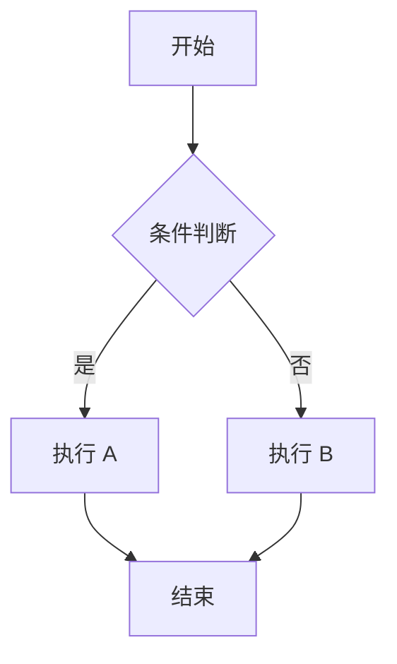
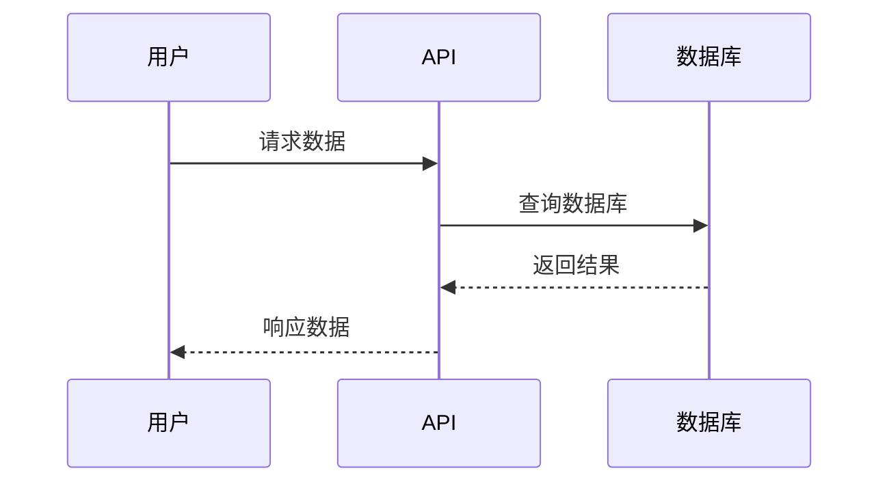
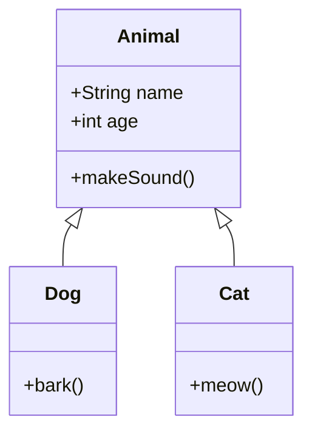
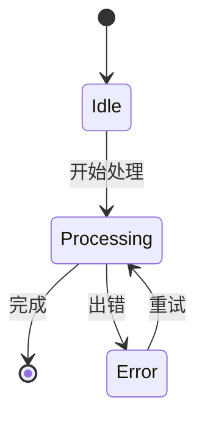
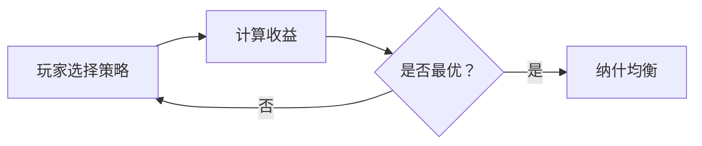

## 测试目的

验证博客系统对 LaTeX 数学公式和 Mermaid 图表的支持。

## LaTeX 公式测试

### 行内公式

这是一个行内公式：$E = mc^2$，以及另一个：$x^2 + y^2 = z^2$。

二次方程求根公式：$x = \frac{-b \pm \sqrt{b^2 - 4ac}}{2a}$

### 块级公式

$$
\sum_{i=1}^n i = \frac{n(n+1)}{2}
$$

$$
\int_0^\infty x^2 dx
$$

欧拉公式：

$$
e^{i\pi} + 1 = 0
$$

### 复杂公式

矩阵：

$$
\begin{pmatrix}
a & b \\
c & d
\end{pmatrix}
$$

多重积分：

$$
\iiint_V f(x,y,z) \,dx\,dy\,dz
$$

## Mermaid 图表测试

### Flow 流程图

### Sequence 序列图

### Class 类图

### State 状态图

## 混合测试

在同一个文章中使用公式和图表：

纳什均衡公式：

$$
\forall i, \forall s_i \in S_i: u_i(s_i, s_{-i}) \geq u_i(s_i', s_{-i})
$$

对应的决策流程：

## 结论

如果以上内容都能正常渲染，说明 LaTeX 和 Mermaid 支持工作正常。
