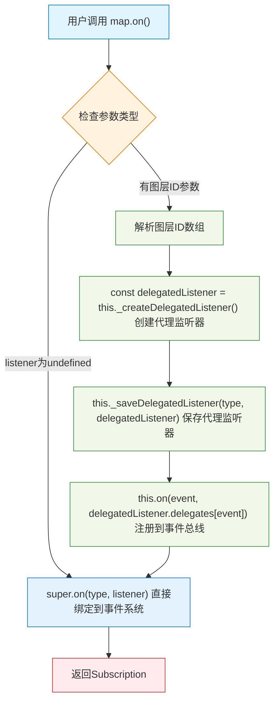

# Maplibre 源码阅读

### 事件处理

**相关类：**

`HandlerManager` : `Handler` 的管理类，负责所有的交互系统的注册、启用/禁用、`Handler` 冲突处理，统一 DOM 事件捕获并将事件路由到各个 `Handler` ，合并处理结果，集中管理交互状态。

`MapMouseEvent` : 鼠标事件封装类，内部通过 `map.unproject`  计算像素坐标对应的经纬度，并存储了事件的上下文信息，以及事件的 `_defaultPrevented` 阻止默认事件的状态

**初始化：**

1. 在 map 实例中初始化 `HandlerManager` ， `HandlerManager` 初始化各个事件处理 `Handler`  (如： `MapEventHandler` 负责 dom 事件处理， `BoxZoomHandler` 处理框选缩放)
2. `HandlerManager`  注册 DOM 监听器，根据监听 `document` 还是 `map` 的容器分别绑定`handleWindowEvent`  和 `handleEvent` 事件。

**事件注册：**

1. 通过 `map.on` 函数统一事件注册入口
全局事件直接通过 `super.on` 注册到 `map` 实例继承的 `Evented` 抽象类中，
对于指定 `layerId` 的侦听器，通过 `_createDelegatedListener` 创建一个委托闭包用于封装相关状态( `mousein` )和 `layerIds.filter()`  的逻辑，并将闭包存储到实例维护的 `_delegatedListeners` 对象中，然后再将闭包中封装后回调函数通过 `super.on` 注册到的事件总线中

**事件分发：**

1. 捕捉到事件后，由 `handleEvent` 集中处理事件分发到各个 `Handler` 并合并结果。
`handleWindowEvent` 捕获 `document` 事件后在事件的 `type` 中添加 `Windows` 后缀转发给 `handleEvent` 进行后续处理
2. `handleEvent` 通过一系列的条件判定事件由哪个 `Handler` 处理
以点击事件为例，点击过程会先调用 `MapEventHandler` 的 `mousedown` 函数并记录下点击位置的坐标；
然后会调用 `MapEventHandler` 的 `click` 函数，此时会判定 `point` 位置和之前记录的位置的偏移是否超过容差范围，如果超过则视为拖拽退出当前处理函数，
没超过则正常触发点击事件，调用 `map.fire(new MapMouseEvent(e.type, this._map, e))` 调用地图实例中注册的回调函数，并创建 `MapMouseEvent` 作为事件参数

**总结：**

交互系统的难度主要体现在如何设计一套完备正交的交互类型判定流程，代码实现上是一个非常“脏”的工作，需要写大量的 `if` 判断处理各种边界条件和冲突

浏览器的原始事件对象是不足够支撑复杂的交互需求的，需要在此之上封装满足自己业务需求的事件对象

---

### 坐标系统

点击坐标 → 容器坐标 → 世界空间坐标 → 经纬度

TODO:

- 空间矩阵变换基础知识扫盲
- 分析 `map.project` 中的变换矩阵是如何计算的

通过一次点击事件的处理过程分析坐标是如何转换的

**背景知识：**

用矩阵表述变换与齐次坐标https://www.jianshu.com/p/c3e887c4c4f4

相机系列——透视投影：针孔相机模型https://zhuanlan.zhihu.com/p/692565077

https://juejin.cn/book/6844733755580481543/section/6844733755941191687

https://webglfundamentals.org/webgl/lessons/zh_cn/webgl-2d-matrices.html

**名词解释：**

- 裁剪空间：WebGL 中空间的表示范围在 [-1, 1] 之间

**相关类：**

`TransformHelper` : 管理和地图变换的所有状态信息，如： `zoom` , `pitch` , `tileSzie` 等，并在 `set*` 方法中实现了状态验证和约束机制。
同时，将计算所需的逻辑通过注册回调的方式交给具体的投影实现（如 `MercatorTransform` ）这样可以避免在每个投影系统中重复实现状态管理逻辑

`MercatorTransform` : 通过 `TransformHelper` 管理所有变换状态，这个类专注于投影计算逻辑，实现多种坐标系之间的双向转换，如：**屏幕坐标**和**墨卡托坐标**的转换，**屏幕坐标**和**地理坐标（包含地形高度的墨卡托坐标）**的转换等

> 这里为了方便表述投影空间直接表述为了墨卡托坐标，实际上地图有非常的多的投影空间，不过 maplibre 中目前只支持了墨卡托投影
> 

`MercatorCoveringTilesDetailsProvider` : 墨卡托投影系统的瓦片覆盖计算服务核心类

`MercatorCameraHelper` : 在墨卡托投影系统中提供相机控制和动画功能的核心类

**初始化：**

1. 在 `map` 实例中初始化 `MercatorTransform`  实例
2. `MercatorTransform` 初始化 `TransformHelper` 实例，并将 `calcMatrices` 回调注册到 `TransformHelper` 中
初始化 `MercatorCoveringTilesDetailsProvider` 类
3. `map` 实例初始化 `MercatorTransform` 的状态
4. `map` 调用 `jumpTo` 通过 `MercatorCameraHelper.handleJumpToCenterZoom()`  方法初始化视图
5. `handleJumpToCenterZoom`  中会调用 `ITransform.setCenter()`  方法，进一步调用 `MercatorTransform._calcMatrices` 初始化变换矩阵
    1. `_calcMatrices` 中会计算七个变换相关的矩阵，分别是：
    `_projectionMatrix` - 透视投影矩阵
    `_mercatorMatrix` - 墨卡托坐标到裁剪空间矩阵
    `_pixelMatrix` - 世界坐标到屏幕像素矩阵
    `_viewProjMatrix` - 视图投影矩阵
    `_pixelMatrix3D` - 3D世界坐标到屏幕矩阵
    `_fogMatrix` - 雾效计算矩阵
    `_alignedProjMatrix` - 像素对齐投影矩阵
    2. **转换过程：**
        1. 获取地图中心点在世界坐标系中的位置 `(x, y)`
        2. 计算 `_pixelPerMeter` 像素/米
        3. 创建标准的**透视投影矩阵**，计算投影矩阵的逆矩阵，应用视角中心偏移（处理地图padding）
        4. 
        ****