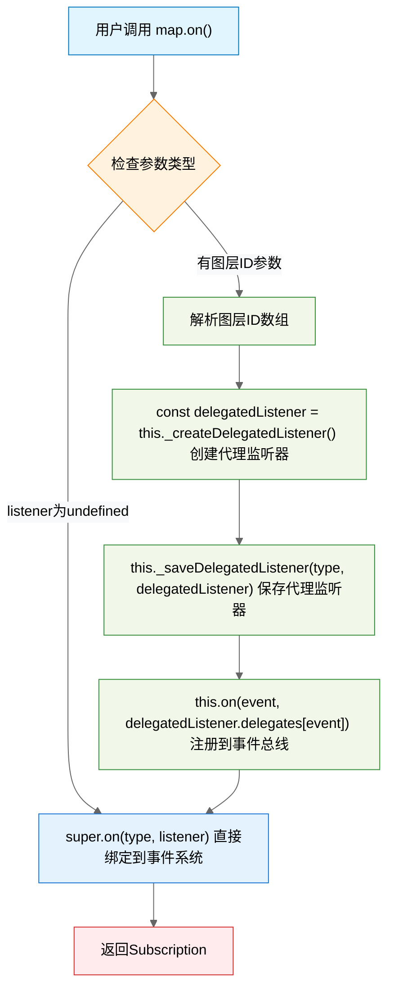

```mermaid
%%{init: {'theme':'base', 'themeVariables': {'primaryColor': '#ffffff', 'primaryTextColor': '#000000', 'primaryBorderColor': '#cccccc', 'lineColor': '#666666', 'secondaryColor': '#f8f9fa', 'tertiaryColor': '#e9ecef', 'background': '#f8f9fa', 'mainBkg': '#ffffff', 'secondBkg': '#f1f3f4', 'tertiaryBkg': '#e8eaed'}}}%%
flowchart TD
    A["用户调用 map.on()"] --> B{检查参数类型}

    B -->|listener为undefined| C1[普通事件注册]

    C1 --> E[返回Subscription]

    B -->|有图层ID参数| D1[解析图层ID数组]
    D1 --> D2["const delegatedListener = this._createDelegatedListener() 创建代理监听器"]
    D2 --> D3["this._saveDelegatedListener(type, delegatedListener) 保存代理监听器"]
    D3 --> D4["this.on(event, delegatedListener.delegates[event]) 注册到事件总线"]
    D4 --> C1["super.on(type, listener) 直接绑定到事件系统"]

    style A fill:#e1f5fe,stroke:#0277bd,stroke-width:1px
    style B fill:#fff3e0,stroke:#f57c00,stroke-width:1px
    style E fill:#ffebee,stroke:#d32f2f,stroke-width:1px

    classDef delegateType fill:#f1f8e9,stroke:#388e3c,stroke-width:1px
    classDef eventType fill:#e3f2fd,stroke:#1976d2,stroke-width:1px

    class D1,D2,D3,D4 delegateType
    class C1 eventType

```