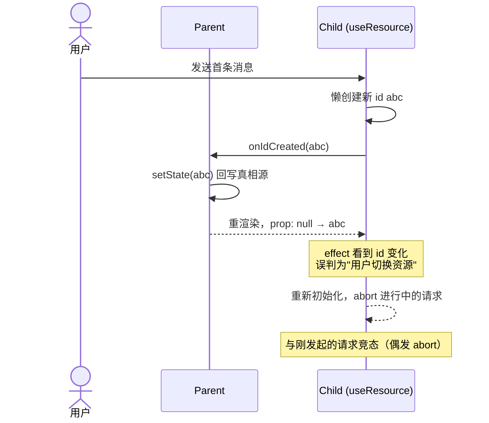
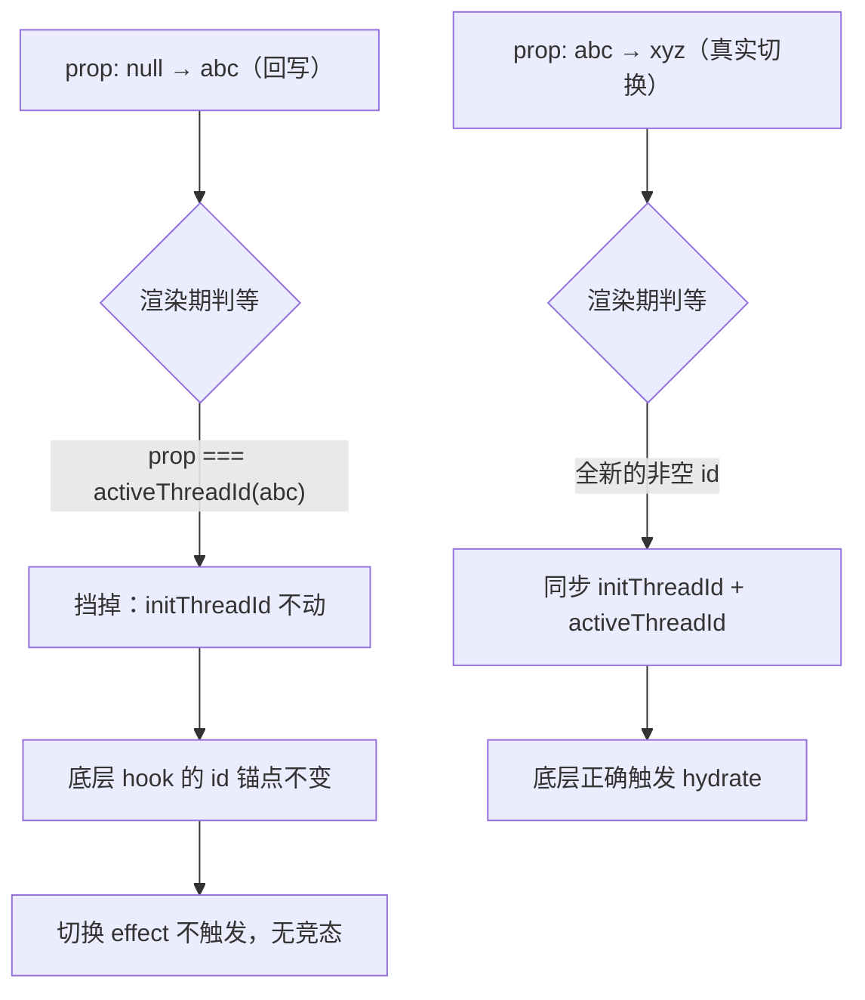

**React 说好的"单向数据流"呢？当子组件需要把运行时派生的状态回写给父级时，单向就悄悄变成了循环——而 React 的机制分不清"用户切换"和"自己的回写"，于是你只能写补丁。**

这篇文章从一次真实的 bug 排查出发：一个 AI 聊天面板，空对话发送首条消息时，`useStream` 懒创建出 thread id，id 回写到父级面板参数后，又触发了 SDK 内部的 hydrate effect，与进行中的 run 打了起来（`signal is aborted`）。

先讲这个"state 循环"长什么样，再吐槽我写过的丑陋补丁，最后聊真正治本的解法——**用中间 state 介入，把 prop 降级成一个"事件驱动"的通知，而不是必须同步进 effect 的状态**。

## 一个看起来很自然的写法

先看最小化的结构。你大概率在某个项目里见过、甚至亲手写过类似的代码：

```tsx
// 父组件持有"真相源"
function Parent() {
  const [resourceId, setResourceId] = useState<string | null>(null);
  return <Child resourceId={resourceId} onIdCreated={setResourceId} />;
}

// 子组件用一个 hook 接管某个资源（连接、会话、文档……）
function Child({ resourceId, onIdCreated }) {
  const api = useResource({
    id: resourceId,      // ① 传入"当前要绑定的资源 id"，可为 null
    onIdCreated,         // ② 资源懒创建时，把新 id 回吐给父级
  });
  // useResource 内部约定：
  //   - id 非 null：按 id 恢复/订阅该资源
  //   - id 为 null：等首次操作时懒创建一个新 id
}
```

这套结构看起来非常自然——父级持有"当前是哪个资源"的真相，子组件用 hook 接管资源生命周期，懒创建出来的 id 回写给父级做持久化（URL、路由、面板状态、缓存 key）。**谁会想到这里藏着一个反馈环？**

## 反馈环：effect 分不清"切换"和"回写"

`useResource` 内部通常有一个 effect 追踪 `id` prop，id 变化时就做"切换资源"的逻辑（重新订阅、重新加载、重新初始化）。问题在于：**这个 effect 无法区分 prop 变化的原因**：

- 是用户主动切换到了另一个资源？（应该重新加载）
- 还是 hook 自己懒创建 id 后、回写父级、又流了回来？（不该重新加载，资源正在进行中）

当懒创建发生时，时序是这样的：



**反馈环的本质**：同一个 id 同时承担两种职责——外部寻址（父级 state / URL）和内部资源 handle（hook 的运行时绑定）。两种职责对"id 何时确定"的预期不一致：外部要求"先有 id 再进入"，内部支持"边跑边生成"。懒创建把 id 从内部提升到外部的那一步，制造了一个 prop 跳变（`null` → 具体值），effect 把这次跳变误判成"主动切换"。

而且这个 bug 特别阴险：**它不一定表现为死循环，常常是"偶发的 abort"或"页面偶尔不更新"**。第一次遇到时你会怀疑网络、怀疑后端，排查半天才发现是自己数据流的问题。

## 第一版补丁：把回写往后拖（丑陋，且埋雷）

遇到问题，第一反应是调整回写时机——从"懒创建瞬间"拖到"操作完全结束"。用 ref 把 id 缓存起来，等操作完成再回写：

```tsx
function Child({ resourceId, onIdCreated }) {
  const mintedRef = useRef<string | null>(null);

  const api = useResource({
    id: resourceId,
    onIdCreated: (newId) => {
      mintedRef.current = newId;   // 先缓存，不立即回写
    },
    onCompleted: () => {
      if (mintedRef.current) {
        onIdCreated(mintedRef.current);  // 操作结束后才回写
        mintedRef.current = null;
      }
    },
  });
}
```

测一下，好像不 abort 了，修好了。**但这是最典型的"丑陋补丁"**：

- **持久化窗口巨大**。从懒创建到操作结束，父级 state 一直是 `null`。这段时间用户刷新页面、关闭 tab、跳转路由，真相就丢了。
- **没有切断反馈环**。回写仍然会让 prop 跳变，effect 仍然会触发——只是触发时"刚好没有副作用在跑"。这是靠时序运气，不是设计上的安全。
- **埋着雷**。机器变慢、网络变快、effect 调度顺序变化，或者未来加一个"操作期间允许并发切换"的需求，问题立刻复现。

把回写时机从"懒创建瞬间"挪到"操作被服务端接受"，再到"操作完全结束"——你会发现竞态只是"概率降低"或"碰巧不出现"，从未被消除。**任何依赖回写时机的修法，本质上都是在调时间窗口，而不是切断循环本身。** 这正是这个陷阱最坑的地方：它看起来像一个逻辑 bug，实际上是一个时序竞态。

## 治本：中间 state 介入，把 prop 降级成"事件"

真正的解法（本文主角）：**让 hook 只听自己的稳定锚点，把 prop 的变化降级成一个"事件"——要不要响应，由 hook 用判等自己决定**。prop 不再是"必须同步进 effect 的状态"，而是"一个可能值得响应的通知"。

```ts
function useResource(threadId: string, options) {
  // initThreadId：传给底层 API 的稳定锚点，只在"显式切换"时变
  const [initThreadId, setInitThreadId] = useState<string | null>(threadId || null);

  // activeThreadId：记录"底层实际在用的 id"，用于判等挡截
  const [activeThreadId, setActiveThreadId] = useState<string | null>(threadId || null);

  // prop → initThreadId 的判等策略：
  //   (a) prop === initThreadId：同一值，不动
  //   (b) prop === activeThreadId：底层已在用的 id（懒创建的回写），不动 ← 关键
  //   (c) prop 是全新的非空 id（真实切换）：同步两个 state
  if (threadId && threadId !== initThreadId && threadId !== activeThreadId) {
    setActiveThreadId(threadId);
    setInitThreadId(threadId);
  }

  // 底层懒创建新 id 时：只更新 activeThreadId，不动 initThreadId
  const handleIdCreated = useCallback((newId: string) => {
    setActiveThreadId(newId);
    options.onIdCreated?.(newId);   // 通知父级即时回写（会被上面的判等挡掉）
  }, [options.onIdCreated]);

  const api = useUnderlyingHook({
    id: initThreadId,               // 永远稳定，懒创建不影响它
    onIdCreated: handleIdCreated,
  });
}
```

走一遍时序，看回写如何被挡掉、真实切换如何放行：



**关键洞察**：底层 hook 的"切换 effect"只追踪我们传入的 `initThreadId`，而我们保证懒创建后它**不变**。懒创建的 id 只写到 `activeThreadId`（一个 sibling state），它的唯一作用是"在 prop 回写时提供判等基准，让回写被挡掉"。这一步完成了那个关键的降级——**prop 从"驱动效果的真相源"降级为"一个事件通知"，响应与否由 hook 说了算**。

由此得到：

- 回写照常发生、父级照常持久化（**即时**，刷新也能恢复）
- 但 effect 不再被回写触发——反馈环被切断，**不依赖任何时机**
- 组件不卸载，输入焦点、滚动位置、动画状态全部保留
- 真实切换（全新的 id）仍然正确触发 hydrate

代价是 hook 内部多了一层 state，读代码的人要理解"为什么有两个 id"；以及一个必须用源码验证的前提（见下节）。

**配套建议**：UI 层不要依赖回写即时性，同时从两个来源派生"当前 id"：

```tsx
const effectiveId = propId ?? hookInternalId ?? null;
```

prop 回写要经过父级 setState + React 重渲染，天生有一两帧延迟。用 `effectiveId` 驱动 UI（查询、标题、状态判断），就不会出现"发了消息页面还是空态"的闪烁。

## 前提：底层 hook 的 effect 必须只追踪外部 option

解法成立，依赖一个必须验证的前提：**底层 hook 的"切换 effect"只追踪外部传入的 id option，不感知内部 mint 出来的 id**。

安全的底层实现长这样（只追外部 option）：

```js
useEffect(() => {
  const target = options.threadId ?? null;
  if (last.target === target) return;   // 只比对上一次的 option 值
  hydrate(target);
}, [options.threadId]);                  // 依赖只有外部 option
```

危险的底层实现长这样（内部强同步，这种包装不了）：

```js
useEffect(() => {
  hydrate(controller.currentThreadId);   // 读 controller 内部 id
}, [controller.currentThreadId]);
```

动手前，去 `node_modules` 把底层 hook 的 effect 读一遍，重点看三点：**依赖数组是 `[options.id]` 还是 `[controller.something]`；effect 内部是比对外部值还是读内部状态；懒创建后内部 id 变化会不会 setState 触发 effect 重跑**。这一步省不得——它是整个方案的根基，读一遍的成本远低于上线后偶发 abort 再回头排查。

## 吐槽收尾：React 为什么不直接给我这个能力？

回顾这场搏斗，React 的"官方答案"其实都很粗糙：

- **官方首推 `key` remount**——id 一变就把组件销毁重建。在"不能丢焦点、不能丢未提交表单、初始化昂贵"的场景里，这个"最正统"的方案恰恰是最贵的。
- **"渲染期 setState 对齐 prop"**——官方文档（*You Might Not Need an Effect*）里写明了这个模式，但被列为"最后手段"，态度是"你最好别用"。
- **"两个会分歧的值必须放同一个地方"**（*You Probably Don't Need Derived State*）——听起来是圣经，但"id 由底层 SDK 内部生成"时，父级根本没法提前生成，这条直接失效。

吐槽归吐槽，我理解 React 的难处：单向数据流是它整个心智模型的地基，它没法为"子组件持有派生状态并回写父级"这种场景提供一个一等公民的表达方式。但需求是真实存在的——AI 聊天、协作编辑、一切"资源 id 由 hook 运行时生成"的场景都会撞上这面墙。于是我们只能靠补丁活着：

- 用 `key` 补丁（接受销毁重建的代价）
- 用"推迟回写"补丁（调时间窗口，埋雷）
- 或者用本文的"中间 state"补丁（判等挡截，把 prop 降级成事件）——**这是最不丑陋的补丁：它至少从设计上切断了反馈环，而不是祈祷时序站在你这边**

如果底层 SDK 提供了显式的 `setId` / `setThreadId` API，优先评估用"显式切换"替代"prop 流入"——那是唯一能从根本上绕开这个反馈环的路。

但这就是标题想说的：**这个丑陋的 React**。机制把坑挖好了，锅是开发者的。你唯一能做的，是把补丁写得体面一点。
