### 跨源资源共享（Cross-Origin Resource Sharing，[CORS](https://developer.mozilla.org/zh-CN/docs/Glossary/CORS)）

是一种**基于 **[**HTTP**](https://developer.mozilla.org/zh-CN/docs/Glossary/HTTP)** 头**的机制（划重点），该机制通过允许服务器标示除了它自己以外的其他[源](https://developer.mozilla.org/zh-CN/docs/Glossary/Origin)（域、协议或端口），使得浏览器允许这些源访问加载自己的资源。
跨源 HTTP 请求的一个例子：运行在 https://domain-a.com 的 JavaScript 代码使用 [XMLHttpRequest](https://developer.mozilla.org/zh-CN/docs/Web/API/XMLHttpRequest) 来发起一个到 https://domain-b.com/data.json 的请求。
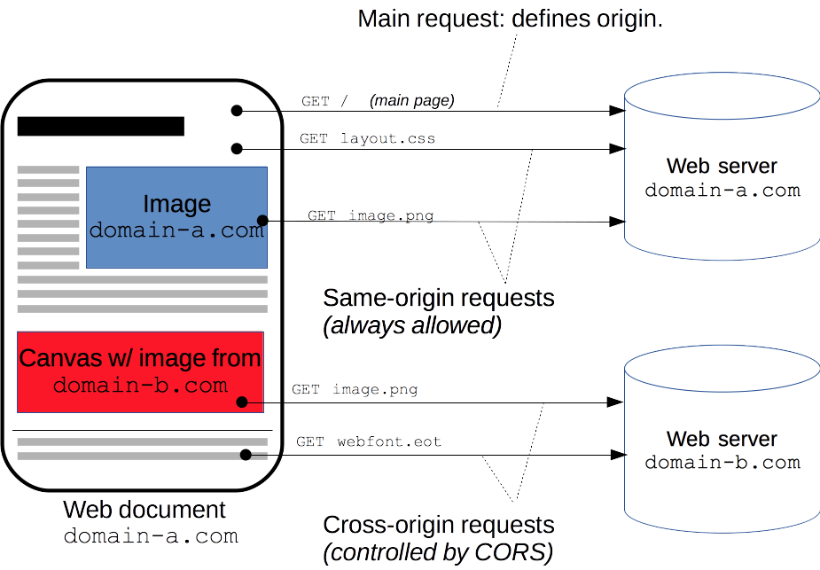
出于安全性，浏览器限制脚本内发起的跨源 HTTP 请求。例如，XMLHttpRequest 和 [Fetch API](https://developer.mozilla.org/zh-CN/docs/Web/API/Fetch_API) 遵循[同源策略](https://developer.mozilla.org/zh-CN/docs/Web/Security/Same-origin_policy)。这意味着使用这些 API 的 Web 应用程序只能从加载应用程序的同一个域请求 HTTP 资源，除非响应报文包含了正确** CORS 响应头**。

### CORS 响应头

前面提到 CORS 是一种基于 HTTP 头的机制，这些 HTTP 头决定了浏览器是否阻止前端 JavaScript 代码获取跨域资源请求的响应
[同源安全策略](https://developer.mozilla.org/zh-CN/docs/Web/Security/Same-origin_policy)默认阻止“跨源”获取资源。但是 CORS 给了 web 服务器这样的权限，即服务器可以选择，允许跨源请求访问到它们的资源。

#### CORS 标头

##### `Access-Control-Allow-Origin`

指示响应的资源是否可以被给定的来源共享。
**指令： \* | \<origin\> | null**
`*`
对于**不包含凭据**的请求，服务器会以“`*`”作为通配符，从而允许任意来源的请求代码都具有访问资源的权限。尝试使用通配符来响应包含凭据的请求会导致报错。
**凭据（Credentials）**通常是指 Cookie、HTTP 认证、TLS 客户端证书等敏感信息**Cookie**：当浏览器发送请求时，如果请求的域与设置了`HttpOnly`属性的 Cookie 所在的域匹配，浏览器会自动将这些 Cookie 附加到请求中。
**跨域请求携带凭据**：如果在 CORS 设置中，服务器响应头部包含了`Access-Control-Allow-Credentials: true`并且浏览器请求时设置了`withCredentials: true`，则浏览器在跨域请求时会将凭据（如 Cookie）一同发送给服务器。
`<origin>`
指定一个来源（只能指定一个）。如果服务器支持多个来源的客户端，其必须以与指定客户端匹配的来源来响应请求。
`null`
指定来源为 "null"
**备注：** null **不应该被使用**“返回 Access-Control-Allow-Origin: "null" 似乎是安全的，但任何使用非分级协议（如 data: 或 file:）的资源和沙盒文件的 Origin 的序列化都被定义为‘null’。许多用户代理将授予这类文件对带有 Access-Control-Allow-Origin: "null" 头的响应的访问权，而且任何源都可以用 null 源创建一个恶意文件。因此，应该避免将 ACAO 标头设置为‘null’值。”
**CORS 和缓存**
如果服务器指定了明确的来源（`<origin>`），那么为了向客户端表明服务器的返回会根据`Origin`请求标头而有所不同，必须在`Vary`响应标头中包含`Origin`

```http
HTTP/1.1 200 OK
Access-Control-Allow-Origin: https://developer.mozilla.org
Vary: Origin
```

[Vary - HTTP | MDN](https://developer.mozilla.org/zh-CN/docs/Web/HTTP/Headers/Vary) `Vary`决定了对于未来的一个请求头，应该缓存一个回复还是向原服务器请求一个新的回复。它被服务器用来表明在 [content negotiation](https://developer.mozilla.org/zh-CN/docs/Web/HTTP/Content_negotiation) algorithm（内容协商算法）中选择一个资源代表的时候应该使用哪些头部信息（headers）。

##### `Access-Control-Allow-Credentials`

指示当前请求的凭证标记为 true 时，是否可以公开对该请求响应。
用于在请求要求包含凭据（credentials）时，告知浏览器是否可以将请求的响应暴露给前端 JavaScript 代码。
当作为对**预检请求**的响应的一部分时，这能表示是否真正的请求可以使用 credentials。注意简单的[GET](https://developer.mozilla.org/zh-CN/docs/Web/HTTP/Methods/GET) 请求没有预检，所以若一个对资源的请求带了 credentials，如果这个响应头没有随资源返回，响应就会被浏览器忽视，不会返回到 web 内容。
`Access-Control-Allow-Credentials`标头需要与`XMLHttpRequest.withCredentials`或 Fetch API 的`Request()`构造函数中的`credentials`选项结合使用。Credentials 必须在前后端都被配置（即`Access-Control-Allow-Credentials`header 和 XHR 或 Fetch request 中都要配置）才能使带 credentials 的 CORS 请求成功。
**指令**
`true`唯一的有效值。

```http
HTTP/1.0 200 OK # 随便写的
Access-Control-Allow-Credentials: true
```

使用 credentials XHR

```javascript
var xhr = new XMLHttpRequest();
xhr.open('GET', 'http://example.com/', true);
xhr.withCredentials = true;
xhr.send(null);
```

Fetch

```javascript
fetch(url, {
  credentials: 'include',
});
```

---

跨源资源共享还通过一种机制来检查服务器是否会允许要发送的真实请求，该机制通过浏览器发起一个到服务器托管的跨源资源的“预检”请求（options）。在预检中，浏览器发送的头中标示有 HTTP 方法和真实请求中会用到的头。

同源策略的限制包括以下几点：

1. Cookie、LocalStorage和IndexDB限制：浏览器限制了在跨域请求中读取和写入Cookie、LocalStorage和IndexDB。
2. DOM访问限制：通过JavaScript，一个页面只能访问其所属的窗口或框架中的页面的DOM。不能直接操作跨域页面的DOM。
3. Ajax请求限制：使用XMLHttpRequest进行跨域请求时，浏览器会发出一个跨域请求预检（preflight）OPTIONS请求，服务器必须在响应中添加特定的CORS头部，才允许浏览器进行跨域请求。

为了允许跨域请求，CORS引入了一些机制：

1. 简单请求：对于某些请求，如果满足一定条件，浏览器允许简单请求的跨域访问，例如GET、POST、HEAD等不会携带特殊头部的请求。
2. 预检请求：对于复杂请求（例如携带自定义头部、使用某些特殊方法的请求等），浏览器会先发起一个OPTIONS预检请求，询问服务器是否允许实际请求，服务器必须返回适当的CORS头部以授权请求。
3. CORS头部：服务器在响应中添加CORS头部，例如Access-Control-Allow-Origin用于指定允许访问的域，Access-Control-Allow-Methods用于指定允许的HTTP方法，等等。
4. CORS携带凭证：在一些情况下，可以通过设置withCredentials来实现跨域请求携带凭证（如Cookie、HTTP认证等）。

需要注意的是，CORS仅限于浏览器环境，不会影响服务器之间的跨域通信。在服务器间通信的情况下，可以通过代理、JSONP等方式来处理跨域请求。

##### `Access-Control-Allow-Headers`

用于对预检请求的响应中，指示实际的请求中可以使用哪些 HTTP 标头。
如果请求中含有`Access-Control-Request-Headers`字段，那么这个首部是必要的。
注意以下特定首部是一直允许的：`Accept`,`Accept-Language`,`Content-Language`,`Content-Type`（只在值属于 **MIME 类型 **`application/x-www-form-urlencoded`,`multipart/form-data`或`text/plain`中的一种时）。这些被称作 **simple headers**，无需特意声明它们。
**指令 **
`*****`**（wildcard 通配符）**
对于没有凭据的请求（没有 HTTP cookie 或 HTTP 认证信息的请求），值"`*`"仅作为特殊通配符值。在具有凭据局的请求中，它被视为没有特殊语义的文字标头名称 "\*"。
**注意 **`**Authorization**`**标头不能使用通配符，并且始终需要明确列出。**
**语法**

```http
GET <url> HTTP/1.0 # 随便写的
Access-Control-Allow-Headers: <header-name>[, <header-name>]*
Access-Control-Allow-Headers: *
```

##### `Access-Control-Allow-Methods`

响应部首 `Access-Control-Allow-Methosd`在对 [preflight request](https://developer.mozilla.org/zh-CN/docs/Glossary/Preflight_request) （预检请求）的应答中明确了客户端所要访问的资源允许使用的方法或方法列表。
**指令**
`<method>` 用逗号隔开的允许使用的 [HTTP request methods](https://developer.mozilla.org/zh-CN/docs/Web/HTTP/Methods) 列表。
**语法**

```http
Access-Control-Allow-Methods: POST, GET, OPTIONS
```

##### `Access-Control-Expose-Headers`

允许服务器指示哪些响应标头可以暴露给浏览器中运行的脚本，以响应跨源请求。
默认情况下，仅暴露[ CORS 安全列表](https://developer.mozilla.org/en-US/docs/Glossary/CORS-safelisted_response_header)的响应标头，如果想要让客户端可以访问到其他的标头，服务器必须将它们在 `Access-Control-Expose-Headers` 里列出来。
**指令**
`**<header-name>**`允许客户端从响应中访问的 0 个或多个使用逗号分隔的标头名称
`*`（wildcard 通配符）若没有携带凭据才会被当做一个特殊的通配符。对于带有凭据的请求，会被简单地当作标头名称"`*`"，没有特殊的语义。不会匹配 `Authorization`，如果要暴露它需要显式指定。
**语法**

```http
Access-Control-Expose-Headers: *, Authorization
```

##### `Access-Control-Max-Age`

表示预检请求的结果可以被缓存多久。
**指令**
`**<delta-seconds>**`
返回结果可以被缓存的最长时间（秒）。在 Firefox 中上限是 24 小时（即 86400 秒）。在 Chromium v76 之前，上限是 10 分钟（即 600 秒），之后是 2 小时（即 7200 秒）。Chromium 同时规定了一个默认值 5 秒。如果值为 -1，则表示禁用缓存，则每次请求前都需要使用 OPTIONS 预检请求。
**语法**

```http
Access-Control-Max-Age: 600
```

##### `Access-Control-Request-Headers`

出现于 preflight request（预检请求）中，用于通知服务器在真正的请求中会采用哪些请求头。
**指令**
`**<header-name>**`在实际请求中将要包含的一系列 HTTP 头，以逗号分隔。
**语法**

```http
Access-Control-Request-Headers: <header-name>, <header-name>, ...
```

##### `Access-Control-Request-Method`

出现于 preflight request（预检请求）中，用于通知服务器在真正的请求中会采用哪种 HTTP 方法。因为预检请求所使用的方法总是 `OPTIONS`，与实际请求所使用的方法不一样，所以这个请求头是必要的。
**指令**
`**<method>**`一种 HTTP 请求方法，例如 GET、POST 或 DELETE。
**语法**

```http
Access-Control-Request-Method: POST
```

##### `Origin`

表示请求的**来源**（协议、主机、端口）。例如，如果一个用户代理需要请求一个页面中包含的资源，或者执行脚本中的 HTTP 请求（fetch），那么该页面的来源（origin）就可能被包含在这次请求中。
**指令**
`null`请求来源是“隐私敏感”的，或者是 HTML 规范定义的[不透明来源](https://developer.mozilla.org/en-US/docs/Web/HTTP/Headers/Origin#description)
`<scheme>`请求所使用协议，通常是 HTTP 协议或者它的安全版本（HTTPS 协议）。
`<hostname>`源站的域名或 IP 地址。
`port`（可选）服务器正在监听的端口号。缺省为服务器的默认端口（对于 HTTP 请求而言，默认端口为 80）。
描述Origin 标头与 [Referer](https://developer.mozilla.org/zh-CN/docs/Web/HTTP/Headers/Referer) 标头类似，但前者不会暴露 URL 的 path 部分，而且其可以为 null 值。其用于为源站的请求提供“安全上下文”，除非源站的信息敏感或不必要的。
从广义上讲，用户代理会在以下情况中添加 [Origin](https://developer.mozilla.org/zh-CN/docs/Web/HTTP/Headers/Origin) 请求标头：

- [跨源](https://developer.mozilla.org/zh-CN/docs/Glossary/CORS)请求。
- 除 [GET](https://developer.mozilla.org/zh-CN/docs/Web/HTTP/Methods/GET) 和 [HEAD](https://developer.mozilla.org/zh-CN/docs/Web/HTTP/Methods/HEAD) 以外的[同源](https://developer.mozilla.org/zh-CN/docs/Web/Security/Same-origin_policy)请求（即它会被添加到同源的 [POST](https://developer.mozilla.org/zh-CN/docs/Web/HTTP/Methods/POST)、[OPTIONS](https://developer.mozilla.org/zh-CN/docs/Web/HTTP/Methods/OPTIONS)、[PUT](https://developer.mozilla.org/zh-CN/docs/Web/HTTP/Methods/PUT)、[PATCH](https://developer.mozilla.org/zh-CN/docs/Web/HTTP/Methods/PATCH) 和 [DELETE](https://developer.mozilla.org/zh-CN/docs/Web/HTTP/Methods/DELETE) 请求中）。

除上述规则外，还有一些特殊情况。例如，在 [no-cors 模式](https://developer.mozilla.org/zh-CN/docs/Web/API/Request/mode#%E5%B1%9E%E6%80%A7%E5%80%BC)下的跨源 [GET](https://developer.mozilla.org/zh-CN/docs/Web/HTTP/Methods/GET) 或 [HEAD](https://developer.mozilla.org/zh-CN/docs/Web/HTTP/Methods/HEAD) 请求不会发送 Origin 标头。
Origin 标头在以下情况中（不完整）会被设置为 null：

- 请求来源的协议不是 http、https、ftp、ws、wss 或 gopher 中的任意一个（如：blob、file 和 data）。
- 跨源的图像或媒体，包括：\、\<video\> 和 \<audio\> 元素。
- 属于以下几种文档类型的：使用 createDocument() 创建的、通过 data: URL 生成的或没有创建者的浏览上下文的。
- 跨源重定向。
- 没有为 sandbox 属性设置 allow-same-origin 值的 iframe。
- 响应（response）是网络错误。

**语法**

```http
Origin: http://developer.mozilla.org
```

### CORS 使用场景

[跨域资源共享标准](https://fetch.spec.whatwg.org/#http-cors-protocol)允许在下列场景中使用跨站点 HTTP 请求：

- 由`XMLHttpRequest`或`Fetch API`发起的跨源 HTTP 请求（服务器端配置了对应 Header）
- Web 字体（CSS 中通过`@font-face`使用跨源字体资源），因此网站就可以发布 TrueType 字体资源，并只允许已授权网站惊醒跨站调用。
- WebGL 贴图
- 使用`drawImage()`将图片或者视频画面绘制到 canvas。
- 来自图像的 CSS 图形

### 功能概述

跨域资源共享标准通过一组 HTTP 头字段，允许服务器声明哪些源站通过浏览器有权限访问哪些资源。另外，规范要求，对那些可能对服务器产生副作用的 HTTP 请求方法（特别是`GET`以外的 HTTP 请求，或者搭配某些 MIME 类型的`POST`请求），浏览器必须先使用`OPTIONS`方法发起一个预检请求（preflight request），从而获知服务端是否允许该跨源请求。在预检请求的响应中，服务器也可以通知客户端，是否需要携带身份凭证（例如 Cookie 和 HTTP 认证相关的数据）。
CORS 请求会产生错误，但是为了安全，在 JavaScript 代码层无法感知到哪里出了问题，只能在浏览器控制台查看错误。

### 若干访问控制场景

#### 简单请求

某些请求不会触发 CORS 预检请求，在废弃的 CORS 中称这样的请求为简单请求，但是目前 Fetch 规范（CORS 现行定义规范）中不在使用这个词语。
其动机是，HTML 4.0 中的`form`元素（早于跨站`XMLHttpRequest`和`fetch`）可以向任何来源提交简单请求，所以任何编写服务器的人一定已经在保护跨域请求伪造攻击（CSRF）。
在这个假设下，服务器不必选择加入（通过响应预检请求）来接收任何看起来像表单提交的请求，因为 CSRF 的威胁不比表单提交的威胁差。然而，服务器仍然必须提供`Access-Control-Allow-Origin`的选择，以便与脚本共享响应。
若请求满足所有下述条件，则该请求可视为简单请求：

- 使用下列方法之一：
  - `GET`
  - `HEAD`
  - `POST`
- 除了被用户代理自动设置的标头字段（例如`Connection`、`User-Agent`或其他在 Fetch 规范中定义为**禁用标头**名称的标头），允许人为设置的字段为 Fetch 规范定义的对 CORS 安全的标头字段集合。该集合为：

  - `Accept`
  - `Accept-Language`
  - `Content-Language`
  - `Content-Type`（需要注意额外的限制）
  - `Range`（只允许简单的范围标头值如`bytes=256-`或`bytes=127-255`）
    > **备注：**Firefox 还没有将`Range`实现为安全的请求标头。

- `Content-Type`标头所指定的媒体类型的值仅限于下列三者之一：
  - `text/plain`
  - `multipart/form-data`
  - `application/x-www-form-urlencoded`
- 如果请求是使用`XMLHttpRequest`对象发出的，在返回的`XMLHttpRequest.upload`对象属性上没有注册任何事件监听器；也就是说，给定一个`XMLHttpRequest`实例`xhr`，没有调用`xhr.upload.addEventListener()`，以监听该上传请求。
- 请求中没有使用`ReadableStream`对象。
  > **备注： **WebKit Nightly 和 Safari Technology Preview 为`Accept`、`Accept-Language`和`Content-Language`标头字段的值添加了额外的限制 ([MDN](https://developer.mozilla.org/zh-CN/docs/Web/HTTP/CORS))。

#### 示例

站点`https://foo.example`的网页应用想要访问`https://bar.other`的资源。`foo.example`的网页中可能包含类似于下面的 JavaScript 代码：

```javascript
const xhr = new XMLHttpRequest();
const url = 'https://bar.other/resources/public-data/';

xhr.open('GET', url);
xhr.onreadystatechange = someHandler;
xhr.send();
```

此操作实行了客户端和服务器之间的简单交换，使用 CORS 标头字段来处理权限：
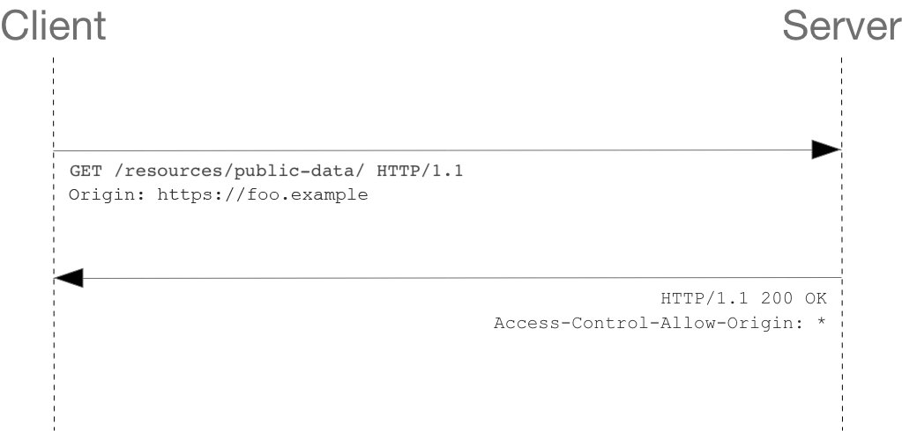
浏览器发送给服务器的请求报文：

```http
GET /resources/public-data/ HTTP/1.1
Host: bar.other
User-Agent: Mozilla/5.0 (Macintoosh; Intel Mac OS X 10.14; rv:71.0) Gecko/20100101 Firefox/71.0
Accept: text/html,application/xhtml+xml,application/xml;q=0.9,*/*;q=0.8
Accept-Language: en-us,en;q=0.5
Accept-Encoding: gzip,deflate
Connection: keep-alive
Origin: https://foo.example
```

请求字段`Origin`表明该请求来源于`http://foo.example`。
服务器的响应：

```http
HTTP/1.1 200 OK
DATE: Mon, 01 Dec 2008 00:23:53 GMT
Server: Apache/2
Access-Control-Allow-Origin: *
Keep-Alive: timeout=2, max=100
Connection: Keep-Alive
Transfer-Encoding: chunked
Content-Type: application/xml

[...XML Data...]
```

本例中，服务端返回的`Access-Control-Allow-Origin: *`标头表明该资源可以被任意外源访问。
也可以限制只能通过`https://foo.example`来访问

```http
Access-Control-Allow-Origin: https://foo.example
```

当响应的是**附带身份凭证的请求**时，服务端必须明确`Access-Control-Allow-Origin`的值，而不能使用通配符`*`。

#### 预检请求

与简单请求不同，“需要预检的请求”要求必须首先使用`OPTIONS`方法发起一个预检请求到服务器，以获知服务器是否允许该实际请求。“预检请求”的使用，可以避免跨域请求对服务器的用户数据产生未预期的影响。
如下是一个需要执行预检请求的 HTTP 请求：

```javascript
const xhr = new XMLHttpRequest();
xhr.open('POST', 'https://bar.other/resources/post-here/');
xhr.setRequestHeader('X-PINGOTHER', 'pingpong');
xhr.setRequestHeader('Content-Type', 'application/xml');
xht.onreadystatechange = handler;
xhr.send('<person><name>Arun</name></person>');
```

上面代码使用`POST`请求发送一个 XML 请求体，该请求包含了一个非标准的 HTTP `X-PINGOTHER`请求标头。这样的请求标头并不是 HTTP/1.1 的一部分，但通常对于 web 应用很有用处。另外，该请求的`Content-Type`为`application/xml`，且使用了自定义的请求标头，所以该请求需要首先发起“预检请求”。
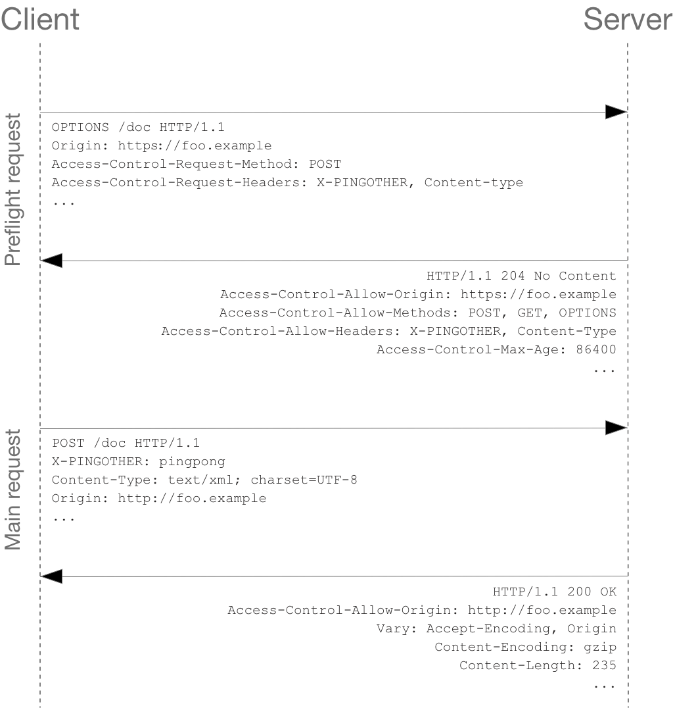

> 备注：如下所述，实际的`POST`请求不会携带`Access-Control-Request-*`标头，它们仅用于`OPTIONS`请求。

服务端和客户端完整的信息交互。首次交互式预检请求/响应：

```http
OPTIONS /doc HTTP/1.1
Host: bar.other
User-Agent: Mozilla/5.0 (Macintosh; Intel Mac OS X 10.14; rv:71.0) Gecko/20100101 Firefox/71.0
Accept: text/html,application/xhtml+xml,application/xml;q=0.9,*/*;q=0.8
Accept-Language: en-us,en;q=0.5
Accept-Encoding: gzip,deflate
Connection: keep-alive
Origin: https://foo.example
Access-Control-Request-Method: POST
Access-Control-Request-Headers: X-PINGOTHER, Content-Type
```

```http
HTTP/1.1 204 No Content
Date: Mon, 01 Dec 2008 01:15:39 GMT
Server: Apache/2
Access-Control-Allow-Origin: https://foo.example
Access-Control-Allow-Methods: POST, GET, OPTIONS
Access-Control-Allow-Headers: X-PINGOTHER, Content-Type
Access-Control-Max-Age: 86400
Vary: Accept-Encoding, Origin
Keep-Alive: timeout=2, max=100
Connection: Keep-Alive
```

从上面的报文中，我们看到，第 1 - 10 行使用`OPTIONS`方法发送了预检请求，浏览器根据上面的 JavaScript 代码片段所使用的请求参数来决定是否需要发送，这样的服务器就可以回应是否可以接受用实际请求参数来发送请求。OPTIONS 是 HTTP/1.1 协议中定义的方法，用于从服务器获取更多信息，是安全的方法。该方法不会对服务器资源产生影响。注意 OPTIONS 预检请求中同时携带了下面两个标头字段：

```http
OPTIONS / HTTP/1.1
Access-Control-Request-Method: POST
Access-Control-Request-Headers: X-PINGOTHER, Content-Type
```

两个字段告诉服务器实际请求将使用`POST`方法，携带两个自定义请求标头字段：`X-PINGOTHER`与`Content-Type`。服务器据此决定，该实际请求是否被允许。
响应报文中表明了服务器将接受后续的实际请求方法和请求头，并且限制了请求源。最后的`Access-Control-Max-Age`给定了该预检请求可供缓存的时间长短，单位为秒。在有效时间内，浏览器无需为同一请求再次发起预检请求。
预检请求完成后发送实际请求：

```http
POST /doc HTTP/1.1
Host: bar.other
User-Agent: Mozilla/5.0 (Macintosh; Intel Mac OS X 10.14; rv:71.0) Gecko/20100101 Firefox/71.0
Accept: text/html,application/xhtml+xml,application/xml;q=0.9,*/*;q=0.8
Accept-Language: en-us,en;q=0.5
Accept-Encoding: gzip,deflate
Connection: keep-alive
X-PINGOTHER: pingpong
Content-Type: text/xml; charset=UTF-8
Referer: https://foo.example/examples/preflightInvocation.html
Content-Length: 55
Origin: https://foo.example
Pragma: no-cache
Cache-Control: no-cache

<person><name>Arun</name></person>
```

```http
HTTP/1.1 200 OK
Date: Mon, 01 Dec 2008 01:15:40 GMT
Server: Apache/2
Access-Control-Allow-Origin: https://foo.example
Vary: Accept-Encoding, Origin
Content-Encoding: gzip
Content-Length: 235
Keep-Alive: timeout=2, max=99
Connection: Keep-Alive
Content-Type: text/plain

[Some XML payload]
```

#### 预检请求与重定向

并不是所有浏览器都支持预检请求的重定向。如果一个预检请求发生了重定向，一部分浏览器将报告错误。（旧版规范）
规避错误的配置方法

- 服务器端去掉对预检请求的重定向
- 将实际请求变成一个简单请求

其他方案

- 发送简单请求（使用`Response.url`或`XMLHttpRequest.respenseURL`）以判断真正的预检请求会返回什么地址
- 发出另一个请求（真正的请求），使用在上一步通过`Response.url`或`XMLHttpRequest.responseURL`获得的 URL。

不过，如果请求是由于存在`Authorization`字段而引发了预检请求，则这一方法将无法使用。这种情况之鞥呢由服务端进行更改。

#### 附带身份凭证的请求

`XMLHttpRequest`或`Fetch`与 CORS 的一个有趣的特性是，可以基于 HTTP cookies 和 HTTP 认证信息发送身份凭证。一般而言，对于跨源`XMLHttpRequest`或 Fetch 请求，浏览器不会发送身份凭证信息。如果需要发送，需要设置`XMLHttpRequest`对象的某个特殊标志位，或在构造`Request`对象时设置。
例：https://foo.example 的某脚本向 https://bar.other 发起一个 GET 请求，并设置 Cookies。在`foo.example`中可能包含如下代码：

```javascript
const invocation = new XMLHttpRequest();
const url = 'https://bar.other/resources/credentialed-content';

function callOtherDomain() {
  if (invovation) {
    invocation.open('GET', url, true);
    invocation.withCredentials = true;
    invocation.onreadystatechange = handler;
    invocation.send();
  }
}
```

第 7 行`withCredentials`标识设置为`true`，从而向服务器发送 Cookies。因为是简单地`GET`请求，因此不会发起预检请求。但如果服务器的响应中未携带`Access-Control-Allow-Credentials: true`浏览器将不会把响应内容返回给请求的发送者。
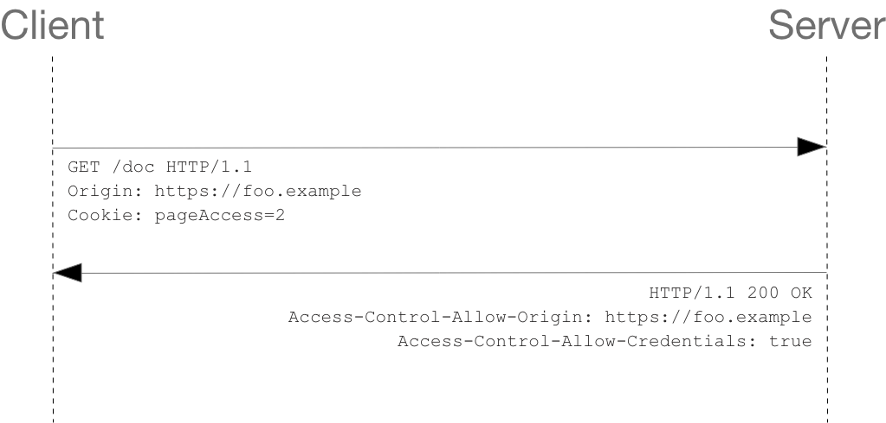
交互报文如下：

```http
GET /resources/credentialed-content/ HTTP/1.1
Host: bar.other
User-Agent: Mozilla/5.0 (Macintosh; Intel Mac OS X 10.14; rv:71.0) Gecko/20100101 Firefox/71.0
Accept: text/html,application/xhtml+xml,application/xml;q=0.9,*/*;q=0.8
Accept-Language: en-us,en;q=0.5
Accept-Encoding: gzip,deflate
Connection: keep-alive
Referer: https://foo.example/examples/credential.html
Origin: https://foo.example
Cookie: pageAccess=2
```

```http
HTTP/1.1 200 OK
Date: Mon, 01 Dec 2008 01:34:52 GMT
Server: Apache/2
Access-Control-Allow-Origin: https://foo.example
Access-Control-Allow-Credentials: true
Cache-Control: no-cache
Pragma: no-cache
Set-Cookie: pageAccess=3; expires=Wed, 31-Dec-2008 01:34:53 GMT
Vary: Accept-Encoding, Origin
Content-Encoding: gzip
Content-Length: 106
Keep-Alive: timeout=2, max=100
Connection: Keep-Alive
Content-Type: text/plain

[text/plain payload]
```

CORS 预检请求不能包含凭证。预检的响应必须指定`Access-Control-Allow-Credentials: true`来表明可以携带凭据进行实际的请求。

> **备注：** 一些企业认证服务要求在预检请求时发送 TLS 客户端证书，这违反了 [Fetch](https://fetch.spec.whatwg.org/#cors-protocol-and-credentials) 的规范。

#### 附带身份凭证的请求与通配符

响应附带身份凭证的请求时：

- `Access-Control-Allow-Origin`不能设为通配符`*`
- `Access-Control-Allow-Headers`不能设为通配符`*`
- `Access-Control-Allow-Methods`不能设为通配符`*`

注意 CORS 的响应中设置的 cookie 适用一般的第三方 cookie 策略。
在上面例子中，页面是在`foo.example`加载，但是第 19 行的 cookie 是被`bra.other`发送的，如果用户设置的浏览器拒绝所有的第三方 cookie，那么将不会被保存。
请求中的 cookie 也可能在正常的第三方 cookie 策略下被阻止。

### 前端开发环境的跨域处理

跨域是由于浏览器的同源策略引起的，因此我们可以通过搭建一个本地代理的方式来转发请求从而达到绕过浏览器同源策略的目的。（注意该方法只是用于本地开发时使用，上线仍需要服务端进行代理配置，通常是通过 Nginx 配置）
vite 和 webpack 都提供了解决方案，通过配置项启动一个本地 node 的代理服务来转发请求。

#### vite 配置

[Vite](https://cn.vitejs.dev/config/server-options.html#server-proxy)

```javascript
export default defineConfig({
  server: {
    proxy: {
      // 字符串简写写法： http://localhost:5173/foo => http://localhost:4567/foo
      '/foo': 'http://localhost:4567',
      // 带选项写法 http://localhost:5173/api/bar => http://jsonplaceholder.typicode.com/bar
      '/api': {
        target: 'http://jsonplaceholder.typicode.com',
        changeOrigin: true,
        rewrite: path => path.replace(/^\/api/, ''),
      },
      // 正则表达式式写法 http://localhost:5173/fallback/ => http://jsonplaceholder.typicode.com/
      '^/fallback/.*': {
        target: 'http://jsonplaceholder.typicode.com',
        changeOrigin: true,
        rewrite: path => path.replace(/^\/fallback/, ''),
      },
      // 使用 proxy 实例
      '/api': {
        target: 'http://jsonplaceholder.typicode.com',
        changeOrigin: true,
        configure: (proxy, options) => {
          // proxy 是 'http-proxy' 实例
        },
      },
      // 代理 websockets 或 socket.io 写法：ws://localhost:5173/socket.io => ws://localhost:5174/socket.io
      '/socket.io': {
        target: 'ws://localhost:5174',
        ws: true,
      },
    },
  },
});
```

#### webpack 配置

[DevServer | webpack 中文文档](https://webpack.docschina.org/configuration/dev-server/#devserverproxy)

```javascript
module.exports = {
  devServer: {
    proxy: {
      // /foo 的请求会被代理到目标地址
      '/foo': 'http://localhost:3000',
      '/api': {
        target: 'http://loaclhost:3000',
        pathRewrite: { '^/api': '' }, // 重写路径
        secure: false, // 允许接收没有证书的 HTTPS 请求
      },
      // 可以基于函数的返回值绕过代理
      // 返回 null 或 undefined 以继续使用代理处理请求。
      // 返回 false 会为请求产生 404 错误。
      // 返回提供服务的路径，而不是继续代理请求。
      '/fun': {
        target: 'http://localhost:3000',
        bypass: function (req, res, proxyOptions) {
          if (req.headers.accept.indexOf('html') !== -1) {
            console.log('Skipping proxy for browser request.');
            return '/index.html';
          }
        },
      },
    },
  },
};

// 多个路径代理到同一目标
module.exports = {
  //...
  devServer: {
    proxy: [
      {
        context: ['/auth', '/api'],
        target: 'http://localhost:3000',
      },
    ],
  },
};

// 默认情况下不会代理 root 的请求，应将 devMiddleware.index 选项设为 false
module.exports = {
  devServer: {
    devMiddleware: {
      index: false,
    },
    proxy: {
      context: () => true,
      target: 'http://localhost:1234',
    },
  },
};

// 默认情况下，代理会保留主机头的来源，可以将 changeOrigin 设置为 true 以覆盖此行为。
module.exports = {
  //...
  devServer: {
    proxy: {
      '/api': {
        target: 'http://localhost:3000',
        changeOrigin: true,
      },
    },
  },
};
```

#### Nginx 配置

```nginx
server {
    listen 80;
    server_name your-domain.com;

    location / {
        # 设置跨域请求头
        add_header Access-Control-Allow-Origin *;
        add_header Access-Control-Allow-Methods "GET, POST, OPTIONS";
        add_header Access-Control-Allow-Headers "DNT,User-Agent,X-Requested-With,If-Modified-Since,Cache-Control,Content-Type,Range,Authorization";

        # 转发请求到目标服务器
        proxy_pass http://target-server-address;
    }
}

```

### 代码实践

#### Hello world!

1. 安装 express.js
   1. `yarn init`
   2. `yarn add express`
2. 应用代码
   新建 app.js 写入下面代码

```javascript
const express = require('express');
const app = express();
const port = 3000;

app.get('/', (req, res) => {
  res.send('Hello World!');
});

app.listen(port, () => {
  console.log(`Example app listening on port ${port}`);
});
```

3. 启动程序
   运行 `node app.js` 控制台会打印出 'Example app listening on port 3000'
   打开浏览器，访问`[http://localhost:3000/](http://localhost:3000/)`即可看到程序响应 'Hello World!'

#### 使用 express-generator 搭建程序框架

- `npx express-generator`
- 启动服务
  - `DEBUG=myapp:* & yarn start`(在 zsh 中会报错，因为 '&' 是一个特殊字符表示将命令放入后台运行，可以使用分号分割命令，效果是相同的。）
  - `DEBUG=myqpp` 是配置环境变量用于调试
- 【可选】使用 nodemon 配置热更新，不配置热更新时每次修改后需要手动重启程序
  - `yarn add nodemon`
  - 添加 nodemon.json 配置

```json
{
  "watch": ["app.js", "routes/", "views/", "bin/"],
  "ext": "js,json",
  "ignore": ["node_modules/"]
}
```

- 使用 nodemon 启动程序 `nodemon ./bin/www`，也可配置在`package.json`中配置

```json
"scripts": {
  "start": "nodemon ./bin/www"
},
```

> 注意：热更新需要修改 bin 目录下的 www 文件名为 www.js，才能正确的监听变化

#### 服务端代码

查看服务端代码的目录结构如下
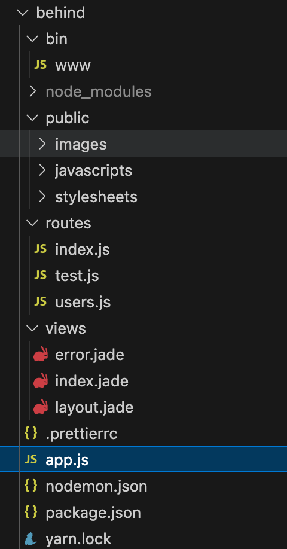
`bin/www` 是程序入口，http 服务在这个文件中创建并启动
`public/` 静态资源
`routes/` 子路由存放位置，程序 API 都以模块的形式组织在这个文件夹中
`views/` 存放视图模板（404 等基础页面）
`app.js` 程序主体，负责创建程序，挂载路由等操作

`bin/www` 的主要内容

```javascript
var app = require('../app');
var http = require('http'); // 引入 node http 模块

var port = normalizePort(process.env.PORT || '3000'); // 合法值处理
app.set('port', port); // 设置端口号

var server = http.createServer(app); // 创建 http 服务

server.listen(port); // 挂载服务
```

`app`的主要内容

```javascript
var express = require('express');
var path = require('path');
var cookieParser = require('cookie-parser');

var app = express();

// 挂载视图引擎
app.set('views', path.join(__dirname, 'views'));
app.set('view engine', 'jade');

// 添加中间件
app.use(express.json()); // 识别请求体中的 json
app.use(express.urlencoded({ extended: false })); // 识别请求体中的字符串和数字
app.use(cookieParser()); // 解析 cookie
// 这些解析结果最终都会添加到 req 中

// 静态文件路径映射，将 public 目录映射到 /static 上
app.use(
  '/static',
  express.static(path.join(__dirname, 'public'), {
    setHeaders: function (res, path, stat) {
      res.header('Access-Control-Allow-Origin', '*'); // 添加跨域请求的头
    },
  }),
);

// 引入路由配置
var indexRouter = require('./routes/index');
var usersRouter = require('./routes/users');
const testRouter = require('./routes/test');

// 挂载路由
app.use('/', indexRouter);
app.use('/users', usersRouter);
app.use('/api', testRouter);

// 捕获 404
app.use(function (req, res, next) {
  next(createError(404));
});

// 错误处理
app.use(function (err, req, res, next) {
  // set locals, only providing error in development
  res.locals.message = err.message;
  res.locals.error = req.app.get('env') === 'development' ? err : {};

  // render the error page
  res.status(err.status || 500);
  res.render('error');
});

module.exports = app;
```

#### get 请求

创建一个支持跨域的 `get` 请求只需要在 `response` 的 `header` 上添加对应的标识即可，`routes/test.js` 文件内容

```javascript
var express = require('express');
var router = express.Router();

/* GET home page. */
router.get('/', function (req, res, next) {
  // 允许跨域配置，get 的跨域请求也需要配置
  res.header('Access-Control-Allow-Origin', '*');
  res.send('success response');
});

module.exports = router;
```

前端 `axios` 请求代码

```javascript
// 跨域 get 请求
axios.get('/api', { params: { name: 'Ginlon' } }).then(res => {
  console.log(res.headers);
});
```

#### post 请求

服务端

```javascript
router.post('/update', function (req, res, next) {
  res.header('Access-Control-Allow-Origin', '*');
  res.send('success update');
});
```

前端

```javascript
axios.post('/api/update').then(res => {
  console.log(res.data);
});
```

简单地 post 请求依然可以通过配置 `Access-Control-Allow-Origin: *` 来进行跨域请求，但是我们的 post 请求携带参数时，如果只配置 `Access-Control-Allow-Origin` 仍然会被跨域拦截，并且可以看到浏览器发起了一个 `preflight` 预检请求
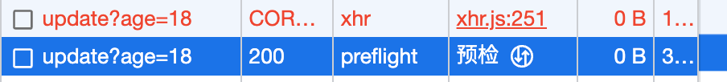
由于跨域机制是由 `http` 的 `header` 控制的因此通过对比两次 `post` 请求的 `header` 不难发现，携带参数的 `post`请求的 `header` 中多了一个 `Content-Type` 项，这是 axio 为了使服务端可以正确的解析字符串而自动添加的标识。
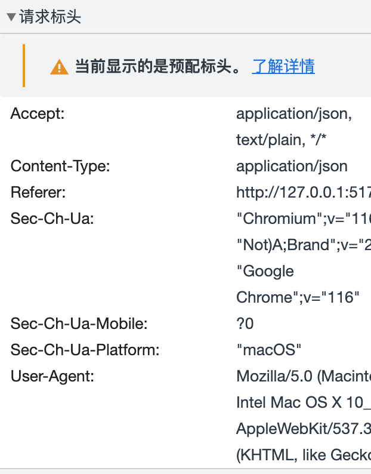
由于整个跨域系统都是基于 header 的，查看前面的 header 说明不难发现 `Access-Control-Allow-Headers`中的描述

> `Content-Type`只在值属于 **MIME 类型 **`application/x-www-form-urlencoded`,`multipart/form-data`或`text/plain`中的一种时，才被称作 **simple headers**，而无需特意声明

因此我们只要在服务端添加一个对应的 `options` 请求的配置说明即可

```javascript
router.options('/update', function (req, res, next) {
  res.header('Access-Control-Allow-Origin', '*'); // 是否允许跨域
  res.header('Access-Control-Allow-Headers', 'Content-Type'); // 允许携带的 header 标识
  res.send();
  res.end();
});
```

这样 `post` 请求就可以正常访问了。
为了知道 `ContentType` 的作用可以使用 `XMLHttpRequest` 自己创建一个 POST 请求，不添加`Content-Type`

```typescript
const xhr = new XMLHttpRequest();
xhr.onreadystatechange = function () {
  if (xhr.readyState === XMLHttpRequest.DONE && xhr.status === 200) {
    console.log(xhr.responseText);
  }
};
xhr.open('POST', 'http://localhost:3000/api/update', true);
xhr.send(
  JSON.stringify({
    name: 'Ginlon',
    age: '18',
  }),
);
```

可以在服务端使用 `console.log` 打印 `request.body` 来查看两次请求什么不一样

```javascript
router.post('/update', function (req, res, next) {
  console.log(req.body);
  res.header('Access-Control-Allow-Origin', '*');
  // 完成响应
  res.send('success response api');
  res.end();
});
```

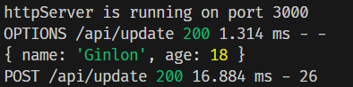
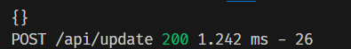
可以看到上面的日志是 axios 发出的带有 `Content-Type` 的 post 请求的输出，
下面是我们自己创建的 不带 `Content-Type` 的 post 请求，可以发现当缺少 `Content-Type` 时服务端负责解析的中间件就不能够识别到 request 中携带的数据。

#### vite 的跨域配置

由于 vite 服务器默认运行在 127.0.0.1:5137 端口，与服务器的 http://localhost:3000 不一致，因此会触发浏览器的跨域机制。
有两种解决方式，一是服务端进行配置，在接口中添加跨域相关的 http header，这样前端就可以直接访问服务器地址无需额外的处理。
服务端无法提供支持时，前端可以自己搭建服务器转发请求，再将结果返回给浏览器从而避免浏览器的跨域限制。
通过添加配置，vite 可以帮我们快速的搭建一个本地服务器转发请求。

```javascript
defineConfig({
  server: {
    proxy: {
      '/api': {
        target: 'http://localhost:3000',
        changeOrigin: true,
        rewrite: path => path.replace(/^\/api/, ''),
      },
    },
  },
});
```

只看配置似懂非懂，我们可以通过发起一个跨域请求，简单地分析一下 vite 是如何完成转发的
整个过程大体可以分为三步

1. 浏览器向 vite 服务器发送请求
2. vite 服务器接收请求并根据转发规则转发请求
3. vite 服务器收到响应，并将响应返回给浏览器

首先我们发起一个请求

```javascript
axios.get('/api/someApi');
```

> js 发起的 get 请求也会触发跨域，在地址栏中直接访问 get 地址不会跨域（因为不是 js 发起的请求，而是直接由浏览器内部进程发起的请求）

首先这个请求的地址并不是一个完整的 URL，因此浏览器会将它视为一个相对路径，而我们的页面根目录本就是 vite 服务器，于是就完成了第一步，浏览器向 vite 服务器发送请求，完整的请求地址可以在**网络**面板看到
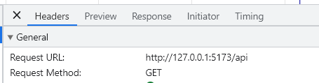
第二步，vite 接收到了来自浏览器的请求，于是 vite 会在 proxy 查找匹配的转发规则，当匹配到相应的转发规则时，vite 会根据相应的配置重新拼装路径（target、rewrite），然后使用 nodejs 的 http api 向目标地址发送请求。(websocket 和 https 同理)
第三步，vite 会收到服务器的响应，由于响应是由本地 vite 服务器接收，而不是浏览器，因此即使后端不添加跨域相关的 header，我们也可以拿到响应信息，然后 vite 会将响应返回给浏览器。
整个过程对浏览器而言就是在与本地的 vite 服务器进行交互，浏览器自始至终都只访问了`localhost:5173`因此也就不存在跨域问题了。

#### 携带 cookie 的跨域请求

> （个人理解，若有误区，欢迎指正）

同源请求时，服务端可以通过在响应头中添加`Set-Cookie`字段来设置 cookie

```javascript
router.get('/setCookie', function (req, res, next) {
  res.cookie('remember-me', '2', {
    expires: new Date(Date.now() + 900000),
  });
  res.send();
});
```

查看 http 的 response 头可以看到`Set-Cookie`字段，其包含了要设置的属性值和一些配置选项，具体每个配置的作用就不在此赘述。

`Set-Cookie`会被浏览器从响应头中过滤掉，而不传给 javascript 脚本，但依然可以通过 `document.cookie` 访问到 cookie，如果不想前端访问 cookie 则可以在发送 cookie 时设置`httpOnly`属性，这样前端就无法通过 document.cookie 访问和修改对应的 cookie。

> 注意：我们本地启动的前端地址和服务端地址并不同源，因此我们可以通过配置 vite 的 server.proxy 实现转发请求，从而绕过跨域机制，完成同源设置 cookie 的请求。

上面的方法只能用于同源的请求，当跨域时即使服务端添加了`Access-Control-Allow-Origin`也不能通过`Set-Cookie`实现跨域的 cookie 设置，浏览器会自动过滤掉相关的 header。
为了限制 cookie 的滥用，浏览器禁止了跨域传递 cookie，当想要跨域传递 cookie 时则必须设置`SameSite`属性，只有当`SameSite`设置为`None`时才能够跨域传递 cookie，现在设置`SameSite=None`属性的 cookie 必须同时设置`Secure`属性，也就是说只能用于安全上下文（https）。

> 创建 https 服务，需要使用证书和密钥，自己的 demo 可以通过自签名证书来提供 https 服务。
> 即使使用了 https 服务也只是能够与当前跨域站点通信时设置和携带 cookie，这些 cookie 仍然不会在第三方请求时携带。

#### img 和 canvas 的跨域问题

通常 img 标签加载的图像数据不与 Javascript 交互，因此 img 标签是被允许加载跨域图像的，但是如果想要通过 Javascript 访问图像数据时就会被浏览器的跨域策略阻止，比如使用 canvas 的 `getImageData` api 访问图像数据时浏览器会报出如下错误

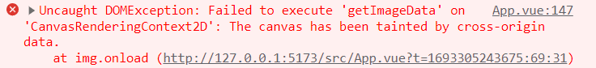

如果想要 canvas 可以访问 img 中的图像数据，就需要配置 img 标签的`crossorigin`属性，添加了`corssorigin`属性的图像会使用 CORS 完成图像资源的抓取，通过 CORS 获取到的图像不会被标记为“污染(tainted)”，便可以使用 Javascript 访问图像的数据。
`crossorigin`允许的值：
`anonymous`发送忽略凭据的跨域请求（不携带 cookie，X.509证书或`Authorization`标头）
`use-credentials`发送携带凭据的跨域请求，如果服务端没有配置`Access-Control-Allow-Credentials:true`响应标头浏览器会将图片标记为被污染，且限制对图像数据的访问。
类似的 video、audio、svg 标签也存在同样地问题，video、audio 也有`crossorigin`属性，前端使用了`crossorigin`属性后服务端也需要添加对应的 header。
