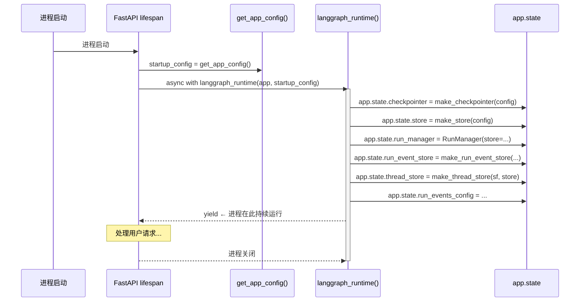
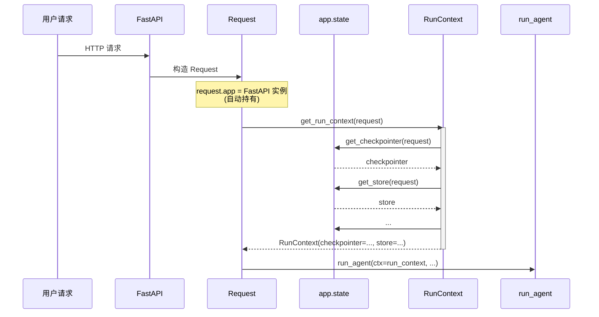

## 完整的依赖注入链路

### 启动时：创建单例并挂载



### 请求时：从 app.state 取出



---

## FastAPI 的 app.state 机制

`app.state` 是 FastAPI 提供的**应用级共享命名空间**：

- **进程级单例**：整个进程只有一个 FastAPI 实例，`app.state` 上的属性对所有请求可见
- **类型无关**：可以挂任意 Python 对象
- **自动引用**：每个 `Request` 通过 `request.app` 持有 FastAPI 实例的引用

```python
# _require() 工厂函数生成 getter
def _require(attr, label):
    def dep(request: Request):
        val = getattr(request.app.state, attr, None)
        if val is None:
            raise HTTPException(503, detail=f"{label} not available")
        return val
    return dep

# 生成各种 getter
get_checkpointer = _require("checkpointer", "Checkpointer")
get_run_manager = _require("run_manager", "Run manager")
```

---

## RunContext 字段详解

```python
@dataclass(frozen=True)
class RunContext:
    checkpointer: Any                     # 必填：状态快照存储
    store: Any | None = None              # 跨线程 KV 存储
    event_store: Any | None = None        # 事件流存储
    run_events_config: Any | None = None  # 事件存储配置快照
    thread_store: Any | None = None       # 线程元数据存储
    app_config: AppConfig | None = None   # 应用配置（每次请求新鲜）
```

### 三种"新鲜度"

| 类别 | 字段 | 生命周期 |
|------|------|---------|
| **启动时冻结** | checkpointer, store, event_store, thread_store | 进程级单例，重启才换 |
| **启动时冻结的配置** | run_events_config | 与 event_store 配对 |
| **每次请求重新解析** | app_config | 通过 `get_app_config()` 热重载 |

### 为什么 run_events_config 也要传？

三个原因：

**#1：部分配置不在 store 里**

`track_token_usage` 影响 RunJournal 的行为，不影响 event_store 的存储行为——store 实例不持有这个标志。

**#2：配置热重载的一致性陷阱**

如果用热重载后的新 config 去操作旧 store：
- 新 config 说 `backend=db`
- 但 store 还是 `MemoryRunEventStore`
- 用户以为数据写库了，其实还是内存

所以 `run_events_config` 也冻结在启动时，与 `event_store` 严格配对。

**#3：显式依赖优于隐式全局**

`RunJournal` 直接从 `ctx.run_events_config` 读取，不必再次查 `app.state`。

### 为什么 AppConfig 不冻结？

`AppConfig` 故意每次请求都走 `get_app_config()` 热重载，因为用户可能随时编辑 `config.yaml` 中的模型列表、token 限制等字段——这些不需要重启就能生效。
但 checkpointer / event_store 等持有连接和句柄，热重载就要重建连接，会断掉所有正在跑的对话。

---

## 资源生命周期管理

`AsyncExitStack` 保证有序清理：

```python
async with AsyncExitStack() as stack:
    app.state.stream_bridge = await stack.enter_async_context(make_stream_bridge(config))
    app.state.checkpointer = await stack.enter_async_context(make_checkpointer(config))
    app.state.store = await stack.enter_async_context(make_store(config))
    ...
    yield
    # 进程退出时：stack 按后进先出顺序关闭所有资源
    # 1. 关闭 store 连接
    # 2. 关闭 checkpointer 连接
    # 3. 关闭 stream_bridge
```

每个 `enter_async_context()` 返回的对象都会在 stack 退出时自动调用 `__aexit__()`，关闭底层连接。
