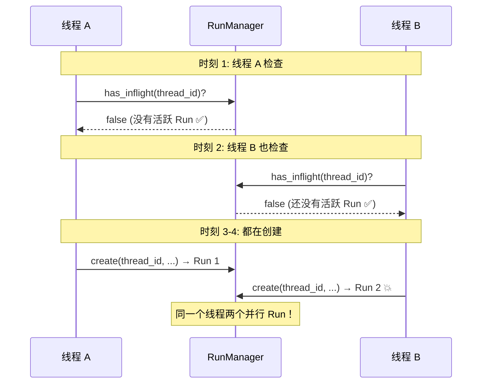
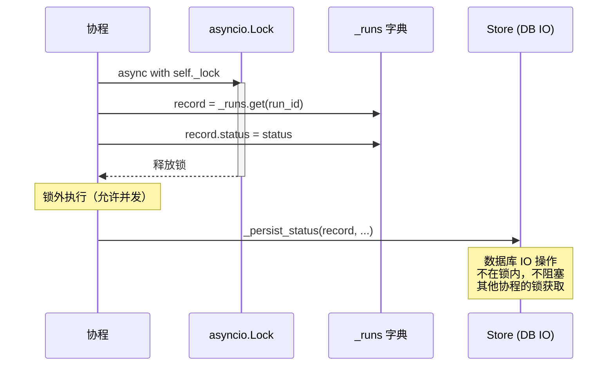

## TOCTOU 竞态条件

### 定义

**TOCTOU = Time-Of-Check-To-Time-Of-Use**（检查时与使用时之间的时间差）。

检查一个条件和基于该条件采取行动之间有时间间隙，另一个并发操作在这个间隙中改变了状态。

### DeerFlow 中的例子

假设没有 `create_or_reject()`，分两步操作：



### 解决方案：原子操作

`create_or_reject()` 把检查和创建放在同一把 `asyncio.Lock` 内：

```python
async with self._lock:
    inflight = [r for r in ... if r.status in (pending, running)]
    if inflight:
        raise ConflictError(...)
    self._runs[run_id] = record
    await self._persist_new_run_to_store(record)
```

检查和创建之间没有间隙——其他协程无法在中间插入。

---

## asyncio.Lock

### asyncio.Lock vs threading.Lock

| | asyncio.Lock | threading.Lock |
|---|---|---|
| 保护对象 | 协程（单线程内的并发） | 线程（真正的并行） |
| 阻塞方式 | `await`（不阻塞线程） | 阻塞线程 |
| 适用场景 | async 代码 | 多线程代码 |

DeerFlow 的 Gateway 是异步的（FastAPI + asyncio），所以用 `asyncio.Lock`。

### 锁的范围

锁保护的是 **对 `_runs` 字典的读写**，不包括后续的 store 操作（store 操作在锁外执行）：



这样设计是因为 store 操作涉及数据库 IO，持锁时间太长会影响并发性能。

---

## SQLite 锁竞争重试

SQLite 的写者是互斥的——一次只能有一个写者。并发写入会出现 "database is locked" 错误。

### 重试策略

```python
@dataclass(frozen=True)
class PersistenceRetryPolicy:
    max_attempts: int = 5
    initial_delay: float = 0.05    # 50ms
    max_delay: float = 1.0         # 最大 1s
    backoff_factor: float = 2.0    # 每次翻倍
```

延迟序列：50ms → 100ms → 200ms → 400ms → 800ms → 放弃

```python
async def _call_store_with_retry(self, operation_name, run_id, operation):
    policy = self._persistence_retry_policy
    attempt = 1
    delay = policy.initial_delay
    while True:
        try:
            return await operation()
        except Exception as exc:
            retryable = _is_retryable_persistence_error(exc)
            if attempt >= policy.max_attempts or not retryable:
                raise
            await asyncio.sleep(delay)
            delay = min(policy.max_delay, delay * policy.backoff_factor)
            attempt += 1
```

### 识别可重试的错误

遍历异常链，检查：
- 错误消息包含 "database is locked" / "database table is locked"
- 错误码是 `SQLITE_BUSY` 或 `SQLITE_LOCKED`

---

## Postgres Advisory Lock

在 DbRunEventStore 中，保证 seq 严格递增需要串行化对同一 thread_id 的写入。

### 问题

Postgres 不支持 `SELECT max(seq) FOR UPDATE`（聚合结果不是可锁定的行）。

### 解决方案：事务级 Advisory Lock

```python
if dialect == "postgresql":
    await session.execute(
        text("SELECT pg_advisory_xact_lock(hashtext(:thread_id))"),
        {"thread_id": thread_id},
    )
```

- `pg_advisory_xact_lock()` 是 Postgres 提供的应用级锁
- 锁的生命周期 = 事务的生命周期
- 锁的 key 由 `thread_id` 哈希得到——不同线程不互相阻塞

### 对比 SQLite 方案

```python
# SQLite: SELECT ... FOR UPDATE 行锁
return await session.scalar(stmt.with_for_update())
```

---

## JSONL 文件的并发写入

JsonlRunEventStore 用 per-thread `asyncio.Lock` 串行化写入：

```python
self._write_locks: dict[str, asyncio.Lock] = {}

async def put(self, *, thread_id, ...):
    async with self._get_write_lock(thread_id):
        seq = self._next_seq(thread_id)
        await asyncio.to_thread(self._write_record, record)
```

保证同一个 JSONL 文件不会被两个协程同时追加——避免行交叉。

---

## 并发安全设计总结

| 场景 | 保护机制 | 保护粒度 |
|------|---------|---------|
| RunManager 操作 `_runs` | `asyncio.Lock` | 全局一把锁 |
| SQLite 写入竞争 | 指数退避重试 | 自动重试 |
| Postgres seq 原子性 | `pg_advisory_xact_lock` | per-thread |
| JSONL 文件写入 | per-thread `asyncio.Lock` | per-thread |
| create_or_reject 原子性 | `asyncio.Lock` 包裹 check + create | 全局一把锁 |

DeerFlow 的并发设计原则：
1. **锁的粒度尽量小**——只在必要时持锁，IO 操作放在锁外
2. **区分可重试和不可重试错误**——只对瞬态错误重试
3. **单进程内用 asyncio.Lock**——Gateway 是单进程异步的
4. **多进程靠数据库事务**——Postgres 的 MVCC 和 advisory lock 处理分布式场景
