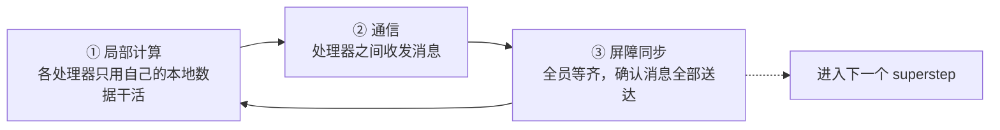
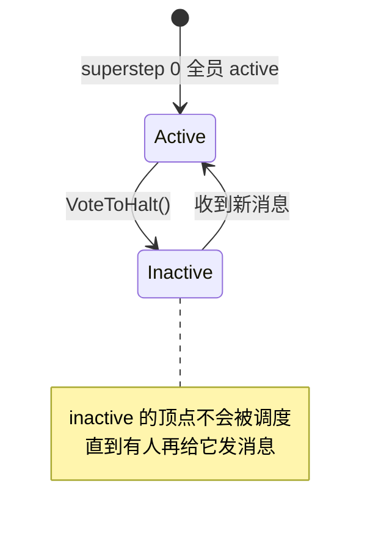
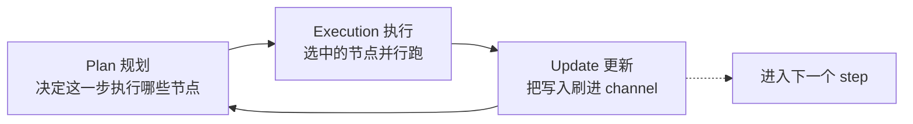

## 一句话定义

**LangGraph 的调度内核源自 BSP（1990）→ Pregel（2010）这条思想线**：把"一批节点并行跑、全部跑完才能进下一步"作为基本调度律。理解这两个模型，能解释你之前在 checkpointer / store / interrupts 笔记里看到的几乎所有现象——为什么节点能并行、为什么有 barrier、为什么 channel 更新要等到下一步才可见。

这篇番外篇是回溯根基：先讲 BSP 与 Pregel 本身，再用一节把它们映射回 LangGraph。

---

## 为什么需要"批量同步并行"

先退一步问：多台处理器一起干活时，最痛的是什么？

答案是**不可预测**。一旦允许任意节点在任意时刻读写共享数据、给任意对端发消息，数据竞争、死锁、执行顺序依赖就会铺天盖地——程序可能在千台机器上跑出千种结果，调试时几乎无从复现。

BSP（Bulk Synchronous Parallel，批量同步并行）给出的解法很朴素：**用"分步走 + 全员等齐"换"可预测性"**。

类比一家**工厂流水线吹哨制**：工人们各自在自己的工位干活，互不干扰；哨声一响，所有人必须停下交班，谁没干完都得等，等齐了再一起进入下一轮。这样一来，每轮内部的并行是自由的，但轮与轮之间的边界是清晰、可预测的。

这个"吹哨"就是后面要反复出现的核心概念——**屏障同步（barrier）**。

---

## BSP 模型本体

### 三要素

BSP 把一台"虚拟并行机"抽象成三样东西：

| 要素 | 含义 | 通俗解释 |
|---|---|---|
| **处理器 + 本地内存** | p 台处理器，每台有自己的本地内存 | 每个工人有自己的工作台和私藏工具 |
| **通信网络** | 连接所有处理器的网络，用于点对点消息传递 | 工人之间能互相递东西的传送带 |
| **屏障同步机制** | 一个全局栅栏，所有处理器到此同步 | 工厂吹哨，全员停手等齐 |

### Superstep 与三阶段

BSP 的计算被切成一串 **superstep（超步）**，每个 superstep 固定走三个阶段：



这套循环里藏着 BSP 的灵魂语义，后面 Pregel 和 LangGraph 都会复用它：

> **在 superstep N 发出的消息，只能在 superstep N+1 被看到。**

也就是说，同一轮里你发给别人的东西，别人这一轮读不到，要等下一轮才开始处理。这条规则看起来"低效"，但它**天然消除了数据竞争**——因为没有"同时读写同一份数据"这回事了。

### 参数与成本公式

BSP 用三个参数刻画一台并行机的"性格"：

| 参数 | 含义 |
|---|---|
| **p** | 处理器数量 |
| **g**（gap） | 通信带宽成本：网络每传一个数据字所需时间，相对本地计算的比值。g 越大，"传东西"越贵 |
| **L**（latency） | 同步延迟：连续两次屏障同步之间的最小间隔，即一次栅栏的固定开销 |

单个 superstep 的成本公式（注意：这里只**用**公式，不推导）：

$$\text{cost}_i = w_i + h_i \cdot g + L$$

逐项拆解：

- $w_i$：这一轮里**最慢的那个处理器**算了多久。木桶效应——一轮的快慢由最慢的人决定。
- $h_i$：这一轮**通信量最大的处理器**单方向收发的消息量。
- $g$、$L$：上面两个机器参数。

**一个微型示例**：3 个处理器、跑 2 个 superstep。假设第 1 轮三人分别算了 5s / 3s / 4s，那么 $w_1 = 5$（取最大值），那 2s 算得快的人只能干等。这就是 BSP 最常被诟病的地方——**负载不均时，快的人会被慢的人拖住**。

把所有 $S$ 个 superstep 的成本加起来就是总耗时：$T = \sum_{i=1}^{S}(w_i + h_i \cdot g + L)$。程序员只要控制住 $w$、$h$、$g$、$L$ 这几个量，就能在写代码时预测性能。

### 优缺点

**优点**

- **可预测**：三个参数就能算出成本，便于性能建模。
- **可移植**：换一台机器只换参数，算法不变。
- **无死锁、无数据竞争**：N→N+1 的消息时序自带顺序保证。

**缺点**

- **同步开销硬**：每轮末尾必须全员屏障等待，栅栏是躲不掉的固定成本。
- **负载不均会被放大**：最慢的人拖垮整轮，`L` 越大、越不均，浪费越严重。

**适合的问题**：迭代型、可分块的批量计算——数值线性代数、图算法（PageRank 这类）、大规模搜索、矩阵运算。**不适合**细粒度、低延迟的"一问一答"交互场景。

---

## Pregel：BSP 落到图计算上

1990 年的 BSP 是抽象模型，真正让它大规模落地的，是 Google 2010 年的 **Pregel** 系统（Malewicz 等，SIGMOD 2010）。论文开宗明义：*"The high-level organization of Pregel programs is inspired by Valiant's Bulk Synchronous Parallel model."* —— Pregel 就是 BSP 在图计算上的具体实例化。

题外话：Pregel 这个名字来自欧拉著名定理"柯尼斯堡七桥"里的那条河，致敬图论的祖师爷。

### 核心思想：Think Like a Vertex

Pregel 的编程范式叫 **vertex-centric（以顶点为中心）**：你只需要写"如果我是图里的一个顶点，在这一步我该干什么"，系统负责把它扩展到全图数十亿个顶点上。论文管这叫 *think like a vertex*。

和 MapReduce 对比一下就清楚了：MapReduce 本质是无状态的函数式流水线，每一步都要**把整张图的状态序列化后搬给下一步**；而 Pregel 让顶点**常驻在执行机器上，只传消息**，通信开销大幅降低。

### 顶点在一个 Superstep 里做什么

每个 active 顶点在每个 superstep 能干 5 件事：

| 行为 | 说明 | 可见性 |
|---|---|---|
| 读 | 读取上一轮收到的所有消息 | 上轮的消息这轮才能读 |
| 算 | 执行自己的 `Compute()`，可改自己的值和出边的值 | 修改立即对本顶点可见 |
| 发 | 给任意已知 ID 的顶点发消息 | **这些消息要到下一轮才送达** |
| 改拓扑 | 发出增删顶点/边的请求 | 下一轮生效 |
| 投票休眠 | `VoteToHalt()`，标记自己"干完了" | 本轮后转为 inactive |

`Compute()` 的伪代码骨架长这样：

```text
// 顶点 V 在 superstep S 的行为
function Compute(incomingMessages):
    // 1. 用上轮收到的消息更新自己
    updateMyValue(incomingMessages)

    // 2. 把新结果沿出边发给邻居
    for edge in myOutEdges:
        SendMessageTo(edge.target, computePayload())

    // 3. 如果收敛了，宣布自己没活了
    if converged:
        VoteToHalt()
```

注意 `SendMessageTo` 的语义：你在 superstep S 发出去的消息，邻居要到 **superstep S+1 调用 `Compute()` 时才收得到**。这完全是 BSP 的 N→N+1 时序。论文特意强调，正是因为这种纯消息传递 + 跨轮可见，"Pregel 程序天然无死锁、无数据竞争"。

### Vote to Halt：顶点状态机

每个顶点有两个状态：**active** 和 **inactive**。



通俗类比：**每个顶点像装了闹钟的工人**——"没我事了我就睡觉，但只要有人给我发消息，我就会被叫醒重新上岗"。一个顶点 halt 之后并非永久退出，一旦收到消息会被重新激活，需要再次 halt。

**全局终止条件**：所有顶点同时处于 inactive **且** 没有任何消息在途。两个条件缺一不可——否则某个睡着的顶点可能马上被一条还在路上的消息叫醒。

### 迷你例：PageRank

PageRank 是 Pregel 最经典的演示。每个顶点的 `Compute()` 长这样：

```text
// superstep 0：每个顶点初始 rank = 1/总顶点数
function PageRankCompute(incomingMessages):
    // 收上轮邻居传来的 rank 贡献，求和
    sum = 0
    for msg in incomingMessages:
        sum += msg.value

    // 经典 PageRank 公式
    myRank = 0.15 / NumVertices + 0.85 * sum
    myValue = myRank

    // 把自己的 rank 均分给出边邻居
    share = myRank / myOutEdges.length
    for edge in myOutEdges:
        SendMessageTo(edge.target, share)

    // 跑够 30 轮（或用 aggregator 判断收敛）就睡
    if superstep >= 30:
        VoteToHalt()
```

整个过程清晰展示了 Pregel 的节奏：superstep 0 大家都 active、各自发消息；superstep 1 每个顶点收到邻居上轮发的贡献、算出新 rank、再发出去；如此迭代，直到所有顶点都 halt。论文实测，在 **10 亿顶点、1270 亿条边、800 个 worker** 的规模上，跑完单源最短路径大约只要 **10 分钟**——这正是 vertex-centric + BSP 调度的威力。

---

## LangGraph：借了骨架，换了血肉

LangGraph 的官方文档说得很直白：它的运行时以 Pregel 命名，"Pregel organizes the execution of the application into multiple steps, following the Pregel Algorithm / Bulk Synchronous Parallel model"。

但要注意，LangGraph **没有照搬 Pregel 的全部**——它只借了 BSP/Pregel 的**调度律**，然后把血肉（顶点、消息、图批处理）全换成了 LLM 应用里的东西。

### 借了什么：调度律

LangGraph 的一个 step（也就是一个 superstep）固定走三个阶段：



把它和 BSP 的三阶段并排看，对应关系一目了然：

| BSP 三阶段 | LangGraph 三阶段 | 对应关系 |
|---|---|---|
| 局部计算 | Plan + Execution | 选节点、并行跑 Runnable |
| 通信 | Execution（写 channel） | 各节点把结果写进 channel 暂存 |
| 屏障同步 | Update | 所有节点完成后才统一刷 channel、进入下一步 |

关键是中间那条规则，LangGraph 文档原话：*"channel updates are invisible to actors until the next step"*——**本步写的 channel 更新，对其它节点不可见，要等下一步才能读到**。这正是 BSP/Pregel 的 N→N+1 消息时序。

有了这个对应，之前笔记里的几个"为什么"就都通了：

- **为什么并行节点跑完才能进下一步？** → 因为 barrier，Update 阶段必须等 Execution 里所有节点完成。
- **为什么 channel 更新要等到下一步才可见？** → 因为 N→N+1 时序，本步的写在本步对别人不可见。
- **为什么 interrupt 能跨请求恢复？** → checkpointer 的存档点就落在 barrier 之后，所以每次恢复都是从一个完整的 superstep 边界继续。

### 换了什么：血肉

| 维度 | 原版 Pregel（Google） | LangGraph |
|---|---|---|
| 领域 | 大规模图数据批处理（PageRank、最短路径） | LLM 应用编排（Agent、工具调用、多步推理） |
| 计算单元 | 顶点的 `Compute()` 函数 | 节点（封装 LLM/工具/子图等的 Runnable） |
| 状态载体 | 顶点值 + 边值 + 消息 | Channel（更通用的状态容器） |
| 通信方式 | `SendMessageTo`，需指定目标顶点 ID | Channel 读写，Pub/Sub 式，无需点名 |
| 规模 | 数十亿顶点、数千台机器 | 单机或小集群，常一条 thread |

最值得说的是 **channel**：它是 Pregel"消息"概念的**泛化**。Pregel 只有点对点消息，而 LangGraph 的 channel 有不同形态——`LastValue`（只保留最后一次写，类似覆盖式寄存器）、`BinaryOperatorAggregate`（用二元算子累积，类似把多条消息归约成一个值）。换句话说，Pregel 的"收一束消息算一次"在 LangGraph 里被抽象成了 channel + reducer，更灵活。

---

## 三列对照表

把前面三部分串起来：

| BSP 原始概念 | Pregel 实例化（Google 2010） | LangGraph 映射 |
|---|---|---|
| 处理器 + 本地内存 | 顶点 + 顶点值/边值（持久跨 superstep） | 节点（PregelNode）+ 其读写的 channel |
| 通信网络（点对点） | `SendMessageTo` 指定目标顶点 | Channel 读写（Pub/Sub 式） |
| Superstep（超步） | Pregel superstep | LangGraph step |
| 局部计算阶段 | 顶点跑 `Compute()` | Plan + Execution：选中的节点并行跑 |
| 通信阶段 | 异步批量发消息 | Execution 期间各节点写 channel（暂存） |
| 屏障同步阶段 | master 等 worker 完成 | Update：所有节点完成后才刷 channel |
| N→N+1 消息时序 | S 发的消息 S+1 才收到 | 本步 channel 更新下一步才可见 |
| 参数 p（处理器数） | worker / 分区数 | 同一 step 内并行执行的节点数 |
| 参数 g（通信成本） | 消息序列化与传输开销 | channel 序列化/checkpoint 开销 |
| 参数 L（同步延迟） | superstep 间 barrier 等待 | 一个 step 末尾等最慢节点完成 |
| Vote to halt | 顶点休眠，收消息复活 | 节点本轮不被 Plan 选中即停 |
| 全局终止 | 所有顶点 inactive 且无消息在途 | 没有 node 被选中，或达到最大步数 |
| 容错 | checkpoint + 恢复 | checkpointer（InMemorySaver 等） |
| 典型负载 | PageRank、最短路径、连通分量 | Agent 循环、工具调用、多步 LLM 推理 |

---

## 一句话总结

LangGraph 之所以能让 LLM 节点安全并行、可中断恢复、状态可追溯，根子都在 1990 年 Valiant 那篇 BSP 论文里——**分步走、等齐再走、跨步传消息**。Pregel 把这套调度律落到了图计算上，LangGraph 又把它借到了 Agent 编排上。理解了这条思想线，前面 checkpointer / store / interrupts 笔记里的种种机制，就都不再是孤立的知识点了。
