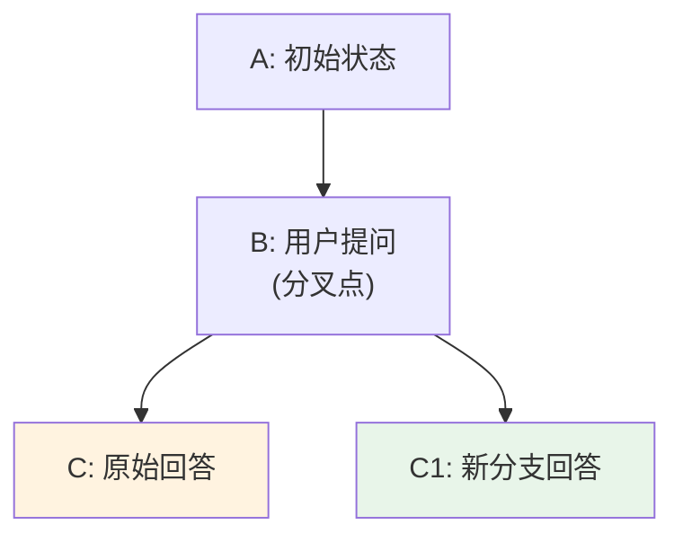
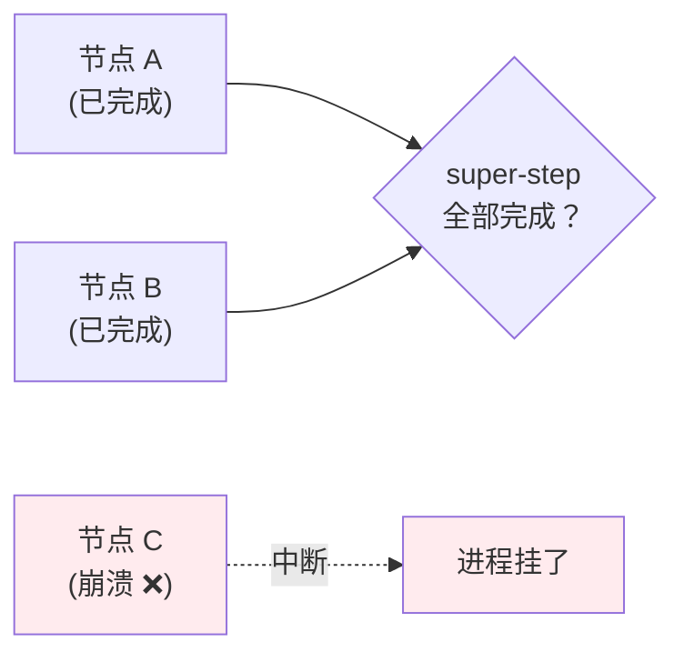
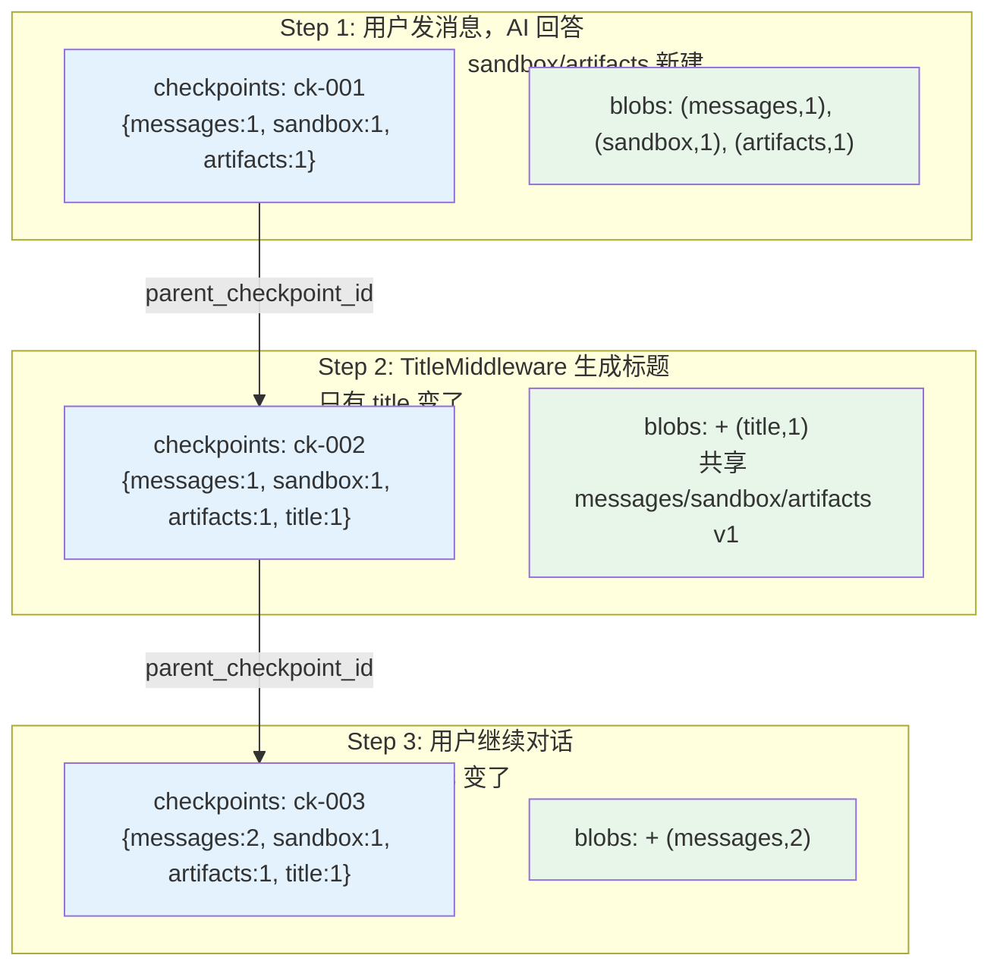
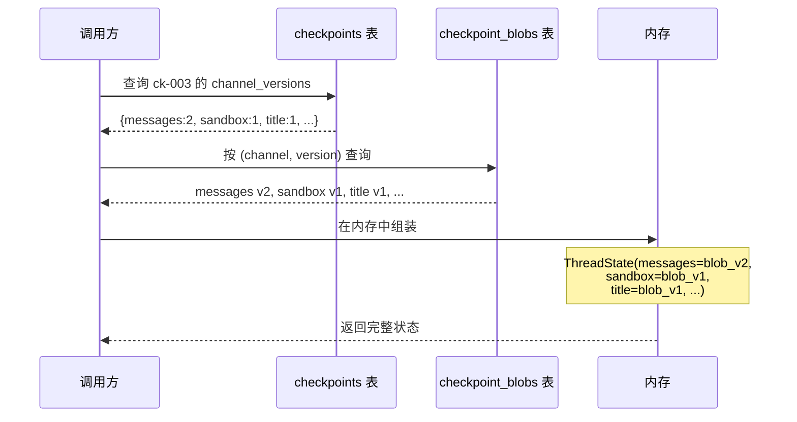

## 一句话定义

**Checkpointer = 对话状态的版本管理系统**——LangGraph 每执行完一个图节点就自动保存完整 ThreadState 快照，支持恢复、回滚和分叉。

类比游戏的"自动存档系统"：每打完一关自动存档，下次启动从最近的存档继续，还能回到任何一个旧存档，甚至从旧存档开出一条新支线。

---

## 四个核心概念

要把 checkpointer 讲清楚，先得立住四个词。后面所有的 API 和表结构，都是围绕它们转的。

| 概念 | 一句话 | 关键属性 |
|---|---|---|
| **Checkpoint**（检查点） | 某一时刻的完整全局状态快照 | 独立、只读、完整副本 |
| **Thread**（线程） | 一个独立对话/任务 | 用 `thread_id` 唯一标识 |
| **Super-step**（超步） | 一轮节点执行（串行节点各占一个，并行节点共用一个） | 每完成一次强制落盘一份 checkpoint |
| **Checkpointer** | 快照的读写底层载体 | 负责持久化、读取、历史查询 |

### Checkpoint 存的不只是 messages

一个常见的误区是"checkpoint 只存对话消息"。**它存的是完整全局 State**：

- 完整 `messages` 全量对话列表
- 自定义业务状态字段、工具返回结果、变量缓存
- 流程控制元数据：下一步待执行节点、唯一 `checkpoint_id`、父快照关联信息、会话配置

> 这是后面"分支对话"能力能成立的根基——下一节会用到。

### Super-step = 强制存档点

> 关于 super-step / 屏障同步的更深层模型（BSP / Pregel），见本专栏 [01-pregel-bsp](../01-pregel-bsp) 笔记。

每个 super-step 边界都是**强制持久化点**：一批节点（无论串行还是并行）全部跑完，落盘一份 checkpoint，再进下一步。这意味着：

- **崩溃恢复**：进程挂了，重启后总能从最近一次完整 super-step 继续，不会出现"半步"状态
- **时间旅行**：每个 super-step 都有对应的 checkpoint 可回溯

### StateSnapshot：API 视角的 checkpoint

当你用 `getState()` / `getStateHistory()` 拿到一份快照时，它以 `StateSnapshot` 的形式出现（JavaScript 里就是普通对象，Python 里是 dataclass）：

| 字段 | 含义 |
|---|---|
| `values` | 该时刻的完整 State（即 ThreadState 的全部字段） |
| `next` | 下一步待执行的节点（已到终态时为 `undefined`/`None`） |
| `config` | 这份快照的配置，含 `thread_id` 和 `checkpoint_id` |
| `metadata` | 执行元数据：`step`、`source`、`writes` 等 |
| `createdAt` | 快照时间戳 |
| `parentConfig` | 指向上一个 checkpoint 的配置（链表前驱） |

记住 `config`——它就是后面"时间旅行"的入口。

---

## 两大查询 API

两个 API 分工明确：一个看"现在"，一个看"全部历史"。

| API | 返回 | 用途 |
|---|---|---|
| `graph.getState(config)` | 单个 `StateSnapshot`（最新一份） | 看当前对话进度、最新上下文 |
| `graph.getStateHistory(config)` | 倒序的 `StateSnapshot` 迭代器 | 时间旅行、分支对话的核心入口 |

### 最小可运行示例（JavaScript）

```javascript
import { MemorySaver } from "@langchain/langgraph";

// 1. 编译图时挂上 checkpointer
const checkpointer = new MemorySaver();
const graph = app.compile({ checkpointer });

// 2. 用 thread_id 标记这次对话
const config = { configurable: { thread_id: "thread-1" } };
await graph.invoke({ messages: [{ role: "user", content: "你好" }] }, config);

// 3. 拿最新一份快照
const snapshot = await graph.getState(config);
console.log(snapshot.values);      // 完整 State
console.log(snapshot.next);        // 下一步节点（终态时为 undefined）
console.log(snapshot.metadata.step);

// 4. 遍历全部历史（按时间倒序）
for await (const snap of graph.getStateHistory(config)) {
  console.log(
    snap.config.configurable.checkpoint_id,
    snap.metadata.step,
    snap.createdAt,
  );
}
```

### `thread_id` 与 `checkpoint_id`

`config.configurable` 里两个 key 是 checkpoint 的坐标系：

- **`thread_id`**（必填）：隔离一次对话。不同 `thread_id` 的状态天然隔离、互不干扰
- **`checkpoint_id`**（可选）：定位线程内的某个具体历史快照

只给 `thread_id` → 拿最新；同时给 `checkpoint_id` → 拿那一份特定快照，**这就是时间旅行的开关**。

---

## 分支对话与时间旅行

这是 checkpointer 最有想象力的能力，也是官方文档和学习笔记的核心主题。

### 场景：从历史分叉

原始对话链路：`A → B → C`（三份 checkpoint）。
你想从 B 重新生成一条回答，得到新分支 `B → C1`。



### 实现步骤（JavaScript）

```javascript
// 1. 从历史里找到 B 的 checkpoint_id
let branchPoint;
for await (const snap of graph.getStateHistory(config)) {
  if (snap.metadata.step === 1) {        // B 对应的步数
    branchPoint = snap.config;            // 拿到那份快照的 config
    break;
  }
}

// 2. 用 B 的 config（含其 checkpoint_id）继续 invoke → 自动生成新分支 C1
await graph.invoke(
  { messages: [{ role: "user", content: "换个思路再答一遍" }] },
  branchPoint,
);

// 3. 现在历史里同时有 A / B / C / C1 四份快照
for await (const snap of graph.getStateHistory(config)) {
  console.log(snap.config.configurable.checkpoint_id, snap.metadata.step);
}
```

### 三条关键结论

理解分支对话，记住这三条就够了：

1. **新旧分支完全并存，原始链路不会被覆盖或删除。** 从历史 checkpoint 重启只会**追加**新快照，原有 A/B/C 永久保留。`getStateHistory` 能同时查到 A、B、C、C1 四份。
2. **随时可以切回原始 C 继续推进。** 找到 C 的 `checkpoint_id`，用它的 config 调 `invoke`，就回到原始时间线；C1 完整保留在历史里不受影响。
3. **两种分叉模式可选：**
   - **同 thread 分叉**（推荐试错）：共用一套历史，随时来回切换分支
   - **新建 thread 分叉**（完全隔离）：把 B 的 state 复制到新 `thread_id`，两条对话彻底独立

### 为什么全量快照是分支的前提？

如果用增量存储（只存每步新增的消息），从中间节点 B 根本分不出两条独立链路——B 不知道自己之前的完整上下文。

LangGraph 的设计是：

- **运行内存**：节点更新 state 时增量追加消息（`add_messages` reducer）
- **持久化存储**：落盘为完整快照，不做增量存储

所以 B 的快照自带 A+B 的完整消息，基于它生成 C1 时产生独立的 `[A,B,C1]` 副本；原 C 快照的 `[A,B,C]` 一字不动。两条分支上下文完全独立。

---

## Checkpointer 存什么

### ThreadState 的全部字段

下面是一个项目里的 ThreadState 示例（业务字段因项目而异）：

```python
class ThreadState(AgentState):
    messages: list[BaseMessage]     # 对话消息
    sandbox: SandboxId | None       # 沙箱 ID
    thread_data: dict               # 线程级数据
    title: str                      # 自动生成的标题
    artifacts: list                 # 输出文件
    todos: list                     # 任务列表 (plan mode)
    uploaded_files: list            # 上传文件
    viewed_images: list             # 查看的图片
```

### 一个 Checkpoint 的完整结构

```python
CheckpointTuple(
    config={
        "configurable": {
            "thread_id": "thread-abc",
            "checkpoint_id": "01HXY...004",   # ULID，含时间戳
        }
    },
    checkpoint={
        "id": "01HXY...004",
        "ts": "2026-06-04T10:15:23.123456Z",
        "channel_values": {                   # ★ ThreadState 的内容
            "messages": [HumanMessage("你好"), AIMessage("你好！"), ...],
            "title": "代码请求对话",
            "sandbox": "sb-xyz-123",
            "artifacts": [],
        },
        "channel_versions": {                 # 每个字段的版本号
            "messages": 4,
            "title": 1,
            "sandbox": 1,
        },
    },
    metadata={
        "source": "loop",
        "step": 3,
        "writes": {"agent_node": {"messages": [AIMessage(...)]}}
    },
    parent_config={                           # 指向上一个 checkpoint
        "configurable": {"checkpoint_id": "01HXY...003"}
    },
)
```

---

## 三张表的结构

### 表 1：`checkpoints` —— 快照清单（轻量索引）

```
┌────────────┬──────────────┬──────────────────┬─────────────────────────────────┐
│ thread_id  │ checkpoint_id│ parent_cp_id     │ channel_versions                │
├────────────┼──────────────┼──────────────────┼─────────────────────────────────┤
│ thread-abc │ ...001       │ NULL             │ {messages:1, sandbox:1, ...}    │
│ thread-abc │ ...002       │ ...001           │ {messages:1, sandbox:1, title:1}│
│ thread-abc │ ...003       │ ...002           │ {messages:2, sandbox:1, title:1}│
└────────────┴──────────────┴──────────────────┴─────────────────────────────────┘
```

**不存任何实际数据**，只存 `channel_versions` 映射（每个字段对应哪个版本）。`parent_checkpoint_id` 形成链表，记录快照之间的先后关系。

### 表 2：`checkpoint_blobs` —— 真实数据（去重存储池）

```
┌────────────┬────────────┬─────────┬──────────────────────────────────────────┐
│ thread_id  │ channel    │ version │ blob (序列化数据)                         │
├────────────┼────────────┼─────────┼──────────────────────────────────────────┤
│ thread-abc │ messages   │ 1       │ <[Human("你好"), AI("你好！")]>           │
│ thread-abc │ messages   │ 2       │ <[..., Human("帮我写代码"), AI("好的")]> │
│ thread-abc │ sandbox    │ 1       │ "sb-xyz"                                │
│ thread-abc │ title      │ 1       │ "代码请求对话"                           │
└────────────┴────────────┴─────────┴──────────────────────────────────────────┘
```

按 `(thread_id, channel, version)` 三元组唯一标识。

### 表 3：`checkpoint_writes` —— super-step 内部的增量写入

前两张表回答的是"某个 super-step 边界上，状态长什么样"。`checkpoint_writes` 回答的是另一个问题：

> **一个 super-step 内部，各个节点往哪个 channel 写了什么？**

一个 super-step 可能包含多个并行节点，每个节点执行完都会产生对 channel 的写入。这些写入**不会等到 super-step 结束才一次性落盘**，而是边写边记到这张表里。

```
┌────────────┬──────────────┬──────────────┬─────────┬────────┬─────────────────────┐
│ thread_id  │ checkpoint_id│ task_id      │ channel │ version│ value (序列化数据)    │
├────────────┼──────────────┼──────────────┼─────────┼────────┼─────────────────────┤
│ thread-abc │ ...004       │ agent_node   │ messages│ 4      │ <AI("好的")>        │
│ thread-abc │ ...004       │ tool_node    │ artifacts│ 2     │ <[file_a.txt]>     │
└────────────┴──────────────┴──────────────┴─────────┴────────┴─────────────────────┘
```

按 `(thread_id, checkpoint_id, task_id, channel, version)` 唯一标识——`task_id` 就是产生这次写入的节点任务。

#### 它的使命：断点恢复时跳过已完成的 node

这张表存在的核心价值是**让崩溃恢复可以"续跑"而不是"重跑"**。

设想一个 super-step 里并行跑 3 个节点：`A`、`B`、`C`。



`A`、`B` 跑完了，`C` 跑到一半进程挂了。重启时怎么办？

- **没有 `checkpoint_writes`**：只能从上一个完整 super-step 重新跑，A/B 白干一遍。如果 A/B 是有副作用的（发邮件、扣额度），重跑可能出问题。
- **有 `checkpoint_writes`**：重启时先读这张表，发现 A、B 在当前 super-step（`checkpoint_id=...004`）下**已经有写入记录**，于是**跳过 A/B**，只重新执行 C。A/B 的输出从这张表直接取。

用伪代码表示这个恢复逻辑：

```text
恢复执行 super-step（checkpoint_id=...004）:
    already_done = 查 checkpoint_writes WHERE checkpoint_id=...004 的 task_id 集合
    for node in 待执行节点列表:
        if node.task_id in already_done:
            skip（输出已经在 writes 表里）
        else:
            执行 node
```

#### 三张表的分工小结

| 表 | 存什么 | 何时写 | 解决什么问题 |
|---|---|---|---|
| `checkpoints` | 快照清单（轻量索引） | 每个 super-step 边界 | 状态的版本目录，支持时间旅行 |
| `checkpoint_blobs` | channel 的去重数据 | channel 版本变化时 | 全量快照下的存储去重 |
| `checkpoint_writes` | 节点级增量写入 | 节点执行后立即记 | **super-step 内断点恢复，跳过已完成节点** |

可以这样记：`checkpoints` + `checkpoint_blobs` 负责把 **super-step 边界**完整留住；`checkpoint_writes` 负责把 **super-step 内部**的进度也留住，两者一起才能做到"任意粒度恢复"。

---

## Channel 版本化 + Blob 共享 = 自动去重

LangGraph 把 ThreadState 的每个字段叫做一个 **Channel**。每个 Channel 独立维护版本号。**只有发生变化的 Channel 才会产生新版本的 blob**。

### 完整例子



### 两张表的关系

- **`checkpoints`** 是"目录页"——记录每个时间点引用了哪些版本
- **`checkpoint_blobs`** 是"正文页"——存放实际数据
- 关联方式：`checkpoints.channel_versions` 中的 `{messages: 2}` 指向 `blobs WHERE channel='messages' AND version=2`
- 多个 checkpoint 可以共享同一个 blob（多对多关系）

### 存储节省效果

假设 10 步对话，每步只有 messages 变化：

| 方案 | 数据量 |
|------|--------|
| 朴素（每步完整拷贝全部字段） | 10 × 9 字段 = 90 份数据 |
| Channel 版本化 | messages × 10 + 其他 8 字段 × 1 = 18 份 |

**节省 80%**。

---

## 查询过程

获取 `ck-003` 时刻的完整状态：



---

## Checkpoint 是只读的，回滚只追加不删除

这条设计原则解释了上面所有现象。

**所有 checkpoint 快照只读。** 任何"回滚""分叉"操作都只是**新增一份 checkpoint**，从不修改或删除已存在的快照。

为什么不能直接删旧 checkpoint？因为 checkpoint 是链表式存储（`parent_checkpoint_id` 串起来），删除中间任何一个都会破坏链结构，导致后续 checkpoint 找不到前驱。

### 回滚的实现

Rollback 本质是"创建一个新 checkpoint，其内容是旧 checkpoint 的副本"：

```python
async def rollback_to_pre_run_checkpoint(checkpointer, pre_run_snapshot):
    checkpoint_to_restore = copy.deepcopy(pre_run_snapshot["checkpoint"])

    marker = new_checkpoint_marker()
    checkpoint_to_restore["id"] = marker["id"]
    checkpoint_to_restore["ts"] = marker["ts"]

    await checkpointer.aput(config, checkpoint_to_restore, metadata, versions)

    for task_id, writes in writes_by_task.items():
        await checkpointer.aput_writes(config, writes, task_id)
```

注意这里调的是 `aput`（写入新 checkpoint）和 `aput_writes`（写入新 super-step 的增量记录），不是 `delete`。回滚 = 追加一份指向旧状态的新快照，对应前面"分支对话"章节里的"原始链路不会被覆盖"。

---

## 三种后端对比

| 后端 | LangGraph 类 | 适用场景 |
|------|-------------|---------|
| `memory` | `InMemorySaver` / `MemorySaver` | 开发/测试，重启即失 |
| `sqlite` | `SqliteSaver` / `AsyncSqliteSaver` | 单机生产，开箱即用 |
| `postgres` | `PostgresSaver` / `AsyncPostgresSaver` | 多实例/企业级部署 |

### SQLite vs Postgres

| 维度 | SQLite | Postgres |
|------|--------|---------|
| 部署复杂度 | 零依赖，一个文件 | 需独立数据库服务 |
| 并发写入 | 受限（WAL 模式改善但仍有限） | 高并发 MVCC |
| 多实例共享 | ❌ 文件锁冲突 | ✅ 多实例读同一库 |
| 适合规模 | 个人/小团队 | 企业/SaaS |

不是冗余，是覆盖不同的部署场景。

---

## 一句话总结

**Checkpointer 用「每 super-step 一份全量快照 + 只读追加 + Channel 版本化去重」三件套，换来了断点续跑、对话分支、流程审计三种能力**——存的时候多花点心思（三张表协作），换来的是读写两端极简的 API 和近乎无限的"回到任意时间点"的自由。
