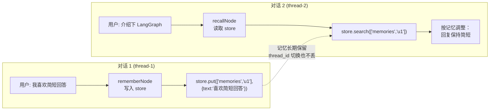
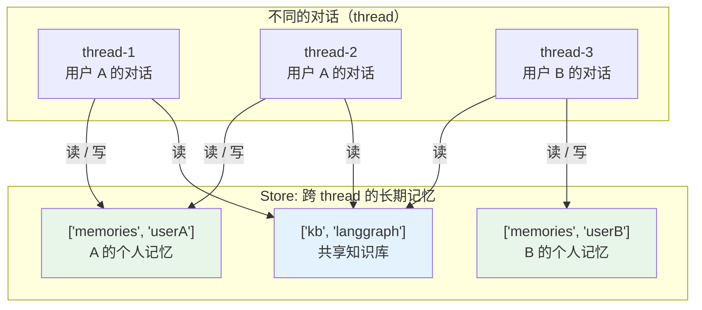

## 一句话定义

**Store = 跨线程的长期记忆系统**——一个按命名空间组织的 KV 存储，让数据能在不同的对话（thread）之间共享、长期保留。它解决的是 checkpointer 解决不了的问题：状态如何**跨对话**存活。

类比一下学校场景：

- **Checkpointer** = 每个学生的「作业本」——按人（`thread_id`）隔离，自动保存每次作业的完整版本。
- **Store** = 教室的「公告栏」——一个共享空间，按栏目（namespace）组织，谁都能来贴、谁来取，贴上去的东西不会因为某个学生下课就消失。

一个对话结束、对话状态被清空，公告栏上的内容依然在——这就是「长期记忆」的含义。

---

## Store vs Checkpointer

两者都是 LangGraph 的存储机制，但分工完全不同。把它们放在一张表里对比，记住这张表就够了：

| | Checkpointer | Store |
|---|---|---|
| **隔离单位** | 按 `thread_id`（每个对话独立） | 按 `namespace`（任意元组路径） |
| **数据模型** | 完整 ThreadState 快照（多版本链表） | 简单 KV 键值对（单版本覆盖） |
| **写入方式** | LangGraph 自动（每个 super-step 后） | 业务代码手动调用 |
| **版本管理** | 有，可时间旅行、分支 | 无，同 key 写入即覆盖 |
| **核心用途** | 对话状态持久化 + 恢复 | 跨对话的长期数据共享 |

一句话区分：**checkpointer 管「这次对话进行到哪了」，store 管「跨多次对话记得什么」**。

> 关于 checkpointer 的细节（快照、版本链、分支对话），见本专栏 [01-checkpointer](../01-checkpointer) 笔记。

### 一条容易忽略的铁律：同后端

Store 和 Checkpointer 在编译图时**必须共用同一个后端配置**。也就是说，checkpointer 用 SQLite，store 也得用 SQLite；checkpointer 用 Postgres，store 也得用 Postgres。

```javascript
import { MemorySaver } from "@langchain/langgraph";
import { InMemoryStore } from "@langchain/langgraph";

const checkpointer = new MemorySaver();
const store = new InMemoryStore();

// ✅ 同后端：内存 + 内存
const graph = app.compile({ checkpointer, store });

// ❌ 不要混搭：checkpointer 用 Postgres、store 留内存
//    会导致两个存储层状态不一致，恢复/共享行为不可预测
```

为什么必须一致？因为两者的数据生命周期是绑定的——一次 invoke 会同时往 checkpointer 写状态快照、往 store 写业务数据。如果它们落在不同后端，崩溃恢复时就可能出现「状态恢复了，但记忆没回来」或反之的撕裂状态。

---

## 核心心智模型：namespace 是层级路径

Store 的所有 API 都围绕一个概念转：**namespace（命名空间）**。

Namespace 是一个**字符串元组**（tuple / 数组），用来组织数据的层级结构——可以理解成文件系统的文件夹路径：

```javascript
const store = new InMemoryStore();

// namespace 是一个数组，每个元素是一层
await store.put(["threads"], "thread-abc", { /* ... */ });
await store.put(["users", "alice", "preferences"], "theme", { value: "dark" });
await store.put(["memories", "user-42"], "fact-1", { text: "喜欢简短回答" });
```

视觉上长这样：

```
store
├── ["threads"]
│   ├── (key="thread-abc", value={...})
│   └── (key="thread-def", value={...})
├── ["users", "alice", "preferences"]
│   └── (key="theme", value={value: "dark"})
└── ["memories", "user-42"]
    ├── (key="fact-1", value={text: "喜欢简短回答"})
    └── (key="fact-2", value={text: "用 Python"})
```

### 两条决定一切的语义

namespace 看起来简单，但底下藏着两条规则，理解了它们，后面所有 API 的行为就都通了：

1. **`key` 只在「同一个 namespace 下」唯一。** 不同 namespace 下可以有相同的 key，互不干扰——`["users","alice"]` 下有个 `"theme"`，`["users","bob"]` 下也可以有个 `"theme"`，这是两个完全独立的记录。
2. **同一 namespace 下对同 key 写入 = 整个 value 覆盖。** Store 没有「字段级更新」，put 一次就是用新 value 整体替换旧 value。想做「只改其中一个字段」？得先 get 出来、改完、再 put 回去（见后面的「读改写」示例）。

```javascript
// 覆盖语义演示
await store.put(["prefs"], "ui", { theme: "dark", lang: "zh" });

// 想把 theme 改成 light，下面这行会把 lang 也丢了 ❌
await store.put(["prefs"], "ui", { theme: "light" });
// 现在 value 只剩 { theme: "light" }，lang 没了

// 正确做法：读-改-写 ✅
const item = await store.get(["prefs"], "ui");
await store.put(["prefs"], "ui", { ...item.value, theme: "light" });
```

把 namespace 当文件夹、key 当文件名、value 当文件内容，这套模型就完全自洽了。

---

## CRUD API 全解

Store 的 API 非常薄，核心就四个动作：**增 / 查 / 删 / 搜**。每个动作都有同步和异步两个版本（异步方法名以 `a` 开头，如 `aput`、`aget`）。在 Node.js 环境里两种都能用；在 Python 环境里只有 `a` 开头的异步版本。

### API 一览

| API | 作用 | 关键参数 |
|---|---|---|
| `put(namespace, key, value, options?)` | 写入（不存在则创建、存在则覆盖） | `namespace: string[]`, `key: string`, `value: object`, `index?: string[]` |
| `get(namespace, key)` | 精确读取单条 | `namespace: string[]`, `key: string` |
| `delete(namespace, key)` | 删除单条 | `namespace: string[]`, `key: string` |
| `search(namespace, options?)` | 按条件搜索 | `filter?: object`, `query?: string`, `limit?: number`, `offset?: number` |
| `aput / aget / adelete / asearch` | 上述方法的异步版本 | 同上 |

### `Item` 的结构

`get` 和 `search` 返回的每条记录都封装成一个 `Item`，它不只是你存进去的 value：

| 字段 | 含义 |
|---|---|
| `namespace` | 这条记录所在的命名空间元组 |
| `key` | 这条记录的 key |
| `value` | 你存进去的实际内容（对象） |
| `createdAt` | 首次创建时间 |
| `updatedAt` | 最近一次更新时间 |

`createdAt` / `updatedAt` 是 Store 自动维护的，你不需要也不应该手动写——这对做「按时间排序」「找最近更新的记忆」非常有用。

### 最小可运行示例

```javascript
import { InMemoryStore } from "@langchain/langgraph";

const store = new InMemoryStore();

// 1. 写入：namespace + key + value
await store.put(["memories", "user-1"], "fact-1", {
  text: "用户是 Java 开发者",
  category: "background",
});
await store.put(["memories", "user-1"], "fact-2", {
  text: "偏好简洁、带代码示例的回答",
  category: "preference",
});

// 2. 精确读取单条
const item = await store.get(["memories", "user-1"], "fact-1");
console.log(item.value);        // { text: "用户是 Java 开发者", category: "background" }
console.log(item.updatedAt);    // 时间戳

// 3. 按 namespace 列出全部
const results = await store.search(["memories", "user-1"]);
console.log(results.length);    // 2

// 4. 删除单条
await store.delete(["memories", "user-1"], "fact-2");
console.log((await store.get(["memories", "user-1"], "fact-2"))); // undefined
```

注意 `get` 在找不到时返回 `undefined`（不抛异常），这点和很多数据库 API 不同，用的时候记得判空。

### `search` 的两种模式

`search` 是 Store 里最灵活的 API，它支持两种过滤方式，可以单独用也可以组合用：

| 参数 | 作用 | 何时用 |
|---|---|---|
| `filter` | 结构化等值过滤（按 value 里的字段精确匹配） | 已知分类、标签等结构化字段 |
| `query` | 语义搜索（按自然语言查询的相似度排序） | 模糊匹配、按意图召回（见下一节） |
| `limit` / `offset` | 分页 | 控制返回条数 |

```javascript
// 模式一：结构化过滤——只看 category 是 "preference" 的记忆
const prefs = await store.search(["memories", "user-1"], {
  filter: { category: "preference" },
  limit: 10,
});

// 模式二：分页——跳过前 20 条
const page2 = await store.search(["memories", "user-1"], {
  limit: 20,
  offset: 20,
});
```

`filter` 是**等值匹配**，不支持范围查询（`>`, `<`）或复杂表达式。要做范围查询，把数据放在 SQL 数据库里更合适——Store 的定位是「记忆」，不是「数据库」。

---

## 语义搜索：带 index 的向量检索

这是 Store 最有「记忆」味道的能力。前面 `search` 的 `filter` 只能做精确等值匹配，但记忆往往是模糊的——用户说「我之前提过喜欢什么来着」，你得能按语义把相关记忆召回。

### 原理：写入时自动向量化

Store 支持在 `put` 时声明哪些字段需要建索引。声明后，写入会自动对指定字段做 embedding（向量化），`search` 时传一个 `query` 就能按语义相似度排序返回。

```javascript
import { InMemoryStore } from "@langchain/langgraph";

const store = new InMemoryStore({
  index: {
    dims: 1536,              // embedding 向量维度（取决于你用的模型）
    embed: embeddings,       // 一个 Embeddings 实例，负责把文本变成向量
    fields: ["text"],        // 对 value 里的哪个字段建索引
  },
});

// 写入时声明：这次写入的 text 字段要进向量索引
await store.put(["memories", "user-1"], "fact-1", {
  text: "用户是后端工程师，常用 Java 和 Go",
}, { index: ["text"] });     // ← index 选项告诉 store 建索引

// 语义搜索：不用精确匹配，用自然语言 query
const hits = await store.search(["memories", "user-1"], {
  query: "用户的技术栈是什么？",
  limit: 3,
});
// 命中 "用户是后端工程师..." 这条，即使 query 里没有"Java/Go/后端"这些字
```

`index` 字段做的是自动 embedding + 向量相似度检索，`search` 返回的结果会按相似度从高到低排序。

### 一个关键认知：memory 后端不支持语义搜索

三种后端对语义搜索的支持是**不对等**的，选错后端会让代码报错：

| 后端 | 类 | 语义搜索（`query` / `index`） | 适用场景 |
|---|---|---|---|
| `memory` | `InMemoryStore` | ⚠️ 需手动配置 index 才支持 | 开发 / 测试 |
| `sqlite` | `AsyncSqliteStore` | ✅ 支持（含向量扩展） | 单机生产 |
| `postgres` | `AsyncPostgresStore` | ✅ 支持（pgvector） | 多实例 / 生产 |

> `InMemoryStore` 在新版本里通过构造时传 `index` 配置也能做语义搜索，但**生产环境别用**——进程一重启，所有记忆和索引都没了。生产环境一律上 sqlite 或 postgres。

### 组合：结构化过滤 + 语义打分

最有实战价值的写法是把 `filter` 和 `query` 组起来用：先用 `filter` 锁定一个范围，再在范围内做语义排序。

```javascript
// 场景：在「偏好类」记忆里，找和「代码风格」相关的
const hits = await store.search(["memories", "user-1"], {
  filter: { category: "preference" },   // 先过滤
  query: "代码示例该怎么写",              // 再语义排序
  limit: 3,
});
```

这相当于一条 SQL：`WHERE category = 'preference' ORDER BY cosine_similarity(text, query) DESC LIMIT 3`——结构化条件缩小候选集，向量相似度决定最终顺序。

---

## 三种后端

Store 的后端选择和 Checkpointer 一一对应，且共用同一套部署考量：

| 后端 | LangGraph 类 | 适用场景 |
|---|---|---|
| `memory` | `InMemoryStore` | 开发 / 测试，嵌套字典实现，重启即失 |
| `sqlite` | `AsyncSqliteStore` | 单机生产，一个文件搞定 |
| `postgres` | `AsyncPostgresStore` | 多实例 / 企业级部署，支持 pgvector 向量检索 |

### SQLite vs Postgres

| 维度 | SQLite | Postgres |
|---|---|---|
| 部署复杂度 | 零依赖，一个文件 | 需独立数据库服务 |
| 并发写入 | 受限（WAL 模式改善但仍有限） | 高并发 MVCC |
| 多实例共享 | ❌ 文件锁冲突 | ✅ 多实例读同一库 |
| 向量检索 | ✅（向量扩展） | ✅ pgvector，更成熟 |
| 适合规模 | 个人 / 小团队 | 企业 / SaaS |

选型一句话：**本地开发用 memory，单机上线用 sqlite，要多实例或高并发就上 postgres。** 这套选型逻辑和 checkpointer 完全一致——再次印证「两者同后端」。

---

## 在节点 / 工具里访问 Store

前面演示的都是「拿到 store 实例直接调」。但真实场景里，store 通常是在编译图时注入的，那在图的节点（node）和工具（tool）里，怎么拿到它？

答案：**通过 `runtime.store`**。LangGraph 在执行时会自动把编译时注入的 store 放进每个节点的运行时上下文（`runtime`）。

```javascript
import { StateGraph, MemorySaver, InMemoryStore, START, END } from "@langchain/langgraph";

// 1. 编译时注入 store（和 checkpointer 一起）
const graph = workflow.compile({
  checkpointer: new MemorySaver(),
  store: new InMemoryStore(),
});

// 2. 在节点函数里，第二个参数 runtime 自带 store
function rememberNode(state, runtime) {
  const store = runtime.store;          // ← 关键：从 runtime 拿 store
  const userId = runtime.configurable.user_id;

  // 写入长期记忆
  store.put(["memories", userId], Date.now().toString(), {
    text: `用户在 ${new Date().toISOString()} 提了问题`,
  });
  return {};
}
```

工具（tool）里同样能拿到——通过工具运行时传入的 `runtime`：

```javascript
import { tool } from "@langchain/core/tools";

const saveMemoryTool = tool(
  async (input, runtime) => {
    const store = runtime.store;
    const userId = runtime.configurable.user_id;
    await store.put(["memories", userId], `mem-${Date.now()}`, { text: input.fact });
    return "已记住";
  },
  {
    name: "save_memory",
    description: "把一条长期记忆存起来",
    schema: memorySchema,
  }
);
```

### 端到端示例：跨对话的长期记忆

把前面的零件拼起来，看一个最能体现 Store 价值的场景：**第一次对话记住用户偏好，第二次新对话自动应用**。这里 `thread_id` 变了（新对话），但 store 里的记忆还在——这就是「跨线程」。



```javascript
import { StateGraph, MemorySaver, InMemoryStore, START, END } from "@langchain/langgraph";
import { z } from "zod";

const State = z.object({ /* messages, ... */ });
const store = new InMemoryStore();
const checkpointer = new MemorySaver();

// 节点 A：对话开始时，从 store 召回历史记忆，注入到上下文
function recallNode(state, runtime) {
  const userId = runtime.configurable.user_id;
  const hits = runtime.store.search(["memories", userId], { limit: 5 });
  // 把召回的记忆作为系统提示的一部分，影响后续 LLM 回复
  const memoryText = hits.map(h => `- ${h.value.text}`).join("\n");
  return { /* 把 memoryText 注入 messages */ };
}

// 节点 B：对话中或结束时，把新学到的偏好写回 store
function rememberNode(state, runtime) {
  const userId = runtime.configurable.user_id;
  const latestPreference = extractPreference(state.messages); // 业务函数
  if (latestPreference) {
    runtime.store.put(
      ["memories", userId],
      `mem-${Date.now()}`,
      { text: latestPreference },
    );
  }
  return {};
}

const workflow = new StateGraph(State)
  .addNode("recall", recallNode)
  .addNode("agent", agentNode)       // 真正调 LLM 的节点
  .addNode("remember", rememberNode)
  .addEdge(START, "recall")
  .addEdge("recall", "agent")
  .addEdge("agent", "remember")
  .addEdge("remember", END);

const graph = workflow.compile({ checkpointer, store });

// 对话 1：thread-1，记住偏好
await graph.invoke(
  { messages: [{ role: "user", content: "我喜欢简短回答" }] },
  { configurable: { thread_id: "thread-1", user_id: "u1" } },
);

// 对话 2：thread-2，自动召回 thread-1 学到的偏好
await graph.invoke(
  { messages: [{ role: "user", content: "介绍下 LangGraph" }] },
  { configurable: { thread_id: "thread-2", user_id: "u1" } },  // ← thread 变了
);
// agent 这次会「记得」用户喜欢简短回答，回复风格自动调整
```

注意两次 invoke 用了**不同的 `thread_id`**——checkpointer 这边它们是完全隔离的两段对话；但因为 store 按 `user_id` 组织记忆，`thread-2` 能读到 `thread-1` 写下的内容。**checkpointer 负责「对话内连续」，store 负责「对话间连续」**，两者协作才构成完整的「记忆」。

---

## 使用模式：Store 适合放什么

Store 的定位是「长期记忆」，不是通用数据库。下面是几个被官方和实战验证过适合 Store 的场景：

| 模式 | namespace 设计 | 典型内容 |
|---|---|---|
| **长期记忆** | `("memories", userId)` | 用户偏好、事实、画像 |
| **用户档案** | `("users", userId, "profile")` | 注册信息、设置 |
| **共享知识库** | `("kb", topic)` | 多个对话共享的领域知识 |
| **Agent 配置** | `("agents", agentName, "config")` | Agent 的可调参数 |



一个判别标准：**「这条数据要不要在不同的对话里被看到？」** 要 → 放 Store；只在当前对话里用 → 放 ThreadState（靠 checkpointer 持久化）。

---

## 设计规则与避坑

把前面散落的要点提炼成五条可操作的规则：

1. **Store 不存对话状态。** 对话进行到哪、messages 列表、当前 super-step——这些是 checkpointer 的活，塞进 Store 既冗余又容易和 checkpointer 不一致。Store 只放「跨对话的长期数据」。

2. **同 namespace 下 key 唯一、put 即覆盖。** 没有「字段级更新」，想改一个字段必须「get → 改 → put」整个 value 写回。忘了这条会丢数据。

3. **语义搜索要选对后端。** `InMemoryStore` 重启即失，只能开发用；生产环境的语义搜索一律 sqlite 或 postgres，且要配好 embedding 模型和 `index` 字段。

4. **大 value 别塞 Store。** Store 的 value 是整体序列化存储，单条 value 几 MB 会拖慢读写和搜索。大文件、长文档放对象存储或专门的知识库，Store 里只存引用（URL / ID）。

5. **Store 与 Checkpointer 同后端。** 编译时两者的后端必须一致，否则崩溃恢复时会出现「状态回来了但记忆没回来」的撕裂状态。

---

## 一句话总结

**Store 用「namespace 分层的 KV + 可选向量检索」三件套，换来了跨对话的长期记忆**——checkpointer 让一次对话能断点续跑，store 让多次对话能记住彼此。namespace 当文件夹、key 当文件名、value 当内容；想模糊召回就给字段建 index、用 `query` 语义搜索。两者共用同一个后端、各司其职，才拼出一个真正「有记忆」的 Agent。
