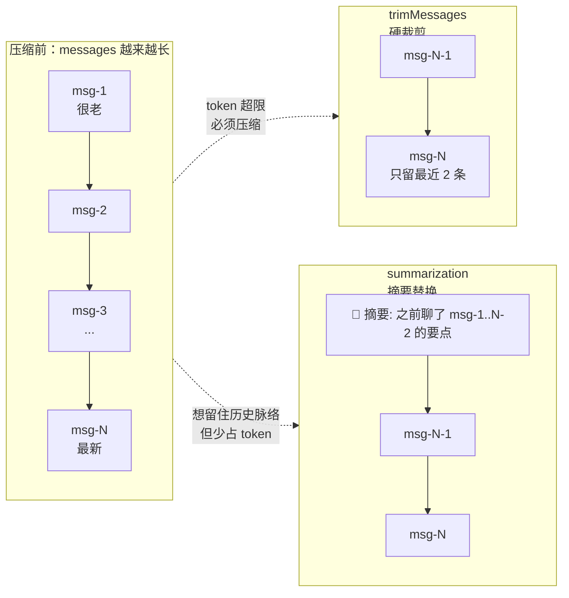
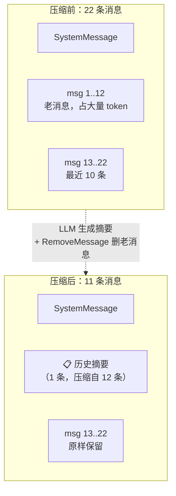
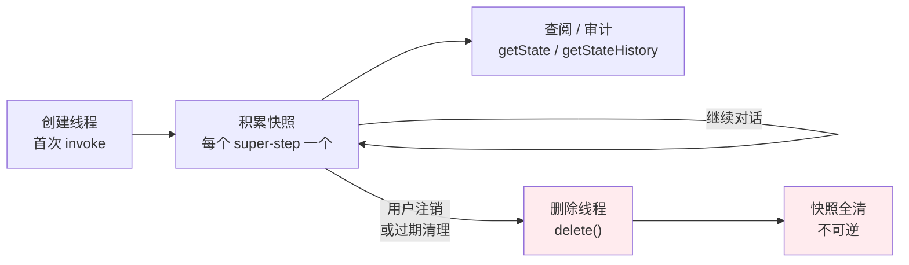

## 一句话定义

**「记忆」不是装上就完事——你得管它：对话越长越要压缩消息、越积越多越要清理 checkpoint、上了生产还得选对后端、建好表。** 本篇讲的就是这套"装好之后"的工程手段。

LangGraph 的记忆分两层，前两篇已经深入讲过它们的存储机制：

- **短期记忆 = checkpointer**：把每个 super-step 的 ThreadState 存成快照，让一次对话能断点续跑。→ 见本专栏 [02-checkpointer](../02-checkpointer)
- **长期记忆 = store**：按 namespace 组织的 KV 存储，跨对话长期保留用户偏好、画像。→ 见本专栏 [03-store](../03-store)

但官方 *Add persistent memory* 文档里，还有一大块**「管好这些记忆」的实务**，前两篇没展开——本篇就补这块：

| 主题 | 解决什么问题 |
|---|---|
| **消息压缩三板斧** | 对话一长，messages 列表膨胀，token 成本爆炸、上下文超限 |
| **Checkpoint 管理** | 线程越积越多，怎么查、怎么删（隐私 / GDPR 合规） |
| **生产部署选型** | memory / sqlite 只能开发用，生产该选 Postgres 还是 MongoDB |
| **数据库迁移 `setup()`** | 怎么自动建表建索引，不用手写 DDL |

一句话：**02/03 讲「记忆怎么存」，本篇讲「记忆怎么管、怎么上线」**。

---

## 消息压缩三板斧

这是本篇篇幅最重的部分，因为它是真实开发里最先撞上的坑。

LLM 是无状态的，每轮对话都要把**完整历史消息**重新喂进去。对话一长，`messages` 列表里几十上百条消息，token 用量线性增长——既贵，又可能撑爆模型的上下文窗口。checkpointer 会忠实地把每条消息都存下来，但它**不会帮你删**。压缩是业务层的责任。

LangGraph 给了三条路子，剪法各不相同：

| 手法 | 做什么 | 丢信息吗 | 适用场景 |
|---|---|---|---|
| **`trimMessages`** | 按数量 / token 数裁掉最老的消息，保留最近 N 条 | ✅ 直接丢弃老消息 | 最简单粗暴，对话历史不重要时 |
| **删除指定消息** | 用 `RemoveMessage` 精确删除某条（靠 reducer 机制） | ✅ 删指定的 | 需要精确控制删哪条（如删掉某轮工具调用） |
| **消息摘要** | 让 LLM 把老消息压成一条摘要，替换掉原文 | ⚠️ 压缩成摘要，信息有损但保留大意 | 长对话需要保留历史脉络时 |



### 手法一：`trimMessages` —— 硬裁剪

最直接：按"保留最近 N 条"或"保留最近 N 个 token"截断。来自 `@langchain/core/messages`，不是 LangGraph 专属，但因为 messages 就是图状态的一部分，通常在节点里调用它、再把结果写回状态。

```javascript
import { trimMessages } from "@langchain/core/messages";
import { AIMessage, HumanMessage } from "@langchain/core/messages";

// 假设 state.messages 已经很长
function callModel(state) {
  // 策略：保留最近 10 条消息
  const trimmed = trimMessages(state.messages, {
    tokenCounter: 10,            // 也可以传一个函数按 token 计数
    strategy: "last",            // 从末尾往前保留
    includeSystem: true,         // 系统消息永远保留，不被裁掉
    startOn: "human",            // 截断后的起点必须是 human 消息（避免以 AI 开头）
    allowPartial: false,
  });

  // 把裁剪后的 messages 喂给模型
  const response = await model.invoke(trimmed);
  return { messages: [response] };
}
```

几个容易踩的点：

- **`includeSystem: true`**：系统提示（SystemMessage）通常定义了 Agent 人格，绝不能被裁掉。这个选项让它跳过计数、始终保留。
- **`startOn: "human"`**：裁剪后的第一条必须是用户消息——否则可能出现"AI 没头没脑先说一句"的非法序列，有些模型会直接报错。
- **`strategy: "last"`**：从最新消息往前保留；对应的 `"first"` 是保留最老的（很少用）。

### 手法二：删除指定消息 —— 精确删除

`trimMessages` 是"一刀切"，删掉最老的。但有时你想精确删某一条——比如删掉一次冗长的工具调用结果、或者删掉用户的敏感输入。LangGraph 提供了 `RemoveMessage`，配合 messages 的 reducer 机制实现。

原理很巧妙：**messages 的 reducer 在收到一条 `RemoveMessage` 时，不是把它加进列表，而是按 id 把对应消息移除。**

```javascript
import { RemoveMessage } from "@langchain/langgraph";

// 删除 id 为 "msg-abc" 的那条消息
function cleanupNode(state) {
  return {
    messages: [new RemoveMessage({ id: "msg-abc" })],
  };
}
```

注意：这里 `return` 的不是要删的消息本身，而是一个**"删除指令"**。LangGraph 拿到它后会去 messages 列表里找 id 匹配的那条删掉。

实战中更常见的写法是"删除某个边界之前的全部消息"——结合 `trimMessages` 找出要删的 id，再转成 `RemoveMessage`：

```javascript
import { trimMessages } from "@langchain/core/messages";
import { RemoveMessage } from "@langchain/langgraph";

function deleteOldMessages(state) {
  // 找出会被裁掉的消息，转成删除指令
  const messagesToRemove = trimMessages(state.messages, {
    tokenCounter: 10,
    strategy: "last",
    includeSystem: true,
    startOn: "human",
    // 关键：返回被裁掉的部分，而不是保留的部分
  });

  return {
    messages: messagesToRemove.map((m) => new RemoveMessage({ id: m.id })),
  };
}
```

> 为什么要绕这一圈，不直接用 `trimMessages`？因为 `trimMessages` 只返回截断后的数组、**不写回状态**。要让压缩结果持久化到 checkpoint，得走 reducer——而 `RemoveMessage` 就是走 reducer 的标准入口。

### 手法三：消息摘要 —— 有损但留住脉络

前两种都是"直接删"，删了就没了。长对话里用户可能聊过很多背景信息（"我是后端工程师"、"我在做电商系统"），全删了 Agent 就"失忆"了。

摘要法的思路：**让 LLM 把老消息压缩成一条总结，替换掉原文**——信息有损但大意保留，且只占一条消息的 token。

典型实现：在节点里判断 messages 长度，超过阈值就触发摘要：

```javascript
import { RemoveMessage } from "@langchain/langgraph";
import { SystemMessage, AIMessage } from "@langchain/core/messages";

async function maybeSummarize(state) {
  const MESSAGE_THRESHOLD = 20;  // 超过 20 条就触发摘要

  if (state.messages.length <= MESSAGE_THRESHOLD) {
    return {};  // 还没到阈值，不压缩
  }

  // 1. 把最老的几条消息（保留系统消息）喂给 LLM，让它生成摘要
  const oldMessages = state.messages.slice(0, -10);  // 留最近 10 条不压缩
  const summaryPrompt = [
    new SystemMessage("把以下对话压缩成一段简短摘要，保留关键事实和用户偏好："),
    ...oldMessages,
  ];
  const summary = await model.invoke(summaryPrompt);

  // 2. 把老消息删掉（转成 RemoveMessage）
  const removeOld = oldMessages
    .filter((m) => m._getType() !== "system")  // 系统消息不删
    .map((m) => new RemoveMessage({ id: m.id }));

  // 3. 把摘要作为一条新消息加在最前面
  return {
    messages: [
      ...removeOld,
      new AIMessage({ content: `📋 历史摘要：${summary.content}` }),
    ],
  };
}
```

压缩前后对比：



### 三种手法怎么选

| 你的诉求 | 选哪个 |
|---|---|
| 对话历史无所谓，只要最新几条 | `trimMessages`（最简单） |
| 要精确删某条（如敏感输入、冗长工具结果） | `RemoveMessage`（精确控制） |
| 长对话要留住历史脉络，但想省 token | 摘要法（有损压缩） |
| 生产环境的成熟方案 | **摘要法为主 + trim 兜底**（官方推荐组合） |

一句话：**`trimMessages` 是剪刀、`RemoveMessage` 是镊子、摘要是压缩机**——按"丢得起多少信息"来选。

---

## Checkpoint 管理

checkpointer 会为**每个线程的每一步**存一个快照。对话一多，线程和快照会越积越多。官方文档把这块归到"管理持久化"——核心是两个动作：**查**和**删**。

### 查：看状态、看历史

| API | 作用 | 典型场景 |
|---|---|---|
| `graph.getState(config)` | 取线程当前最新状态 | 调试、确认对话进行到哪 |
| `graph.getStateHistory(config)` | 列出线程的所有历史快照 | 时间旅行、审计、回溯 |

```javascript
const config = { configurable: { thread_id: "thread-1" } };

// 1. 看当前状态
const state = await graph.getState(config);
console.log(state.values);       // 当前 state 的值
console.log(state.next);         // 下一个要执行的节点

// 2. 看历史快照（按时间倒序，最新的在前）
const history = [];
for await (const snapshot of graph.getStateHistory(config)) {
  history.push({
    checkpointId: snapshot.config.configurable.checkpoint_id,
    createdAt: snapshot.metadata?.created_at,
    next: snapshot.next,
  });
}
console.log(`线程 thread-1 共有 ${history.length} 个快照`);
```

> `getStateHistory` 返回的是**异步迭代器**，且按**从新到旧**倒序排列——想看最早的得迭代到末尾。这点在做时间旅行（找分叉点）时很关键，详见本专栏 [08-time-travel](../08-time-travel)。

### 删：清理线程

为什么要删？两个真实诉求：

1. **隐私 / 合规**：GDPR 的"被遗忘权"要求用户注销时彻底清除其对话数据——光删 store 里的长期记忆不够，checkpointer 里的对话快照也得删。
2. **清理过期会话**：长期运行的 Agent 会积累大量僵尸线程，占数据库空间、拖慢查询。

LangGraph 提供了 `langgraph.checkpoint` 的删除接口：

```javascript
// 删除整个线程（所有快照一次性清掉）
import { ThreadNotFound } from "@langchain/langgraph-checkpoint";

try {
  await graph.checkpointer.delete({
    configurable: { thread_id: "thread-1" },
  });
  console.log("线程已删除");
} catch (e) {
  if (e instanceof ThreadNotFound) {
    console.log("线程不存在（可能已删）");
  }
}
```

删除后，该 `thread_id` 下的**所有快照**都没了——无法再 `getState`、无法时间旅行。这是个不可逆操作，删前确认。

线程的生命周期长这样：



> ⚠️ 注意层级：`graph.checkpointer.delete()` 删的是**单个线程**；要清空整个数据库（比如迁移、重置开发环境），用各后端自己的清表操作，LangGraph 没提供"清空所有线程"的 API——这是有意为之的安全设计。

---

## 生产部署：选对后端

02/03 讲过 memory / sqlite / postgres 三档，但那是偏存储机制的视角。上了生产，**后端选型**还有一个重要变量没展开：**MongoDB**。LangGraph 的 checkpointer 和 store 都有 MongoDB 实现，它是和 Postgres 并列的生产级选项。

### 四后端对比

| 后端 | Checkpointer 类 | Store 类 | 适用规模 | 多实例共享 |
|---|---|---|---|---|
| `memory` | `MemorySaver` | `InMemoryStore` | 开发 / 测试 | ❌ 进程内 |
| `sqlite` | `AsyncSqliteSaver` | `AsyncSqliteStore` | 单机生产 | ❌ 文件锁冲突 |
| `postgres` | `AsyncPostgresSaver` | `AsyncPostgresStore` | 多实例 / SaaS | ✅ |
| `mongodb` | `AsyncMongoDBSaver` | `AsyncMongoDBStore` | 多实例 / SaaS | ✅ |

### Postgres vs MongoDB：怎么选

两者都是生产级、都支持多实例共享，区别在**你团队的现有技术栈和数据特性**：

| 维度 | Postgres | MongoDB |
|---|---|---|
| **数据模型** | 关系型，行存 | 文档型，JSON-like |
| **向量检索** | ✅ pgvector，成熟 | ✅ Atlas Vector Search |
| **schema 灵活度** | 强 schema，改表要迁移 | 弱 schema，字段随时加 |
| **事务** | 强 ACID | 多文档事务较重 |
| **适合谁** | 已有 PG 技术栈、需要强一致性 | 已有 Mongo 技术栈、state 结构多变 |

选型一句话：**技术栈跟着团队走**——团队用 Postgres 就用 Postgres，用 MongoDB 就用 MongoDB；都没有就从 Postgres 起步，它的 pgvector 和强事务在 Agent 场景里更省心。

### 初始化：编译时注入

不管选哪个后端，套路都一样——**编译图时把 checkpointer 和 store 一起注入**（且必须同后端，见 03-store 的铁律）：

```javascript
// Postgres 示例
import { StateGraph } from "@langchain/langgraph";
import { AsyncPostgresSaver } from "@langchain/langgraph-checkpoint-postgres";
import { AsyncPostgresStore } from "@langchain/langgraph-checkpoint-postgres";

// 1. 建连接（生产环境从环境变量读连接串）
const checkpointer = AsyncPostgresSaver.fromConnString(process.env.PG_URL);
const store = AsyncPostgresStore.fromConnString(process.env.PG_URL);

// 2. 建表建索引（见下一节）
await checkpointer.setup();
await store.setup();

// 3. 同后端注入
const graph = workflow.compile({ checkpointer, store });
```

```javascript
// MongoDB 示例
import { AsyncMongoDBSaver } from "@langchain/langgraph-checkpoint-mongodb";
import { AsyncMongoDBStore } from "@langchain/langgraph-checkpoint-mongodb";

const checkpointer = AsyncMongoDBSaver.fromConnString(process.env.MONGO_URL);
const store = AsyncMongoDBStore.fromConnString(process.env.MONGO_URL);

await checkpointer.setup();
await store.setup();

const graph = workflow.compile({ checkpointer, store });
```

---

## 数据库迁移：`setup()`

上一节代码里那个 `await checkpointer.setup()` 是什么？这就是 LangGraph 的**数据库迁移机制**。

### 为什么需要它

checkpointer 要存快照、store 要存 KV，底层都得有表 / 集合。这些 schema 不是凭空存在的——Postgres 要建表建索引，MongoDB 要建集合和索引。手写 DDL 既繁琐又容易和库版本脱节（字段一改，旧 DDL 就对不上）。

`setup()` 就是 LangGraph 提供的**自动建表 / 建索引**方法：它按当前库版本生成正确的 schema，幂等执行（重复跑不报错），相当于一个内置的 migration 工具。

### 怎么用

每个后端的 checkpointer 和 store 都有自己的 `setup()`，**两者都要调**：

```javascript
const checkpointer = AsyncPostgresSaver.fromConnString(process.env.PG_URL);
const store = AsyncPostgresStore.fromConnString(process.env.PG_URL);

// 部署 / 启动时跑一次，建好 checkpointer 需要的表
await checkpointer.setup();

// 再建好 store 需要的表（通常是不同的表 / 集合）
await store.setup();

// 之后正常编译、运行
const graph = workflow.compile({ checkpointer, store });
```

几个实战要点：

| 要点 | 说明 |
|---|---|
| **何时跑** | 应用启动时跑一次（幂等），或部署流水线里作为独立的 migration 步骤 |
| **幂等** | 重复执行不会报错、不会丢数据——内部判断"表已存在则跳过 / 补字段" |
| **checkpointer 和 store 各调各的** | 两者建的是不同的表，不能只调一个 |
| **升级库版本后重跑** | 新版可能加字段 / 加索引，重跑 `setup()` 会自动补齐 |

> 对比传统 Web 开发：`setup()` 之于 LangGraph，就像 `rails db:migrate` 之于 Rails、`prisma migrate` 之于 Prisma——只不过它**内置在 saver/store 类里**，不用单独装迁移工具。

---

## 设计规则与避坑

把前面散落的要点提炼成六条可操作规则：

1. **压缩是业务层的责任，checkpointer 不会帮你删消息。** 对话越长 messages 越长，token 成本线性增长。必须在节点里主动调 `trimMessages` / `RemoveMessage` / 摘要法，否则迟早撑爆上下文。

2. **`RemoveMessage` 走 reducer，写回状态才持久化。** `trimMessages` 只返回截断后的数组、不写回 checkpoint。要让压缩结果跨步骤生效，必须转成 `RemoveMessage` 走 messages 的 reducer。

3. **系统消息别被裁掉。** `trimMessages` 务必设 `includeSystem: true`、`startOn: "human"`——前者保住 Agent 人格，后者避免截断后以 AI 消息开头的非法序列。

4. **删除线程不可逆，删前确认。** `graph.checkpointer.delete()` 清掉的是整个线程的所有快照，无法恢复。用户注销 / GDPR 清理时才用，且要先确认没有其他服务依赖这个线程的历史。

5. **生产环境必须用持久化后端，且 checkpointer 与 store 同后端。** `memory` 重启即失、`sqlite` 多实例锁冲突；生产选 Postgres 或 MongoDB，且两者的后端必须一致（详见 03-store 的铁律）。

6. **部署时记得 `setup()`，且 checkpointer / store 各调一次。** 忘了建表，首次 invoke 就会报"表不存在"。`setup()` 是幂等的，启动时跑一次最稳妥。

---

## 一句话总结

**记忆不是"装上 checkpointer + store"就完事——你得管它：长对话用 `trimMessages` / `RemoveMessage` / 摘要法压缩消息省 token，过期线程用 `delete()` 清理保合规，上生产换 Postgres 或 MongoDB 持久化后端，部署时跑 `setup()` 自动建表。** 02/03 讲了记忆怎么存，本篇讲了记忆怎么管、怎么上线——存 + 管 + 部署，三件套凑齐，才是一个能上生产的"有记忆"Agent。
