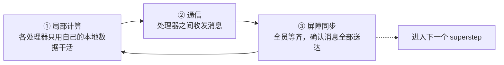

## 一句话定义

**LangGraph 的调度内核源自 BSP（1990）→ Pregel（2010）这条思想线**：把"一批节点并行跑、全部跑完才能进下一步"作为基本调度律。理解这两个模型，能解释你之前在 checkpointer / store / interrupts 笔记里看到的几乎所有现象——为什么节点能并行、为什么有 barrier、为什么 channel 更新要等到下一步才可见。

这篇番外篇是回溯根基：先讲 BSP 与 Pregel 本身，再用一节把它们映射回 LangGraph。

---

## 为什么需要"批量同步并行"

先退一步问：多台处理器一起干活时，最痛的是什么？

答案是**不可预测**。一旦允许任意节点在任意时刻读写共享数据、给任意对端发消息，数据竞争、死锁、执行顺序依赖就会铺天盖地——程序可能在千台机器上跑出千种结果，调试时几乎无从复现。

BSP（Bulk Synchronous Parallel，批量同步并行）给出的解法很朴素：**用"分步走 + 全员等齐"换"可预测性"**。

类比一家**工厂流水线吹哨制**：工人们各自在自己的工位干活，互不干扰；哨声一响，所有人必须停下交班，谁没干完都得等，等齐了再一起进入下一轮。这样一来，每轮内部的并行是自由的，但轮与轮之间的边界是清晰、可预测的。

这个"吹哨"就是后面要反复出现的核心概念——**屏障同步（barrier）**。

---

## BSP 模型本体

### 三要素

BSP 把一台"虚拟并行机"抽象成三样东西：

| 要素 | 含义 | 通俗解释 |
|---|---|---|
| **处理器 + 本地内存** | p 台处理器，每台有自己的本地内存 | 每个工人有自己的工作台和私藏工具 |
| **通信网络** | 连接所有处理器的网络，用于点对点消息传递 | 工人之间能互相递东西的传送带 |
| **屏障同步机制** | 一个全局栅栏，所有处理器到此同步 | 工厂吹哨，全员停手等齐 |

### Superstep 与三阶段

BSP 的计算被切成一串 **superstep（超步）**，每个 superstep 固定走三个阶段：

这套循环里藏着 BSP 的灵魂语义，后面 Pregel 和 LangGraph 都会复用它：

> **在 superstep N 发出的消息，只能在 superstep N+1 被看到。**

也就是说，同一轮里你发给别人的东西，别人这一轮读不到，要等下一轮才开始处理。这条规则看起来"低效"，但它**天然消除了数据竞争**——因为没有"同时读写同一份数据"这回事了。

### 参数与成本公式

BSP 用三个参数刻画一台并行机的"性格"：

| 参数 | 含义 |
|---|---|
| **p** | 处理器数量 |
| **g**（gap） | 通信带宽成本：网络每传一个数据字所需时间，相对本地计算的比值。g 越大，"传东西"越贵 |
| **L**（latency） | 同步延迟：连续两次屏障同步之间的最小间隔，即一次栅栏的固定开销 |

单个 superstep 的成本公式（注意：这里只**用**公式，不推导）：

`cost_i = w_i + h_i · g + L`

逐项拆解：

- `w_i`：这一轮里**最慢的那个处理器**算了多久。木桶效应——一轮的快慢由最慢的人决定。
- `h_i`：这一轮**通信量最大的处理器**单方向收发的消息量。
- `g`、`L`：上面两个机器参数。

**一个微型示例**：3 个处理器、跑 2 个 superstep。假设第 1 轮三人分别算了 5s / 3s / 4s，那么 `w_1 = 5`（取最大值），那 2s 算得快的人只能干等。这就是 BSP 最常被诟病的地方——**负载不均时，快的人会被慢的人拖住**。

把所有 S 个 superstep 的成本加起来就是总耗时：`T = Σ (w_i + h_i·g + L)`。程序员只要控制住 `w`、`h`、`g`、`L` 这几个量，就能在写代码时预测性能。

### 优缺点

**优点**

- **可预测**：三个参数就能算出成本，便于性能建模。
- **可移植**：换一台机器只换参数，算法不变。
- **无死锁、无数据竞争**：N→N+1 的消息时序自带顺序保证。

**缺点**

- **同步开销硬**：每轮末尾必须全员屏障等待，栅栏是躲不掉的固定成本。
- **负载不均会被放大**：最慢的人拖垮整轮，`L` 越大、越不均，浪费越严重。

**适合的问题**：迭代型、可分块的批量计算——数值线性代数、图算法（PageRank 这类）、大规模搜索、矩阵运算。**不适合**细粒度、低延迟的"一问一答"交互场景。
