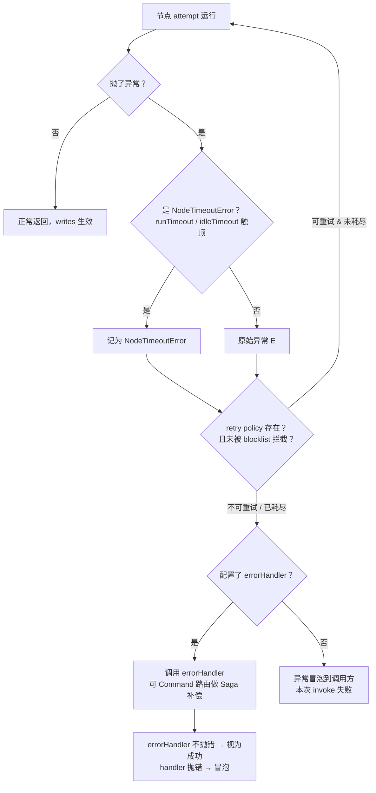
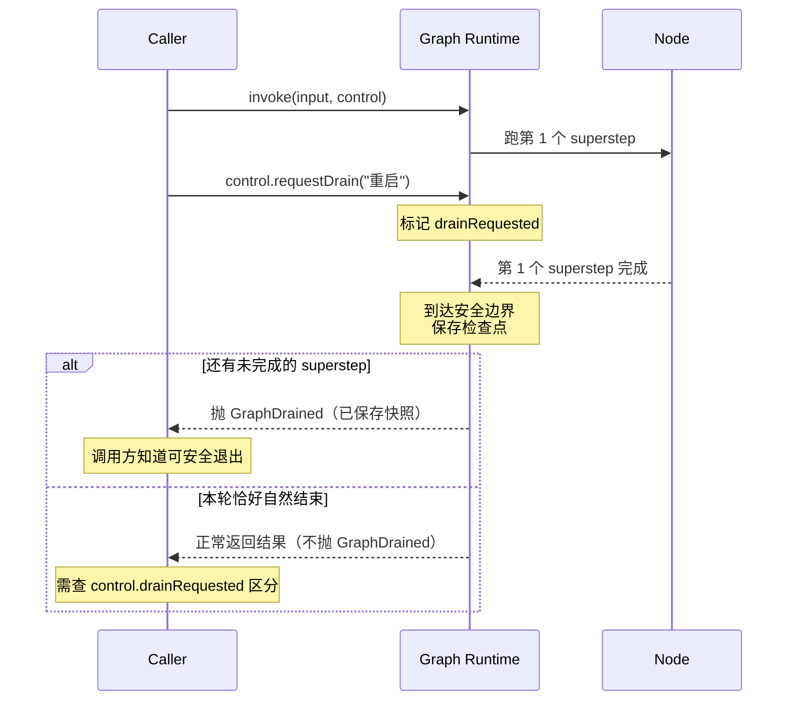

## 一句话定义

**LangGraph 的容错是"按固定顺序接力的三段式管线"**：一个节点 attempt 抛异常后，先由**超时（Timeouts）**决定是否快失败，再由**重试策略（Retry Policy）**决定是否再来一次，最后由**错误处理器（Error Handler）**兜底补偿——官方原话是 "three composable mechanisms that work together"。

但这套管线只是"运行期"的容错。一个真正能上线的 Agent，还需要两块外部支撑：

- **`setNodeDefaults`**：在图级别统一配置超时/重试/错误处理，避免每个节点重复写。
- **Graceful shutdown（优雅关闭）**：容器重启、收到 SIGTERM 时，等当前 superstep 跑完、保存检查点，再退出，不丢进度。

这篇把官方 [Fault tolerance](https://docs.langchain.com/oss/javascript/langgraph/fault-tolerance) 文档完整过一遍，目标是回答一个问题：**一个 LLM 节点挂了，会发生什么、怎么救、怎么不拖垮整张图**。

---

## 心智模型：一次 attempt 失败后会怎样

先抛开各个 API 的细节，只看一件事：**节点某一次 attempt 抛异常之后，框架按什么顺序处理它**。这条顺序记住了，后面的 API 就都好理解。



读懂这张图，就抓住了全文主线。有几个关键点值得单独强调：

- **顺序固定，不可调换**：超时先于重试，重试先于错误处理。你不能让 errorHandler 先跑、retry 后跑——这是框架写死的组合律。
- **NodeTimeoutError 是"一类"错误**：无论是 `runTimeout`（执行超时）还是 `idleTimeout`（等待超时）触顶，最终都统一抛成 `NodeTimeoutError`，方便 retry policy 一视同仁地处理。
- **errorHandler 不是"吞错器"**：它的真正用法是用 `Command(goto=...)` 跳到补偿节点做 Saga 回滚，而不是简单 `catch` 后假装没事。handler 自己抛错也会冒泡。
- **没配 retry policy = 一次都不重试**：重试是 **opt-in** 的，不写 `retryPolicy` 就等于"挂了直接进 errorHandler 或冒泡"。

接下来五节分别拆开讲这条管线上的每个环节。

---

## Timeouts：让节点"快失败"

超时要解决的问题是：**外部 API 卡死、LLM 推理挂住、死循环**——这些故障不会抛异常，但会把整个图拖死。LangGraph 给了两个互补的时钟，外加一个 heartbeat 心跳模式。

### runTimeout：硬性 wall-clock 上限

`runTimeout` 是节点的**总执行时长上限**，从节点开始执行计时，**无论节点内部做什么都不会刷新**。一旦超过，强制抛 `NodeTimeoutError`。

```ts
import { StateGraph, Annotation } from '@langchain/langgraph';

const State = Annotation.Root({
  query: Annotation<string>,
});

const graph = new StateGraph(State)
  .addNode('callLLM', callLLMNode, {
    timeout: {
      runTimeout: 10_000, // 10 秒硬上限，到点必杀
    },
  })
  .addEdge('__start__', 'callLLM');
```

适用场景：**LLM 调用、外部 API 请求**这类"要么成功要么超时，没有中间态"的操作。

### idleTimeout：等待式上限（进度重置）

`idleTimeout` 衡量的是节点"**多久没有进度**"。和 `runTimeout` 的关键区别在于——**只要节点产生进度信号，idleTimeout 的时钟就会被重置清零**。它专门对付"卡住但没退出"的任务，比如轮询一个永远不返回的队列。

```ts
  .addNode('pollQueue', pollQueueNode, {
    timeout: {
      // 只要持续有进度（收到消息），就一直不超时；
      // 一旦 5 秒没有任何进度信号，强制超时。
      idleTimeout: 5_000,
    },
  })
```

这两个时钟可以同时配，互不冲突：`runTimeout` 卡总时长上限，`idleTimeout` 卡"卡死"时长。

### 进度信号：idleTimeout 怎么知道"有进度"？

idleTimeout 的"进度信号"由 `refreshOn` 控制，官方文档列了四种来源，默认是 `auto`：

| `refreshOn` 值 | 什么信号会重置 idleTimeout |
|---|---|
| `'manual'` | **仅**手动调用 `runtime.heartbeat()` 才算进度，节点事件不算 |
| `'node_start'` | 当前节点或子图节点开始执行时 |
| `'any_node_start'` | 任意节点（含子图）开始执行时 |
| `'node_finish'` | 当前节点或子图节点完成时 |
| `'auto'`（默认）| 框架自动选择合适策略 |

最常用的是 `'manual'`——你想精确控制"什么算进度"时用它，配合下面的 heartbeat。

### heartbeat 模式：长任务手动保活

对于"跑很久但有节奏"的任务（批处理 100 条数据，每条 3 秒），用 `'manual'` + 在循环里手动 `runtime.heartbeat()` 打点：

```ts
import { Annotation, StateGraph, type Runtime } from '@langchain/langgraph';

async function batchNode(state: typeof State.State, runtime: Runtime) {
  const results = [];
  for (const item of state.items) {
    // 每处理一条就打一次心跳，重置 idleTimeout
    runtime.heartbeat();
    results.push(await processItem(item));
  }
  return { results };
}

const graph = new StateGraph(State)
  .addNode('batch', batchNode, {
    timeout: {
      idleTimeout: 5_000,
      refreshOn: 'manual', // 只认 heartbeat
    },
  });
```

类比：heartbeat 像**长跑运动员每跑完一圈按一下计时器**——只要还在按，说明人还活着；一旦超过 5 秒没按，说明真出事了，立刻抢救（超时）。

### NodeTimeoutError 与类型守卫

无论哪种超时，最终都抛同一个 `NodeTimeoutError`。它带几个字段帮你区分到底是哪种超时、发生在哪：

| 字段 | 含义 |
|---|---|
| `type` | 固定为 `'NodeTimeoutError'` |
| `timedOutAtMs` | 触发超时的那一刻的时间戳（ms）|
| `kind` | `'runTimeout'` 或 `'idleTimeout'`，说明是哪种时钟触顶 |
| `signals` | idleTimeout 触发时记录的最近进度信号，用于排查 |

判断一个错误是不是超时，用官方提供的类型守卫，别自己 `instanceof`（子类层级可能变）：

```ts
import { isNodeTimeoutError } from '@langchain/langgraph';

try {
  await graph.invoke(input, config);
} catch (e) {
  if (isNodeTimeoutError(e)) {
    console.log(`超时类型：${e.kind}，触发于 ${e.timedOutAtMs}`);
  }
}
```

### timeout + retry：天然组合

这是官方文档反复强调的一个设计点：**timeout 抛出的 `NodeTimeoutError` 默认是"可重试"的**。也就是说：

- 每次 retry 的 attempt，时钟都**重新从 0 开始计**；
- 上一次 attempt 超时前的任何 channel writes **会被清空**，不会污染下一次 attempt。

所以一个慢 API 节点配 `runTimeout: 5000` + `retryPolicy: { maxAttempts: 3 }` 是非常自然的组合：第一次 5 秒超时 → 自动重试 → 第二次重新给 5 秒。你不需要自己写 `setTimeout` + `Promise.race`，框架替你做了。

### 进阶：Dynamic timeouts with Send

当用 `Send` 动态派发节点时，可以给每个 Send 实例单独传 timeout，实现"按数据决定超时"（比如不同优先级的请求给不同时长）。这块属于高级用法，需要时查官方文档即可，本篇不展开。

---

## Retries：自动恢复 + 区分错误类型

超时只是"快失败"，失败之后要不要再试一次，由 **retry policy** 决定。它是 opt-in 的——不配置就不重试。

### retryPolicy 参数

```ts
  .addNode('callAPI', callAPINode, {
    retryPolicy: {
      maxAttempts: 3,            // 最多尝试 3 次（含首次）
      backoffFactor: 2,          // 退避倍率
      initialInterval: 500,      // 首次重试等待 500ms
      maxInterval: 10_000,       // 单次退避上限 10s
      jitter: true,              // 加随机抖动，避免重试风暴
      retryOn: [TimeoutError],   // 可选：只重试这些错误类型
    },
  })
```

退避间隔用指数公式计算（用 KaTeX 渲染）：

$$\text{wait}_n = \min(\text{initialInterval} \cdot \text{backoffFactor}^{n-1},\ \text{maxInterval})$$

第 $n$ 次重试的等待时长，是 `initialInterval` 乘以 `backoffFactor` 的 $n-1$ 次方，但不超过 `maxInterval`。配 `jitter: true` 后再加一点随机量，防止多个客户端同时重试压垮下游。

### 关键认知：重试是 opt-in，但"默认不重试"≠"配了就全重试"

这里有个**最容易踩的认知陷阱**：

- **不配 `retryPolicy`**：一次都不重试，挂了直接进 errorHandler 或冒泡。
- **配了空 policy `{}`**：开启重试，`maxAttempts` 用默认值（通常 3）。但**不是所有异常都会被重试**——见下面的内置 blocklist。

### 内置 blocklist：这些错误默认不重试

官方文档明确：即使配了 retry policy，以下错误**默认不会触发重试**，会直接跳过重试进入 errorHandler：

| 错误类型 | 为什么不重试 |
|---|---|
| `AbortError` | 调用方主动取消（如 AbortSignal），重试没意义 |
| `ECONNABORTED` | 连接被主动中止 |
| HTTP 4xx（除 408/429）| 客户端错误，重试也是同样结果（参数错、没权限）|
| `insufficient_quota` / 配额不足 | 重试只会继续扣失败配额 |
| 控制流错误（如 interrupt 的内部异常）| 重试会破坏图执行语义 |

> ⚠️ **修正旧认知**：如果你之前以为"配了 retry 就是所有异常都重试"，请记住——内置 blocklist 会先把这一类"重试无意义"的错误挡掉。这是框架的合理默认，避免你对一个参数错误重试 3 次。

唯一例外是 `NodeTimeoutError`：它**不在** blocklist 里，默认可重试（呼应上一节"timeout + retry 天然组合"）。

### 自定义 retryOn：精确控制重试范围

想反过来——**只**重试某些特定错误，其它一律不试——用 `retryOn`。它是异常过滤器，只有匹配数组里类型的错误才重试：

```ts
import { TimeoutError } from '@langchain/langgraph';

  .addNode('callAPI', callAPINode, {
    retryPolicy: {
      maxAttempts: 3,
      retryOn: [TimeoutError, NetworkError], // 只重试这两种
    },
  })
```

`retryOn` 的三种用法语义要分清：

| 写法 | 行为 |
|---|---|
| 不写 `retryOn` | 用内置 blocklist 过滤（推荐，覆盖大多数场景）|
| `retryOn: [SomeError]` | **仅**匹配这些错误重试，其余直接失败 |
| `retryOn: []`（空数组）| 完全禁用重试 |

> 注意：Python SDK 有个 `defaultRetryOn` helper，JS/TS SDK **没有**。在 JS 里想自定义判断逻辑，就往 `retryOn` 数组里塞错误类，靠 `instanceof` 匹配。

### 用 executionInfo 切 fallback 策略

重试期间，节点可以通过第二个参数 `runtime.executionInfo` 读到"这是第几次尝试"，据此走不同逻辑（比如第 3 次降级用更便宜模型）。具体字段见下一节。

---

## executionInfo：窥探重试状态

`runtime.executionInfo` 是节点第二个入参（`runtime`）上的一个对象，存了"当前这次运行的元信息"——重试次数、会话 ID、检查点 ID 等。它最大的用途是**让节点知道自己处于重试的哪一轮**，从而走 fallback。

### 字段速查表

| 字段 | 含义 | 存在条件 |
|---|---|---|
| `nodeAttempt` | 当前节点第几次尝试，从 1 开始 | 节点执行时一定存在 |
| `nodeFirstAttemptTime` | 节点首次执行的时间戳，重试不变 | 节点执行时存在 |
| `taskId` | 当前节点任务 ID | 节点执行时存在 |
| `threadId` | 会话唯一 ID | **必须配置 checkpointer**，否则 `undefined` |
| `runId` | 单次完整流程运行 ID | 调用时传入才存在 |
| `checkpointId` | 当前快照唯一 ID | **开启检查点**才存在，否则 `undefined` |
| `checkpointNs` | 快照命名空间，用于多租户/子图隔离 | **开启检查点**才存在，否则 `undefined` |

### 两个常见疑问

**Q1：checkpointId / checkpointNs 一定存在吗？**

不是。它们只在挂载了 checkpointer 时才会生成。没配 checkpointer，这俩字段是 `undefined`。文档里写的类型是"简写"，省略了 `undefined` 的可能性，别被误导。

**Q2：为什么 threadId 依赖 checkpointer？**

因为 `threadId` 是**会话顶层主键**——它的全部意义就是"用来定位某次会话的快照"。没配 checkpointer，就没有快照存储，自然不需要区分会话，threadId 就是 `undefined`。

底层主键关系是一条链：

```text
thread_id（会话）
    └─ checkpointNs（命名空间，隔离子图/多租户）
         └─ checkpointId（单张快照）
```

要恢复某次运行，必须先有 threadId 定位会话、再按 namespace 找分区、最后按 checkpointId 取具体那张快照。这也是为什么 interrupts / graceful shutdown 都强依赖 checkpointer——它们本质都是在"快照边界"上做动作。检查点的存储机制详见《LangGraph Checkpointer》一文。

### 实战：按重试次数降级

```ts
import { Annotation, StateGraph, type Runtime } from '@langchain/langgraph';

async function callLLMNode(state: typeof State.State, runtime: Runtime) {
  const attempt = runtime.executionInfo.nodeAttempt;

  // 第 3 次尝试时降级到便宜模型
  const model = attempt >= 3 ? cheapModel : expensiveModel;
  return { answer: await model.invoke(state.query) };
}

const graph = new StateGraph(State)
  .addNode('llm', callLLMNode, {
    retryPolicy: { maxAttempts: 3 },
  });
```

---

## Error handling：用 Saga 补偿兜底

当 retry 耗尽（或不配 retry 直接挂），最后一步是 `errorHandler`。但它的定位不是"吞掉错误"，而是**实现 Saga 补偿模式**——某步失败后执行反向操作，保证业务最终一致。

### errorHandler 基本形态

注意：`errorHandler` **只在 StateGraph 上可用**，Functional API（task/entrypoint）不支持。它接收一个 `NodeError` 对象：

```ts
import { StateGraph, Annotation, Command } from '@langchain/langgraph';

const State = Annotation.Root({
  orderId: Annotation<string>,
  paid: Annotation<boolean>,
  refunded: Annotation<boolean>,
});

const graph = new StateGraph(State, {
  // 重试耗尽后，路由到 compensate 节点
  errorHandler: async (error: NodeError, state, runtime) => {
    console.log(`节点 ${error.node} 失败：`, error.error);
    return new Command({ goto: 'compensate' });
  },
})
  .addNode('pay', payNode, { retryPolicy: { maxAttempts: 3 } })
  .addNode('compensate', refundNode)
  .addNode('finalize', finalizeNode)
  .addEdge('__start__', 'pay')
  .addEdge('compensate', 'finalize');
```

`NodeError` 只有两个字段：

| 字段 | 含义 |
|---|---|
| `node` | 失败的节点名 |
| `error` | 原始错误对象 |

### Saga 模式：订单支付失败走退款

分布式长事务的经典问题：**下单 → 扣款 → 发货**，如果扣款成功但发货失败，钱不能白扣。Saga 的思路是给每个正向操作配一个反向补偿，失败时按相反顺序回滚。

类比：**快递破损走理赔流程**——签收时发现坏了，不是直接丢掉，而是触发"拒收 → 退回仓库 → 退款给买家"这套补偿链。

```ts
async function refundNode(state) {
  if (state.paid) {
    await refund(state.orderId); // 反向操作：退款
    return { refunded: true };
  }
  return {};
}
```

支付节点重试 3 次都失败 → errorHandler 触发 → `Command({ goto: 'compensate' })` 跳到退款节点 → finalize 收尾。整条链路保证"要么成功，要么退款"，不会停在"扣了钱没发货"的中间态。

### 子图失败的冒泡

如果一个节点是子图，子图内部的节点失败且未被子图自己的 errorHandler 处理，错误会**冒泡到父图**，由父图的 errorHandler 处理。这和普通异常冒泡一样，记住"错误向上找最近的 errorHandler"即可。

### errorHandler 的三条限制

| 限制 | 说明 |
|---|---|
| 一节点一 handler | 图级配置一个 errorHandler，对所有节点生效；不能给单个节点单独配 |
| handler 不应用到自身 | errorHandler 节点出错会直接冒泡，不会无限递归 |
| handler 抛错即冒泡 | errorHandler 自己抛异常，异常冒泡给调用方，本次 invoke 失败 |

核心心法：**errorHandler 是 Saga 补偿的入口，不是 try/catch 的替代品**。如果你的 handler 只是 `console.error` 然后返回空状态，那相当于"假装成功"，会让业务进入不一致状态——这通常是你不想要的。

---

## setNodeDefaults：图级默认配置

前面三节（timeout/retry/errorHandler）都是逐节点配置的。但一个 Agent 图可能有十几个节点，难道每个都写一遍同样的 retry policy？`setNodeDefaults` 就是来解决这个重复的。

### 一次配置，全图生效

```ts
const graph = new StateGraph(State)
  .addNode('llm', llmNode)
  .addNode('tool', toolNode)
  .addNode('validate', validateNode)
  // 统一默认：所有节点 10s 超时 + 3 次重试 + 统一错误处理
  .setNodeDefaults({
    timeout: { runTimeout: 10_000 },
    retryPolicy: { maxAttempts: 3 },
    errorHandler: defaultErrorHandler,
  });
```

这等价于给每个 `addNode` 都填上同样的配置。可选字段：`retryPolicy` / `errorHandler` / `timeout` / `cachePolicy`。

### Precedence：直接配置 > defaults

如果某个节点在 `addNode` 时**直接**传了 `retryPolicy`，它会**覆盖** defaults 里的同名配置，而不是合并。解析时机是 `compile()`，所以最终值在编译时就定死了。

```ts
  .addNode('longLLM', longLLMNode, {
    retryPolicy: { maxAttempts: 5 }, // 覆盖 defaults 的 maxAttempts: 3
  })
// longLLM 节点最终：maxAttempts=5，其它（timeout/errorHandler）继承 defaults
```

### Applicability：errorHandler / cachePolicy 不应用到 handler 节点

默认配置不是无脑套到所有节点上。官方有一张 applicability matrix：

| 默认配置 | 应用到普通节点 | 应用到 error-handler 节点 |
|---|---|---|
| `retryPolicy` | ✅ | ✅ |
| `timeout` | ✅ | ✅ |
| `errorHandler` | ✅ | ❌（避免 handler 出错又触发自己，无限递归）|
| `cachePolicy` | ✅ | ❌（handler 是兜底逻辑，不应缓存）|

记住一句话：**errorHandler 和 cachePolicy 对 error-handler 节点本身不生效**，这是框架防递归/防脏缓存的保护。

### Scope：不继承子图

`setNodeDefaults` 的作用域是**当前图**。如果某个节点是一个子图，子图内部节点**不会**继承父图的 defaults——子图要自己 `setNodeDefaults`。这点容易踩坑：你在父图配了 timeout，子图里的节点照样可能无限执行。

---

## Functional API：task / entrypoint 的容错

前面讲的都是 StateGraph（命令式建图）的容错。LangGraph 还有一套 **Functional API**——用 `task()` 和 `entrypoint()` 函数式地组织流程，不用显式建图。它的容错配置和 StateGraph **几乎一样，但有几个命名陷阱**。

### task：支持 timeout + retry

```ts
import { entrypoint, task } from '@langchain/langgraph';

const callLLM = task('callLLM', {
  timeout: { runTimeout: 10_000 },
  retry: { maxAttempts: 3 }, // ⚠️ 注意是 retry，不是 retryPolicy！
}, async (state) => {
  return { answer: await model.invoke(state.query) };
});

const app = entrypoint('app', async (state) => {
  return await callLLM(state);
});
```

> ⚠️ **命名陷阱**：StateGraph 里叫 `retryPolicy`，Functional API 的 `task` 里叫 **`retry`**（少个 Policy）。两个名字指向同一套配置，写错不会报 schema 错，但配置不生效。

task 重试时的行为有个关键点：**重试会重置 task 内部的局部状态**。task 里声明的临时变量、未 return 的中间结果，在重试时都会丢失。所以 task 之间传值必须用 `return`，别指望靠闭包共享状态跨重试存活。

### entrypoint：只支持 timeout

`entrypoint` 是流程入口，本身只支持 `timeout`，不支持 retry / errorHandler：

```ts
const app = entrypoint('app', {
  timeout: { runTimeout: 60_000 }, // 整个流程上限 60s
}, async (state) => {
  // ...
});
```

### 一张速查表

| 能力 | StateGraph 节点 | `task` | `entrypoint` |
|---|---|---|---|
| `timeout` | ✅ | ✅ | ✅ |
| 重试（retry）| ✅ `retryPolicy` | ✅ **`retry`** | ❌ |
| `errorHandler` | ✅ | ❌ | ❌ |
| `setNodeDefaults` | ✅ | ❌（无图级默认）| ❌ |

结论：**Functional API 没有 errorHandler**。如果你需要 Saga 补偿这类兜底逻辑，只能回到 StateGraph，或者在 task 内部自己 `try/catch` + 条件跳转。

---

## Graceful shutdown：协作式排空

前面五节管的是"运行期"的容错。但生产环境还有一类场景：**容器要重启、进程收到 SIGTERM**——这时候不能粗暴杀进程，否则正在跑的 superstep 会丢失进度。Graceful shutdown（优雅关闭）就是干这个的，版本要求 `@langchain/langgraph >= 1.4.0`。

### 三个核心组件

| 组件 | 作用 |
|---|---|
| `RunControl` | 停机控制器，和单次执行绑定 |
| `requestDrain(reason)` | 下发"排空停机"信号，通知框架跑完当前 superstep 就停 |
| `GraphDrained` | 正常排空停机时抛出的专属异常，**代表快照已保存** |

关键认知：requestDrain **不是立刻杀**，而是"协作式排空"——框架会等当前 superstep 完整跑完、保存检查点，然后抛 `GraphDrained` 让调用方知道"可以安全退出了"。

### 为什么只能在 superstep 边界停？

回顾一下 superstep 概念（详见《LangGraph 的根基：BSP 与 Pregel》）：superstep 是图执行的最小原子轮次，一轮包含"并行节点执行 + 状态合并 + 快照持久化"。

**所有暂停、优雅停机、检查点保存，都只会在 superstep 边界发生**。你不能在节点运行到一半时停——那样状态不完整，检查点无法恢复。Graceful shutdown 就是利用这条规则：它知道下一个 superstep 边界是个安全点，于是等到那里再停。

### 五种排空场景

收到 `requestDrain` 后到底会发生什么，取决于当时图处于什么状态：



| 场景 | 行为 |
|---|---|
| 节点正在跑 | **不停**，等当前 superstep 跑完 |
| 节点正在重试 | **不打断**重试，重试完再判断是否到边界 |
| 还有后续 superstep | 到达边界后抛 `GraphDrained`（快照已存）|
| 本轮恰好自然完成 | **不抛**异常，正常返回结果；要靠 `control.drainRequested` 区分是"跑完了"还是"被排空停了" |
| 子图请求 drain | 信号冒泡到父图，由父图统一排空 |

### Resume after drain：续跑未完成流程

抛 `GraphDrained` 后，未跑完的流程可以通过同一个 thread_id 续跑（和 interrupts 的 resume 一模一样）：

```ts
await graph.invoke(null, config); // 传 null 复用原状态
```

### 在节点内提前感知停机

节点第二个入参 `runtime` 可以提前读到 drain 状态，**不必等到 superstep 结束**就能优化：

```ts
async function heavyNode(state, runtime: Runtime) {
  // 检测到要停机，直接跳过耗时任务，加速关闭
  if (runtime.control.drainRequested) {
    console.log(`停机原因：${runtime.control.drainReason}，跳过重活`);
    return { skipped: true };
  }
  return await doHeavyWork(state);
}
```

实战优化：批处理节点检测到 drainRequested 后，可以直接跳过剩余批次——反正快照已存到上一个边界，下次 invoke 会续跑。

### SIGTERM hook 模式

生产环境最常见的是监听系统 SIGTERM 信号（Linux/Docker/K8s 的友好终止信号），转成 requestDrain：

```ts
import { getLangGraphRunnable } from '@langchain/langgraph';

process.on('SIGTERM', () => {
  console.log('收到 SIGTERM，开始排空...');
  control.requestDrain('SIGTERM');
});
```

SIGTERM 小知识：容器默认给 30 秒，超时未退出会发 SIGKILL 强杀——那就真的丢状态了。所以排空逻辑必须快。

### 重要限制：requestDrain 无法中断异步任务

这是最容易踩的坑：**`requestDrain` 只标记状态，不会中断节点内已发起的异步操作**（fetch、数据库查询、定时器）。它会阻塞到这些任务自然完成，才走到 superstep 边界。

如果节点里发了一个永不返回的 fetch，优雅关闭会一直卡着，直到容器超时被 SIGKILL——优雅关闭就白做了。

**最佳实践**：搭配 `AbortSignal` + 超时，给异步任务一个硬性上限：

```ts
async function fetchNode(state, runtime: Runtime) {
  const controller = new AbortController();
  // 节点内部再设一个超时，防止 requestDrain 永远等不到任务完成
  const timer = setTimeout(() => controller.abort(), 8_000);
  try {
    return await fetch(state.url, { signal: controller.signal });
  } finally {
    clearTimeout(timer);
  }
}
```

这样即使 requestDrain 卡住，8 秒后 fetch 也会被 abort，节点退出，到达 superstep 边界，正常排空。

---

## 设计规则

把全文踩坑点浓缩成 8 条可落地的规则：

| # | 规则 | 反例代价 |
|---|---|---|
| 1 | **每个会卡住的节点都配 `runTimeout`** | LLM/外部 API 卡死 → 整张图挂死 |
| 2 | **retry 要区分临时错误 vs 业务错误** | 对"参数错误"重试 3 次 = 浪费配额 |
| 3 | **errorHandler 用 Command 做 Saga，别吞错** | 只 console.error 返回空 = 业务进不一致态 |
| 4 | **长任务用 `'manual'` + heartbeat 保活** | 批处理跑 10 分钟，idleTimeout 默认会误杀 |
| 5 | **setNodeDefaults 不继承子图，子图要单独配** | 父图配了 timeout，子图节点照样能无限跑 |
| 6 | **Graceful shutdown 必配 AbortSignal 兜底** | 异步任务不响应 drain → 卡到被 SIGKILL |
| 7 | **JS 里自定义重试要自己写 `retryOn`** | 找 `defaultRetryOn` 会扑空（那是 Python 的）|
| 8 | **timeout 和 retry 天然组合，别自己写 setTimeout** | 手写 `Promise.race` 容易漏掉 writes 清理 |

另外两个命名陷阱，记住省一次调试：

- StateGraph 用 `retryPolicy`，Functional API 的 `task` 用 `retry`（少个 Policy）。
- 想判断超时错误用 `isNodeTimeoutError(e)`，别 `instanceof`。

---

## 一句话总结

**LangGraph 的容错不是单一开关，而是一条按固定顺序接力的管线**：超时负责"快失败"，重试负责"自动恢复"，errorHandler 负责"Saga 兜底"，三者由框架按固定顺序组合，你只需声明每段用什么策略。再叠上图级 `setNodeDefaults` 减少重复、Graceful shutdown 保证停机不丢进度，一个 LLM 节点挂掉就再也不是整张图的灾难。
