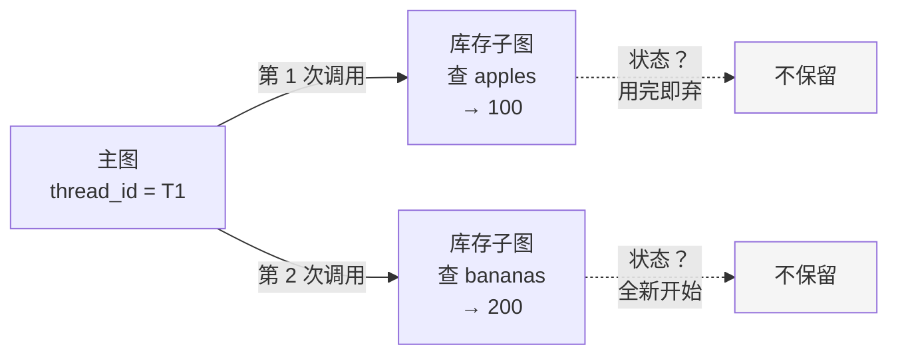
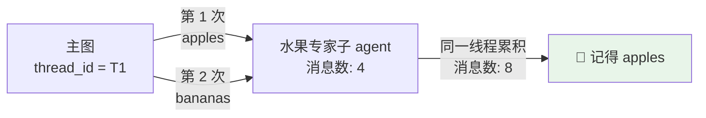
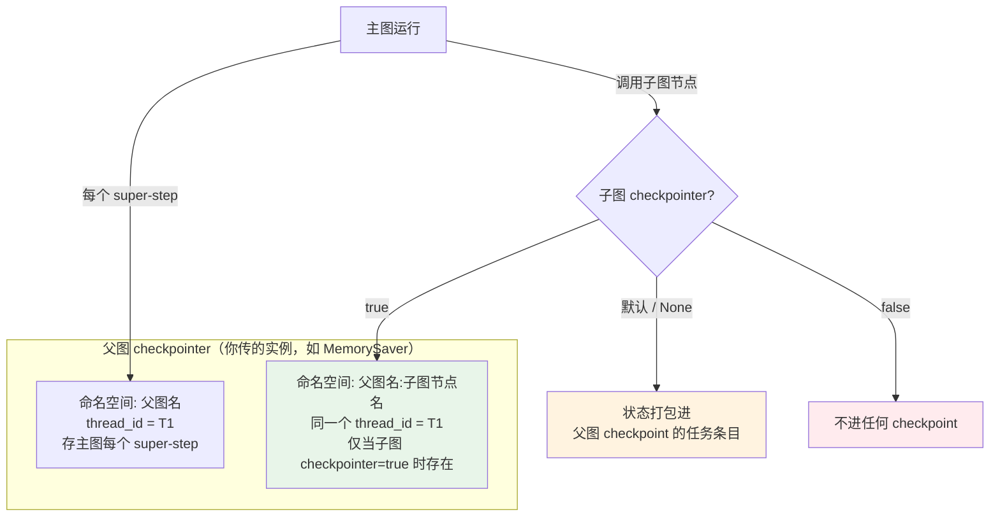

## 一句话定义

**子图的 `checkpointer` 不是"要不要持久化"的开关，而是"持久化给谁看"的选择——per-invocation（默认）让子图每次调用都全新、但单次内仍支持 interrupt；per-thread 让子图在同一个 thread_id 上跨调用累积记忆、代价是不能再并行；stateless 干脆什么都不存。** 父图的 checkpointer 是这一切的地基，没它，子图怎么配都白搭。

前三篇已经把 checkpointer（[02-checkpointer](../02-checkpointer)）、store（[03-store](../03-store)）、记忆管理（[04-memory-advanced](../04-memory-advanced)）讲透了。但有一个角落一直没正面展开：**当持久化遇上子图（subgraph）或子 agent 时，状态到底存到哪、算谁的、跨不跨调用？**

这正是子图持久化要回答的问题。一个图里嵌着另一个图，外层有外层的 checkpoint，内层要不要也有自己的？内层的记忆是每次调用都清零，还是能像主图一样在同一个线程上累积？

官方文档对此的表述分散在两处、用了两套词：

- **JS 文档**（`use-subgraphs.md`）只讲 `true` / `false` 两个取值，说的是「子图有没有自己**独立的 checkpoint 命名空间**」。
- **Python 文档**讲得更细，给出 `None` / `True` / `False` 三种取值，对应 **per-invocation / per-thread / stateless** 三种语义。

本篇以语义更完整的**三模式**为主线（JS/TS 代码为主，关键处标注 JS 文档的命名差异），把这层关系彻底理清。

| 模式 | 子图怎么配 | 状态存哪 | 跨调用记忆 | 典型场景 |
|---|---|---|---|---|
| **per-invocation**（默认） | 不设 / `None` | 父图 checkpoint 里的一个任务条目 | ❌ 每次调用全新 | 大多数情况：子图只是主图的一步 |
| **per-thread** | `checkpointer: true` | 子图**独立命名空间**，共用父图的 thread_id | ✅ 同线程累积 | 子 agent 要"记得"同一线程上聊过什么 |
| **stateless** | `checkpointer: false` | 不存 | ❌ 且单次内也不可 interrupt | 纯计算、无状态、不打算断点续跑的子图 |

一句话：**01 讲"状态怎么存"，本篇讲"子图语境下，状态存给谁、存多久"。**

---

## 三个场景，三种选择

先不讲 API，用三个场景把三种模式的区别钉死。

### 场景一：per-invocation（默认）—— 子图是"用完即弃"的一步

主图里有一个"查询库存"子图，每次进入它就是干一次活、查完就回主图。你**不关心**它跨调用记不记得上次查了什么——事实上你**希望**它每次都是干净的，避免上次的脏状态污染这次。



注意：per-invocation **不是 stateless**。子图在**单次调用内部**仍然会跟着父图的 checkpointer 走，所以它依然支持 `interrupt()`、依然能 durable execution——只是**调用结束、状态不延续到下一次**。

### 场景二：per-thread —— 子 agent 要"记得你说过什么"

你做了一个"水果专家"子 agent，挂在主图里。用户在同一个对话里先问 apples、再问 bananas，你**希望**子 agent 第二次回答时还记得第一次聊的内容——就像主图的 checkpointer 让主图有记忆一样。



这就是 `checkpointer: true` 的作用：子图拿到一个**独立命名的 checkpoint 存储区**（命名空间形如 `<父图名>:<子图节点名>`），但在**同一个 thread_id** 上累积。代价是：**同一个子图不能再被并发调用**——详见后文「per-thread 的并发代价」。

### 场景三：stateless —— 纯计算，不打算断点

子图只是一个无副作用的纯函数（比如格式化输出、做一道数学计算），你既不需要它跨调用记东西，也**不需要**它在单次内 interrupt——那就 `checkpointer: false`，彻底不进 checkpoint，最省存储。

| 你的需求 | 选哪种 |
|---|---|
| 子图每次调用都该是干净的，但单次内可能要 interrupt | **per-invocation**（默认，什么都不设） |
| 子 agent 要在同一对话里"记得"上下文 | **per-thread**（`checkpointer: true`） |
| 子图是纯计算，永远不 interrupt、不续跑 | **stateless**（`checkpointer: false`） |

---

## 三种模式怎么配

### per-invocation（默认）

什么都不设，或 Python 里显式传 `None`：

```javascript
import { MemorySaver } from "@langchain/langgraph-checkpoint";

// 子图：不设 checkpointer —— 继承父图的持久化，但不跨调用累积
const subgraph = new StateGraph(SubStateAnnotation)
  .addNode("worker", workerNode)
  .addEdge(START, "worker")
  .addEdge("worker", END)
  .compile(); // ← 不传 checkpointer，等价于 per-invocation

// 父图：必须配 checkpointer，否则连主图都没持久化
const parent = new StateGraph(ParentStateAnnotation)
  .addNode("sub", subgraph) // 直接把编译好的子图当节点
  .addEdge(START, "sub")
  .addEdge("sub", END)
  .compile({ checkpointer: new MemorySaver() });
```

子图的状态会被**打包进父图 checkpoint 的对应任务条目**里——它没有自己的命名空间，你无法脱离父图单独查它的历史。

### per-thread（`checkpointer: true`）

```javascript
// 子图：开自己的 checkpointer（独立命名空间，共用父图 thread_id）
const subgraph = new StateGraph(SubStateAnnotation)
  .addNode("worker", workerNode)
  .addEdge(START, "worker")
  .addEdge("worker", END)
  .compile({ checkpointer: true }); // ← 关键：true

// 父图：仍然必须配一个真实的 checkpointer 实例
const parent = new StateGraph(ParentStateAnnotation)
  .addNode("sub", subgraph)
  .addEdge(START, "sub")
  .addEdge("sub", END)
  .compile({ checkpointer: new MemorySaver() });
```

这里的 `true` 不是"随便给个布尔值"，它的真实含义是：**让 LangGraph 为这个子图自动创建一个 checkpointer，挂在和父图相同的 thread_id 下，但用独立的命名空间 `<父图名>:<子图节点名>` 隔离开**。于是子图有了自己的状态历史，能被单独 `getState` / `getStateHistory` / `interrupt`。

用 `createAgent` 创建子 agent 时同理（这也是本篇最开始那个代码片段的出处）：

```javascript
import { createAgent } from "@langchain/langgraph/prebuilt";

const fruitAgent = createAgent({
  model: "gpt-5.4-mini",
  tools: [fruitInfo],
  prompt: "You are a fruit expert. Use the fruit_info tool. Respond in one sentence.",
  checkpointer: true, // ← 同语义：子 agent 走 per-thread，跨调用累积记忆
});
```

### stateless（`checkpointer: false`）

```javascript
const subgraph = new StateGraph(SubStateAnnotation)
  .addNode("format", formatNode)
  .addEdge(START, "format")
  .addEdge("format", END)
  .compile({ checkpointer: false }); // ← 彻底不持久化
```

JS 文档原文点明了 `false` 的语义：

> *"the subgraph will **not** have its own checkpointer. The subgraph's state will be persisted **as part of the parent graph's checkpoint**..."*

⚠️ **注意一个 JS / Python 文档的措辞差异**：JS 文档把"不设"和 `false` 都描述成"状态并入父图 checkpoint"。但 Python 文档区分得更清楚——**默认（不设 = `None`）是 per-invocation（单次内仍随父图持久化、可 interrupt），而显式 `false` 才是真正的 stateless（连单次内的 interrupt 能力都不要）**。实践上：想省心就用默认（per-invocation），只有确定子图绝不需要 interrupt 时才显式写 `false`。

---

## 父子两层 checkpoint：一张全景图

把三种模式放在一起，关键是理解**有两层 checkpoint**：



三个要点：

1. **父图的 checkpointer 是地基**。文档原文：*"The parent graph must have a checkpointer — otherwise neither the parent nor the subgraph will be persisted."* 父图没配，子图配什么都没用。
2. **`true` 只是"开独立命名空间"的旗子**，它不指定后端——子图复用的是**父图那个 checkpointer 实例**（同一个 `MemorySaver` / Postgres / …），只是存到了不同的 namespace 下。
3. **thread_id 始终共用**。无论哪种模式，子图的 checkpoint 都和父图在同一个 `thread_id` 上——这也是 per-thread 模式能"跨调用累积"的原因。

---

## per-thread 的并发代价

per-thread 模式有个**实质性的限制**：同一个 per-thread 子图**不能被并行调用**。

原因很直接——并行调用会往**同一个命名空间 + 同一个 thread_id** 写 checkpoint，产生冲突。主图在不同分支里同时调用同一个 per-thread 子图，等于两个执行流抢着改同一份记忆，结果不可预测。

所以当你给子图开 `checkpointer: true` 后，如果它被当成工具由主 agent 调用，通常要用中间件把**并发调用数限到 1**：

```javascript
import { createAgent } from "@langchain/langgraph/prebuilt";

// 限制 ask_fruit_expert 这个工具同一时间只能被调用 1 次
const toolCallLimitMiddleware = {
  toolCallLimit: 1,
  toolCallLimitToolName: "ask_fruit_expert",
};

const mainAgent = createAgent({
  model: "gpt-5.4-mini",
  tools: [fruitAgent.asTool({
    name: "ask_fruit_expert",
    description: "Ask the fruit expert sub-agent a question.",
  })],
  middleware: [toolCallLimitMiddleware],
  checkpointer: new MemorySaver(), // 父图必须配
});
```

per-invocation 和 stateless 模式**没有这个限制**，因为它们根本不往持久命名空间写跨调用状态，并行调用互不干扰。

| 模式 | 能并行调用同一个子图吗 | 为什么 |
|---|---|---|
| per-invocation | ✅ 能 | 每次调用独立，不共享持久状态 |
| **per-thread** | ❌ **不能** | 共享命名空间 + thread_id，并发写冲突 |
| stateless | ✅ 能 | 不写任何 checkpoint |

---

## 实战对比：同一对话连问两次

用一段可运行的对照把 per-thread 和默认模式的差异钉死。同一个 `thread_id`，连续问两次：

```javascript
const config = { configurable: { thread_id: "t-1" } };

// 第一次问 apples
await graph.invoke(
  { messages: [{ role: "user", content: "Tell me about apples." }] },
  config
);

// 第二次问 bananas（同一个 thread_id）
await graph.invoke(
  { messages: [{ role: "user", content: "Now tell me about bananas." }] },
  config
);
```

观察子 agent 内部的 `messages` 数量变化：

```text
┌─────────────────────────────────────────────────────────────┐
│ checkpointer: true（per-thread）                            │
├─────────────────────────────────────────────────────────────┤
│ 第 1 次 (apples)   →  子 agent messages: 4                  │
│ 第 2 次 (bananas)  →  子 agent messages: 8   ← 累积了 apples │
└─────────────────────────────────────────────────────────────┘

┌─────────────────────────────────────────────────────────────┐
│ 默认 / 不设（per-invocation）                               │
├─────────────────────────────────────────────────────────────┤
│ 第 1 次 (apples)   →  子 agent messages: 4                  │
│ 第 2 次 (bananas)  →  子 agent messages: 4   ← 全新，不记得  │
└─────────────────────────────────────────────────────────────┘
```

per-thread 模式下第二次 messages 数翻倍，说明子 agent 把第一次的对话也带在身上了；默认模式下每次都是干净的 4 条。**这就是"子 agent 有没有记忆"的可观测差异。**

---

## 怎么观察子图的 checkpoint

per-thread 子图（`checkpointer: true`）有了独立命名空间，所以你能脱离父图、单独查它的状态——这正是它和 per-invocation 在可观测性上的最大区别。

```javascript
import { subgraph } from "./graphs";

// 拿到某次运行的 config（含 thread_id）
const config = { configurable: { thread_id: "t-1" } };

// 子图当前状态
const state = await subgraph.getState(config);
console.log(state.values);        // 子图内部状态
console.log(state.next);          // 子图下一步要执行什么

// 子图的状态历史（注意：和父图的 getStateHistory 是分开的两条线）
const history = subgraph.getStateHistory(config);
for await (const snapshot of history) {
  console.log(snapshot.config);   // 含独立的 checkpoint_id
  console.log(snapshot.values);
}
```

⚠️ per-invocation 模式下，子图**没有**这种独立历史——它的状态混在父图的 checkpoint 里，得通过父图的 `getState(config, { subgraphs: true })` 从 `tasks` 数组里下钻才能看到（详见 [08-time-travel](../08-time-travel) 的子图时间旅行一节）。

| 想做的事 | per-invocation | per-thread |
|---|---|---|
| 直接对子图 `getState` / `getStateHistory` | ❌ 不行 | ✅ 可以（独立命名空间） |
| 从父图 `getState({subgraphs:true})` 下钻看子图 | ✅ 可以 | ✅ 也可以 |
| 对子图单独做时间旅行 / Fork | ❌ 不行 | ✅ 可以 |
| 子图内部 interrupt 后定位恢复 | ✅（随父图） | ✅（可独立定位） |

---

## 设计规则速查

把全文浓缩成一张决策表：

| 你想做的事 | 怎么配 |
|---|---|
| 子图只是主图的一步，每次干净开始 | 默认（不设 checkpointer） |
| 子 agent 要在同一对话里记得上下文 | 子图/子 agent `compile({ checkpointer: true })` |
| 子图是纯计算，永不 interrupt、永不续跑 | `compile({ checkpointer: false })` |
| 让子图能被单独 `getState` / 时间旅行 | `checkpointer: true`（拿到独立命名空间） |
| 让一切持久化生效 | **父图必须配 checkpointer 实例**（如 `new MemorySaver()`） |

以及五条容易踩的硬规则：

1. **父图的 checkpreter 是地基**——父图不配，子图配什么都白搭，父子都不会被持久化。
2. **`checkpointer: true` 不指定后端**——它只是"开独立命名空间"的旗子，复用的是父图那个 checkpointer 实例。
3. **thread_id 始终共用**——子图的 checkpoint 和父图在同一个 thread_id 上，per-thread 的"累积"就建立在这之上。
4. **per-thread 子图不能并行调用**——并发写同一命名空间会冲突，必要时用中间件把并发数限到 1。
5. **默认 ≠ stateless**——默认是 per-invocation（单次内仍可 interrupt），只有显式 `false` 才是真 stateless。

---

## 一句话总结

子图的 `checkpointer` 回答的不是"要不要持久化"，而是"持久化给谁看"：**默认（per-invocation）让子图每次调用都全新、单次内仍能 interrupt，状态打包进父图 checkpoint；`true`（per-thread）给子图开独立命名空间、在同一 thread_id 上跨调用累积记忆，代价是不能再并行；`false`（stateless）彻底不存。** 父图的 checkpointer 是这一切的地基，`true` 只是"开独立命名空间"的旗子而非新后端。官方 JS 文档只讲了 `true`/`false` 两值、Python 文档才把三种语义讲全——记住"per-invocation 是默认且非 stateless""per-thread 要付并发代价""父图 checkpointer 是地基"这三条，子图持久化就再不会配错。
