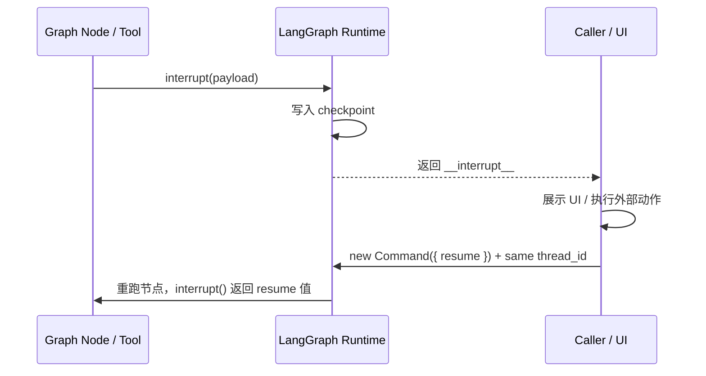
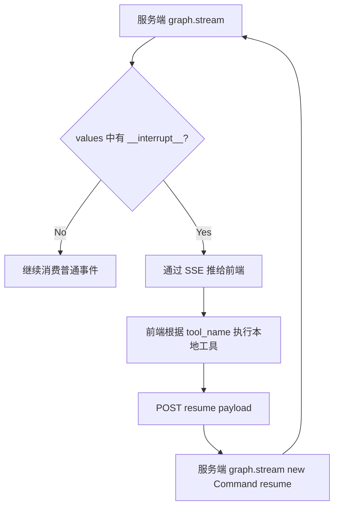

## 一句话定义

**Interrupts = LangGraph 的动态暂停点**：在节点或工具中调用 `interrupt(value)` 暂停图运行，把 `value` 暴露给外部调用方；外部系统拿到人类输入、审批结果或工具结果后，再用 `new Command({ resume })` 恢复运行。

它解决的是一类很实际的问题：**Agent 运行到一半，必须等一个外部结果才能继续**。

常见场景：

- 高风险操作前让用户审批
- 让用户检查并修改 LLM 生成内容
- 工具调用前展示参数，让用户确认或改写
- 表单式收集信息，并在输入不合法时继续追问
- 服务端 Agent 暂停，等待浏览器执行本地能力后再恢复

---

## 最小心智模型



| 概念 | 作用 |
|---|---|
| `interrupt(value)` | 在节点内部声明“这里需要暂停”，`value` 必须可 JSON 序列化 |
| `__interrupt__` | 暂停后暴露给调用方的 payload，调用方据此渲染 UI 或执行外部逻辑 |
| `new Command({ resume })` | 恢复运行的输入，`resume` 会变成 `interrupt()` 的返回值 |

Interrupt 依赖两个前提：

1. graph 编译时必须配置 checkpointer，用来保存暂停时的状态。
2. 首次运行和恢复运行必须使用同一个 `thread_id`，它是恢复 checkpoint 的游标。

```ts
const graph = builder.compile({ checkpointer });

const config = {
  configurable: {
    thread_id: 'thread-1',
  },
};
```

---

## 基础用法：审批后继续

最典型的场景是“先问人，再决定下一步”。

```ts
import { Command, interrupt } from '@langchain/langgraph';

async function approvalNode(state) {
  const approved = interrupt({
    type: 'approval',
    question: '是否继续执行这个操作？',
    action: state.action,
  });

  return new Command({
    goto: approved ? 'proceed' : 'cancel',
  });
}
```

首次运行时，节点执行到 `interrupt()` 会暂停：

```ts
const result = await graph.invoke(input, config);
console.log(result.__interrupt__);
```

调用方拿到 `__interrupt__` 后，可以渲染确认弹窗。用户点击确认后，再恢复：

```ts
await graph.invoke(new Command({ resume: true }), config);
```

此时 `interrupt()` 返回 `true`，节点继续执行后面的逻辑，并路由到 `proceed`。

---

## 实际应用 1：审核并编辑 LLM 输出

很多 Agent 场景不是简单批准/拒绝，而是希望用户改一下内容再继续。

```ts
async function reviewDraftNode(state) {
  const edited = interrupt({
    type: 'review_text',
    instruction: '请检查并修改这段文案',
    content: state.draft,
  });

  return {
    draft: edited,
  };
}
```

调用方可以把 `content` 放进编辑器，用户修改后把最终文本作为 `resume` 传回：

```ts
await graph.invoke(
  new Command({ resume: '用户修改后的最终文案' }),
  config,
);
```

这个模式的重点是：**interrupt payload 负责描述 UI 应该展示什么，resume 负责携带用户最终决定**。

---

## 实际应用 2：工具调用前确认或改写参数

如果工具会产生外部副作用，例如发邮件、删数据、调用支付接口，最好在真正执行前暂停。

```ts
import { tool } from '@langchain/core/tools';
import { interrupt } from '@langchain/langgraph';
import * as z from 'zod';

const sendEmailTool = tool(
  async ({ to, subject, body }) => {
    const decision = interrupt({
      type: 'tool_approval',
      tool: 'send_email',
      args: { to, subject, body },
      message: '是否发送这封邮件？',
    });

    if (decision.action !== 'approve') {
      return '用户取消发送';
    }

    return sendEmail({
      to: decision.to ?? to,
      subject: decision.subject ?? subject,
      body: decision.body ?? body,
    });
  },
  {
    name: 'send_email',
    description: 'Send an email',
    schema: z.object({
      to: z.string(),
      subject: z.string(),
      body: z.string(),
    }),
  },
);
```

恢复时可以只传审批结果，也可以传修改后的参数：

```ts
await graph.invoke(
  new Command({
    resume: {
      action: 'approve',
      subject: '更新后的邮件标题',
    },
  }),
  config,
);
```

这类设计适合做 Human-in-the-loop 工具系统：LLM 负责提出 tool call，人类负责确认边界，工具再执行真实副作用。

当希望审批逻辑与工具本身绑定、使其可在流程图的不同部分重复使用时，此方法非常实用。

---

## 实际应用 3：服务端暂停，前端执行本地工具

在 Web Agent 中，LLM 和图运行通常在服务端，但某些能力只能在浏览器里完成，例如读取本地文件、调用浏览器 API、弹出前端交互组件。

这时可以把 interrupt 当成一套“服务端暂停 → 前端执行 → 服务端恢复”的握手协议。

```ts
async function frontendToolNode(state) {
  const toolCall = state.messages.at(-1).tool_calls[0];

  const result = interrupt({
    type: 'frontend_tool',
    tool_call_id: toolCall.id,
    tool_name: toolCall.name,
    args: toolCall.args ?? {},
  });

  return {
    messages: [
      {
        role: 'tool',
        tool_call_id: toolCall.id,
        content: result.tool_result,
      },
    ],
  };
}
```

外部流程可以这样设计：



前端回传工具结果：

```json
{
  "command": {
    "resume": {
      "tool_call_id": "call_123",
      "tool_result": "本地工具执行结果"
    }
  }
}
```

这个模式的价值在于：服务端不需要知道前端工具如何实现，只要约定好 interrupt payload 和 resume payload 的协议即可。

---

## 实际应用 4：输入校验与多轮追问

Interrupt 也可以放在循环里，用来实现“问用户 → 校验 → 不合法就继续问”。

```ts
async function collectAgeNode() {
  let prompt = '请输入你的年龄';

  while (true) {
    const answer = interrupt({
      type: 'form_input',
      field: 'age',
      prompt,
    });

    if (typeof answer === 'number' && answer > 0) {
      return { age: answer };
    }

    prompt = `'${answer}' 不是合法年龄，请输入正数`;
  }
}
```

每次传入非法值，节点都会重跑，并在下一次 `interrupt()` 暴露新的提示语。传入合法值后，节点返回最终状态。

这里要注意：循环条件必须稳定，不要依赖随机数、当前时间或可能变化的外部数据，否则多次重跑时 interrupt 顺序可能错乱。

---

## 运行机制：为什么恢复后不是从那一行继续？

这是理解 interrupts 最容易踩坑的地方：**LangGraph 恢复时会从当前节点开头重新执行，而不是从 `interrupt()` 那一行继续执行。**

`interrupt()` 第一次执行时，本质上会抛出一个由 LangGraph runtime 捕获的控制流异常。runtime 捕获后会：

1. 记录 interrupt payload
2. 写入 checkpoint
3. 把 payload 放进 `__interrupt__`
4. 让本次 invoke/stream 正常结束

当外部传入 `new Command({ resume })` 后，LangGraph 会加载同一个 `thread_id` 下的 checkpoint，然后重跑暂停所在的节点。第二次跑到同一个 `interrupt()` 时，它不会再暂停，而是返回 `resume` 值。

```ts
async function node() {
  console.log('before');

  const answer = interrupt('continue?');

  console.log('after', answer);
  return { answer };
}
```

| 运行轮次 | 行为 |
|---|---|
| 第一次 | 打印 `before` → `interrupt()` 暂停 → 返回 `__interrupt__` |
| 恢复后 | 再次打印 `before` → `interrupt()` 返回 resume → 打印 `after` |

所以，`interrupt()` 之前的代码一定会重复执行。

---

## 多个 interrupt：按顺序重放

如果一个节点中有多个 `interrupt()`，LangGraph 会按调用顺序记录 resume 值。

```ts
async function profileNode() {
  const name = interrupt('你的名字？');
  const age = interrupt('你的年龄？');
  const city = interrupt('所在城市？');

  return { name, age, city };
}
```

执行过程类似这样：

| 运行轮次 | 第 1 个 interrupt | 第 2 个 interrupt | 第 3 个 interrupt |
|---|---|---|---|
| 第一次 | 暂停等待 name | - | - |
| resume name | 返回 name | 暂停等待 age | - |
| resume age | 重放 name | 返回 age | 暂停等待 city |
| resume city | 重放 name | 重放 age | 返回 city |

这解释了官方文档中“不要重排 interrupt 调用顺序”的规则。如果恢复后代码路径变化，导致 interrupt 数量或顺序变了，LangGraph 可能把某个 resume 值配给错误的 interrupt。

并行分支同时暂停时，应使用 interrupt id 到 resume value 的映射一次性恢复：

```ts
await graph.invoke(
  new Command({
    resume: {
      'interrupt-a': 'answer for a',
      'interrupt-b': 'answer for b',
    },
  }),
  config,
);
```

同一节点内的多个 interrupt 依赖顺序；并行分支的多个 interrupt 应优先依赖 interrupt id。

---

## 流式应用中的处理方式

在交互式 Agent 中，通常不是 `invoke()` 一次拿最终结果，而是使用 `stream()` 或 `streamEvents()`。

```ts
let input = initialInput;

while (true) {
  const stream = await graph.stream(input, config);
  let interrupted = false;
  let interruptPayload;

  for await (const chunk of stream) {
    if (chunk.__interrupt__) {
      interrupted = true;
      interruptPayload = chunk.__interrupt__[0].value;
      break;
    }

    renderChunk(chunk);
  }

  if (!interrupted) {
    break;
  }

  const response = await waitForUserOrExternalSystem(interruptPayload);
  input = new Command({ resume: response });
}
```

实际工程里，服务端常见做法是：消费 LangGraph stream，发现 `__interrupt__` 后通过 SSE/WebSocket 推给前端，并把当前 run 状态标记为 `interrupted`；前端完成交互后提交 `resume`，服务端再用 `new Command({ resume })` 和同一个 `thread_id` 重新启动 stream。

---

## 设计规则

### 1. 不要在 `interrupt()` 外层裸 `try/catch`

`interrupt()` 依赖特殊异常通知 runtime 暂停。如果被业务代码 catch 掉，LangGraph 就收不到暂停信号。

```ts
async function badNode() {
  try {
    const answer = interrupt('继续吗？');
    return { answer };
  } catch (error) {
    console.error(error);
  }
}
```

如果必须 catch，需要把非业务异常重新抛出，或把 `interrupt()` 和容易报错的逻辑拆开。

### 2. `interrupt()` 之前不要做非幂等副作用

因为节点会重跑，下面这种写法可能重复创建审计日志：

```ts
async function badNode() {
  await db.auditLogs.create({ action: 'pending_approval' });

  const approved = interrupt('是否批准？');
  return { approved };
}
```

更推荐把副作用放到 `interrupt()` 之后，或拆到后续节点中。

### 3. 不要改变同一节点内 interrupt 的顺序

同一节点内的多个 `interrupt()` 是按调用顺序匹配 resume 值的，所以不要在恢复后因为条件变化跳过某个 interrupt，也不要让循环次数依赖不稳定数据。

### 4. payload 只放协议数据

`interrupt()` 的 payload 是给调用方看的协议要求必须能够合理序列化，不应该塞函数、类实例、数据库连接等运行时对象。推荐使用明确的 `type` 字段区分不同 UI 或外部动作。

```ts
interrupt({
  type: 'tool_approval',
  tool: 'send_email',
  args,
});
```

---

## 实践中的协议设计

我会把 interrupt payload 当成一个前后端协议来设计：

```ts
type InterruptPayload =
  | { type: 'approval'; question: string; details?: unknown }
  | { type: 'review_text'; instruction: string; content: string }
  | {
      type: 'frontend_tool';
      tool_call_id: string;
      tool_name: string;
      args: Record<string, unknown>;
    };
```

对应的 resume payload 也应该显式建模：

```ts
type ResumePayload =
  | { action: 'approve' | 'reject'; [key: string]: unknown }
  | string
  | {
      tool_call_id: string;
      tool_result: unknown;
    };
```

这样做的好处是：UI 层只需要根据 `type` 分发到不同交互组件；服务端只需要校验 `resume` 是否满足当前 interrupt 的协议；LangGraph 节点只关心 `interrupt()` 返回值。

---

## 调试用：静态中断断点（Static Interrupts）

前面讲的 `interrupt()` 是运行时动态暂停，给线上人机交互用。除此之外 LangGraph 还有一套**静态中断**机制——`interruptBefore` / `interruptAfter`，它把流程图当成可单步执行的程序，专门用于开发调试。

> ⚠️ 静态中断仅用于开发调试和流程测试，**不要用于线上人机交互**。生产场景需要等待人类或外部系统响应时，请使用 `interrupt()` 函数。

它的核心思路是：在编译图时或每次调用时指定若干"断点节点"，图运行到这些节点前后会暂停，便于你观察状态、单步放行。

### 两种触发时机

| 配置 | 含义 |
|---|---|
| `interruptBefore: ['node_a']` | 到达 node_a **执行节点逻辑前**暂停 |
| `interruptAfter: ['node_b', 'node_c']` | 目标节点**完整执行完毕后**再暂停 |

### 两种配置方式

```ts
// 1. 编译时配置：图编译阶段固定断点，所有调用统一生效
const graph = builder.compile({
  checkpointer,
  interruptBefore: ['node_a'],
  interruptAfter: ['node_b', 'node_c'],
});

// 2. 运行时配置：每次 invoke 单独传入，互不影响（推荐调试使用）
await graph.invoke(inputs, {
  configurable: { thread_id: 'debug-1' },
  interruptBefore: ['node_a'],
  interruptAfter: ['node_b', 'node_c'],
});
```

`node_a` / `node_b` / `node_c` 等是流程图里**已有的业务节点**，无需为调试新增节点——静态中断仅基于节点名添加暂停点，不修改任何业务代码。

### 单步恢复

静态中断触发后，图不会自动继续，必须手动调用 `invoke(null)` 放行：

```ts
// 第一次：携带业务输入，运行到第一个断点自动停止
await graph.invoke(inputs, config);

// 之后：传入 null 复用原有输入，继续运行到下一个断点
await graph.invoke(null, config);
```

规则是：首次携带业务输入，运行到第一个断点即停；之后每次 `invoke(null)` 单步放行到下一个断点；**每触发一次中断，都需要手动执行一次 `invoke(null)`**。

### 调试观测

排查中断相关问题时，配合 [LangSmith](https://smith.langchain.com/) 可视化观测流程状态、断点触发逻辑会非常直观。

### 和 `interrupt()` 函数的关键区分

这两种机制容易混淆，但用途完全不同：

| 维度 | `interruptBefore` / `interruptAfter` | `interrupt()` |
|---|---|---|
| 用途 | 开发调试断点 | 线上人机交互 |
| 暂停粒度 | 节点级（节点前后） | 节点内任意位置 |
| 恢复方式 | `invoke(null)` | `new Command({ resume })` |
| 能否注入新数据 | 否，复用原输入 | 能，注入人工修改后的业务数据 |
| 是否修改业务代码 | 否，只挂断点 | 是，节点内显式调用 |

简而言之：**调试流程用静态中断；让 Agent 在生产中"等人"用 `interrupt()`**。

---

## 和 Checkpointer / Store 的关系

Interrupt 强依赖 Checkpointer，但和 Store 不是同一类东西：

| 机制 | 解决问题 |
|---|---|
| Checkpointer | 保存当前 thread 的图状态，让 interrupt 可以跨请求恢复 |
| Store | 跨 thread 共享业务数据或记忆 |
| Interrupt | 在运行过程中暂停，等待外部输入后继续 |

可以把它们放在一起理解：Checkpointer 负责“记住运行到哪了”，Interrupt 负责“告诉外面现在要等什么”。

---

## 一句话总结

`interrupt()` 不是普通的输入函数，而是一个由 LangGraph runtime 接管的暂停协议：第一次调用时暂停并暴露 `__interrupt__`，恢复时通过 `Command({ resume })` 把外部结果注入回节点。实际使用时，要把它当成前后端/外部系统之间的协议来设计，并保证节点可重入、顺序稳定、副作用可控。
