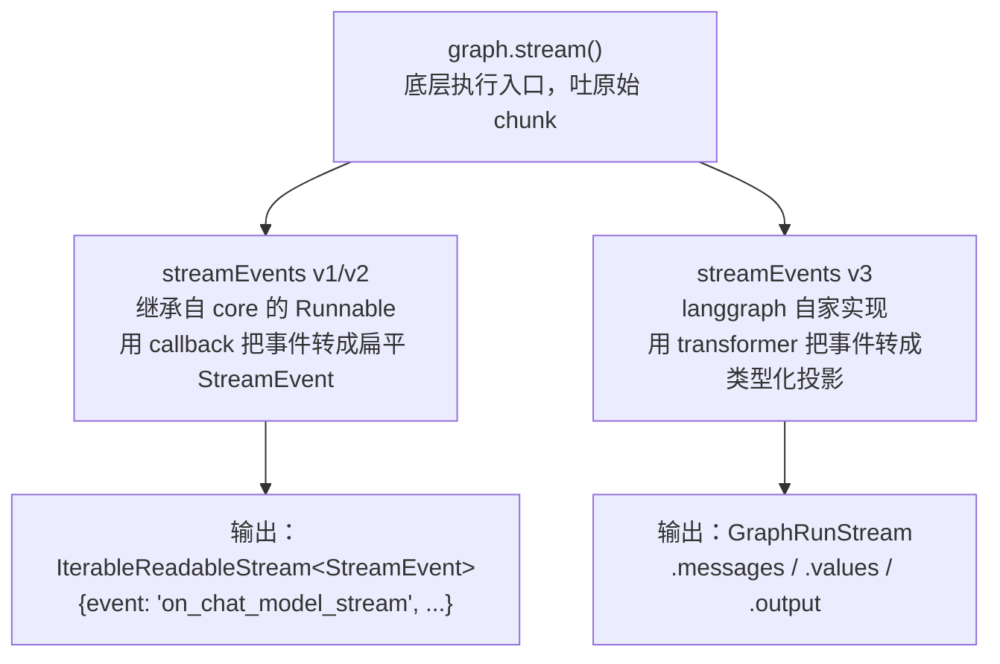
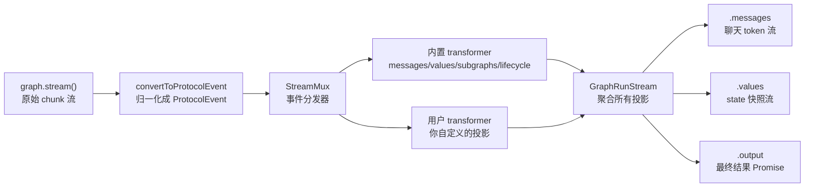

## 一句话定义

**`streamEvents({ version: "v3" })` 不是一个新的执行引擎，而是套在 `stream()` 原始流之上的一层 transformer 投影管线**：它把每个原始 chunk 归一化成统一的 `ProtocolEvent`，再经过一串 `StreamTransformer` 加工，最终暴露成 `run.messages` / `run.values` / `run.output` 这些"类型化、开箱即用"的投影。理解这条管线，你才能解释 v3 为什么比 v2 好用、以及为什么文档里有些字段在你的版本里根本不生效。

---

## 先看全貌：三个接口的依赖层级

LangGraph 的流式 API 不止一个，初学者最常被绕晕的就是"到底该用哪个"。它们的依赖关系其实很干净——**都建立在 `stream()` 之上**：



三者的区别一览：

| 接口 | 内部实现 | 返回什么 | mode 控制 |
|---|---|---|---|
| **`stream()`** | 引擎本体 | 原始流，每个 chunk 是 `[namespace, mode, payload]` 三元组 | 你自己指定 `streamMode` |
| **`streamEvents` v1/v2** | core 的 `Runnable._streamEventsV2`（挂 `EventStreamCallbackHandler`） | 扁平的 `StreamEvent` 数组 | 不细控，靠 callback 捕获 |
| **`streamEvents` v3** | langgraph 的 `Pregel.#streamEventsV3`（transformer 管线） | `GraphRunStream` 对象，带类型化投影 | 固定开 6 个 mode，你不用管 |

关键证据在源码里。`streamEvents(v3)` 的入口 `pregel/index.js:942` 写得很直白：

```ts
// 简化自 @langchain/langgraph/dist/pregel/index.js 的 #streamEventsV3
async streamEventsV3(input, options) {
  const { version, encoding, transformers, ...restOptions } = options;
  // ① 固定参数
  const streamOptions = {
    ...restOptions,
    streamMode: STREAM_EVENTS_V3_MODES,  // 固定开 6 个 mode
    subgraphs: true,                      // 固定开子图
  };
  // ② 内部就是调 stream()
  const source = this.stream(input, streamOptions);
  // ③ 套一层 transformer 管线
  return createGraphRunStream(source, [...this.streamTransformers, ...transformers]);
}
```

第 ② 步那句 `this.stream(input, streamOptions)` 是铁证——**v3 不是另起炉灶，它内部用的就是 `stream()`**，区别只在于拿到流之后怎么加工。v3 把加工的活交给了 transformer 管线。

> 顺带一提：v1/v2 那条线同样落在 `stream()` 上（`@langchain/core` 的 `_streamEventsV2` 第 396 行也是 `this.stream(...)`），只不过它用的是老的 callback 机制。所以**三条线底层共用一个执行引擎，不冲突**。

---

## stream()：最底层的原始流

要看懂 v3 在改造什么，得先看看它改造的对象——`stream()` 吐出来的原始 chunk 长什么样。

### 一个可运行的最小示例

```ts
import { StateGraph, Annotation, END } from "@langchain/langgraph";

// 1) 定义 state：用 reducer 让 messages 累加
const State = Annotation.Root({
  messages: Annotation<string[]>({
    reducer: (a, b) => [...a, ...b],
    default: () => [],
  }),
});

// 2) 两个节点
const graph = new StateGraph(State)
  .addNode("think", async (state) => ({
    messages: ["[think] 我需要查一下天气"],
  }))
  .addNode("tool", async (state) => ({
    messages: ["[tool] 北京今天 28°C，晴"],
  }))
  .addEdge("__start__", "think")
  .addEdge("think", "tool")
  .addEdge("tool", END)
  .compile();

// 3) 用 stream() 拿原始流，指定 values 模式
const stream = await graph.stream(
  { messages: ["用户：北京天气怎么样？"] },
  { streamMode: "values" }
);

// 4) 每个 chunk 就是一个完整的 state 快照
for await (const snapshot of stream) {
  console.log(snapshot.messages);
}
```

输出（每个 `snapshot` 都是"截止当前"的完整 state）：

```text
[ "用户：北京天气怎么样？" ]                                              // 初始输入
[ "用户：北京天气怎么样？", "[think] 我需要查一下天气" ]                  // think 跑完
[ "用户：北京天气怎么样？", "[think] 我需要查一下天气", "[tool] 北京今天 28°C，晴" ]  // tool 跑完
```

注意三个细节：

- **chunk 的形状由 `streamMode` 决定**：`"values"` 给完整快照、`"updates"` 给增量、`"messages"` 给 token 流……你要什么得自己选。
- **你要自己解析 chunk**：如果开了 `subgraphs: true`，chunk 会变成 `[namespace, mode, payload]` 三元组，你得自己解构、自己判断 `mode`。
- **没有类型化的便捷出口**：想拿"所有 LLM 消息"？你得自己写循环自己过滤。

这就是 `stream()` 的定位——**底层、灵活、但繁琐**。v3 要解决的就是这个"繁琐"。

---

## streamEvents(v3)：用投影改造原始流

v3 的核心思想一句话：**与其让你在 `for await` 里手动解 chunk，不如让引擎帮你归一化、帮你分流，给你开箱即用的类型化出口。**

### 它在内部做了什么



四个关键环节：

1. **固定开 6 个 mode**：`STREAM_EVENTS_V3_MODES = ["values", "updates", "messages", "tools", "custom", "tasks"]`。这样所有类型的事件都会产生，transformer 才有东西可加工。你不用再操心选哪个 mode。
2. **`convertToProtocolEvent` 归一化**：把五花八门的原始 payload 统一成 `ProtocolEvent` 信封（`{ type, seq, method, params }`），后面所有 transformer 都基于这个统一格式工作。
3. **`StreamMux` 分发**：每个事件无差别地喂给所有 transformer 的 `process(event)`，transformer 自己决定关心什么、产出什么。
4. **`GraphRunStream` 聚合投影**：把内置 transformer 和你传入的 transformer 的产物合并，暴露成 `.messages` / `.values` / `.output` 等属性。

### 同一个 graph，用 v3 跑

把上面 `stream()` 的示例换成 v3，对比一下手感：

```ts
// 用 streamEvents(v3) 跑同一个 graph
const run = await graph.streamEvents(
  { messages: ["用户：北京天气怎么样？"] },
  { version: "v3" }
  // 注意：不用指定 streamMode，也不用指定 subgraphs——v3 全固定好了
);

// 想看 state 怎么一步步演变？用 .values
let step = 0;
for await (const snapshot of run.values) {
  step++;
  console.log(`第 ${step} 步后的 state:`, snapshot.messages);
}

// 只想要最终结果？await run.output
const final = await run.output;
console.log("最终 state:", final.messages);
```

输出和 `stream()` 那版几乎一样，但你**少写了解析逻辑、少了 mode 选择的心智负担**。在真实的 Agent 场景里差距更明显——当你想要"打字机效果的 token 流"时，直接 `for await (const m of run.messages) console.log(await m.text)` 就行，不用自己从 chunk 里捞 `messages` mode 的 payload。

### 四个内置投影速查

| 投影 | 给你什么 | 适合场景 |
|---|---|---|
| `run.messages` | 每个 LLM 消息的流式句柄（`.text` / `.reasoning` / `.usage`） | 聊天框打字机效果 |
| `run.values` | 每步的完整 state 快照（多次 yield） | 调试、步骤式 UI、观察 state 演化 |
| `run.output` | 最终 state（一次 resolve 的 Promise） | 只关心结果 |
| `run.subgraphs` | 子图的独立流句柄 | 多 Agent / 子图编排 |
| `run.lifecycle` | 运行生命周期事件（启动/子图进出/终止） | 可观测性、进度跟踪 |

> **`run.values` vs `run.messages` 的区别**：`values` 给的是"state 级别"的快照（每个节点跑完一次），`messages` 给的是"token 级别"的流（LLM 每吐一个字）。前者粗，后者细——做打字机用 `messages`，做步骤进度用 `values`。

---

## 自定义 transformer：插你自己的投影

内置投影不够用时，v3 允许你写自己的 `StreamTransformer`，造一个全新的投影。这是 v3 相比 v2 最强大的地方——**v2 的事件格式是写死的，v3 是可扩展的**。

### 一个例子：统计工具调用活动

假设你想把所有工具调用汇总成一个"工具活动流"。文档给出的写法长这样：

```ts
import { StreamChannel } from "@langchain/langgraph";

const toolActivityTransformer = () => {
  // ① 建一个带名字的 channel——带名字意味着 push 的值会作为
  //    custom:toolActivity 事件出现在流里，对远程客户端也可见
  const activity = new StreamChannel<{
    name: string;
    status: "started" | "finished" | "error";
  }>("toolActivity");

  return {
    // ② init 返回初始投影，里面的 channel 会被 mux 自动接管
    init: () => ({ toolActivity: activity }),
    // ③ 每个事件都会进 process，你在这里过滤、加工
    process(event) {
      if (event.method === "tools") {
        const data = event.params.data as { tool_name?: string; event?: string };
        if (data.tool_name && data.event) {
          activity.push({
            name: data.tool_name,
            status: data.event === "tool-error" ? "error" : "started",
          });
        }
      }
      return true; // 返回 true 表示保留原始事件
    },
  };
};

// 使用：传给 transformers 参数
const run = await graph.streamEvents(
  { messages: ["帮我查天气"] },
  { version: "v3", transformers: [toolActivityTransformer] }
);

// 你的自定义投影出现在 run.extensions 上
for await (const act of run.extensions.toolActivity) {
  console.log(`工具 ${act.name} 状态: ${act.status}`);
}
```

### StreamTransformer 的四个钩子

| 钩子 | 何时调用 | 作用 |
|---|---|---|
| `init()` | 运行开始前一次 | 返回初始投影，里面的 `StreamChannel` 会被 mux 自动接管生命周期 |
| `process(event)` | 每个事件到达时 | 过滤/加工事件；返回 `false` 可丢弃原始事件 |
| `onRegister(emitter)` | transformer 注册后 | 可选，用于合成新事件注入流（高级用法） |
| `finalize()` / `fail()` | 运行结束/失败时 | 可选，做收尾（如 resolve 一个 Promise） |

核心心智模型：**transformer 是一条流水线工位**。原始事件像零件一样从流水线上过，每个 transformer 看一眼、决定要不要基于它产出点什么（往自己的 channel 里 push），然后零件继续往下传。

---

## 实战提醒：文档与 1.4.7 实现不符

读官方文档时你会遇到一个叫 `required_stream_modes` 的字段，文档信誓旦旦地说"每个 transformer 必须声明它作用的 mode，否则引擎不会产生那些事件"。但当你照着写，会发现上面的示例**根本没声明这个字段，却照样能工作**。

这不是你的理解问题——**是文档和当前实现（@langchain/langgraph@1.4.7）对不上**。用源码可以验证这一点。

### 验证一：这个字段在代码里根本不存在

把 `node_modules/@langchain/langgraph` 全量搜一遍：

```text
搜索 required_stream_modes | streamModes | requiredStreamModes  →  No matches found
```

`StreamTransformer` 的类型定义（`dist/stream/types.d.ts`）只有这几个成员：

```ts
interface StreamTransformer<TProjection> {
  init(): TProjection;
  onRegister?(emitter: StreamEmitter): void;
  process(event: ProtocolEvent): boolean;
  finalize?(): void | PromiseLike<void>;
  fail?(err: unknown): void;
  // ❌ 没有 required_stream_modes
}
```

### 验证二：事件是"全量分发"，不是"按声明开关"

`StreamMux.push()` 的核心逻辑（`dist/stream/mux.js:168`）：

```ts
push(ns, event) {
  // ... 每个事件无差别喂给所有 transformer
  for (const transformer of this.#transformers)
    if (!transformer.process(event)) keep = false;
  // ...
}
```

没有任何地方读 `required_stream_modes` 来决定"要不要给某个 transformer 送某种 mode"。引擎固定开 6 个 mode（`STREAM_EVENTS_V3_MODES`），事件产生后全量分发，transformer 在 `process()` 里用 `if (event.method === "tools")` 自己过滤。

### 怎么解释文档的说法

最可能的解释：**文档描述的是 Python 版 LangGraph 的语义（或一个计划中/已废弃的设计），和当前 JS 实现对不上**。具体表现：

| 文档说的 | JS 1.4.7 实际 |
|---|---|
| "每个 transformer 必须声明它作用的 mode" | `StreamTransformer` 接口里没这个字段 |
| "漏声明的 mode 不会被引擎产生" | `STREAM_EVENTS_V3_MODES` 固定开 6 个 mode |
| "漏声明的事件到不了 process()" | `push()` 把每个事件分发给所有 transformer |

所以上面的示例不写 `required_stream_modes` 是**完全正确**的——在 JS 版里这个字段即使写了也会被忽略。

### 一条更通用的经验

> 读 LangGraph（或任何活跃框架）的文档时，涉及"必须声明 X""引擎会按 X 开关"这类机制性描述，**别只凭文档下结论，用源码验证一遍**。具体方法：把发布包装进 `node_modules`，用全量搜索找字段名、找调用点，看运行时到底读不读它。文档会过时，源码不会。

---

## 一句话总结

`streamEvents(v3)` 的本质是 **`stream()` + transformer 投影管线**：底层还是那个吐原始 chunk 的 `stream()`，v3 只是在它上面套了归一化（`convertToProtocolEvent`）→ 分发（`StreamMux`）→ 加工（`StreamTransformer`）→ 聚合（`GraphRunStream`）这一串，把繁琐的手动解析换成 `.messages` / `.values` / `.output` 这些开箱即用的类型化出口。而当你读到文档里"`required_stream_modes` 必须声明"这种和代码对不上的说法时，记住——**文档会过时，源码才是 ground truth**。
