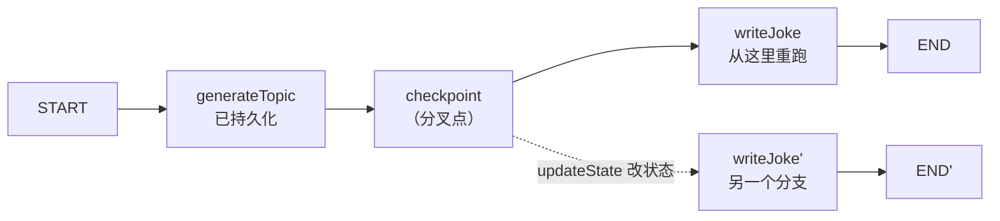
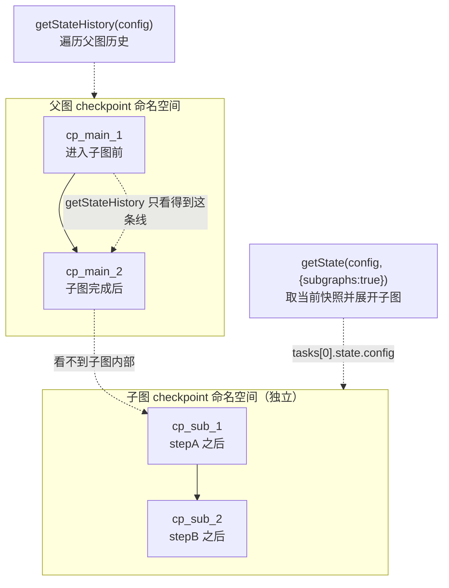

## 一句话定义

**LangGraph 的"时间旅行"建立在 checkpoint 之上——`getStateHistory` 在历史时间线上找一个过去的时间点，`invoke(null, config)` 把它**原样重放**（Replay），`updateState` 则在那个点改写状态后**分叉出新分支**（Fork）；当图里出现子图时，要换一套思路：用 `getState(config, { subgraphs: true })` 从父状态的 `tasks` 里"挖"出子图自己的 checkpoint，才能钻进子图内部做时间旅行。**

本篇以官方 *Use time-travel* 文档为骨架，覆盖 Replay / Fork / Interrupts / Subgraphs 四大场景。**官方文档代码给得勤快，但对几个关键概念语焉不详**——尤其"为什么主图用 `getStateHistory`、子图却要用 `getState({subgraphs:true})`"这个最容易卡住人的问题，文档从未显式对比。本文把这层窗户纸捅破，并补全 `getStateHistory` 的逆序行为、子图 checkpoint 命名空间、`config` 必须带 `checkpoint_id` 等官方略过的细节。

> 时间旅行的地基是 checkpoint 持久化。如果你还不熟悉 checkpointer 怎么把每一步 state 存下来，先看本专栏第 1 篇。

---

## 全貌：两种操作 + 一个心智模型

官方 Overview 一句话点题：时间旅行让你**从任意历史 checkpoint 恢复执行**。它分两种操作：

| 操作 | 做什么 | 关键 API |
|---|---|---|
| **Replay（回放）** | 从历史 checkpoint **原样重跑**后续节点，不改状态 | `getStateHistory` 找点 → `invoke(null, config)` |
| **Fork（分叉）** | 在历史 checkpoint 上**改写状态**，再从新分支继续 | `getStateHistory` 找点 → `updateState` 改状态 → `invoke(null, forkConfig)` |

两者共同的底层逻辑只有一句，但极其重要：

> **checkpoint 之前的节点不会重跑（结果已持久化），之后的节点会重跑。**

这是时间旅行能"省算力"的根本——你不用从头跑整个图，只重放分叉点之后的部分。用一个最小的心智模型：



实线是原始执行；虚线是 `updateState` 产生的新分支。两条分支**互不影响**——原始历史完整保留。下面每一节，都是在不同场景里复现这套"找点 → 改状态 → 续跑"的套路。

---

## 一、Replay：从历史 checkpoint 重放

### 官方示例：一个生成笑话的图

官方用一个两节点图演示最基础的 replay。这里给出**补全 import 后**的完整可跑版本：

```ts
import { v7 as uuid7 } from "uuid";
import { StateGraph, MemorySaver, START, Annotation } from "@langchain/langgraph";

const StateAnnotation = Annotation.Root({
  topic: Annotation<string>(),
  joke: Annotation<string>(),
});

function generateTopic(state: typeof StateAnnotation.State) {
  return { topic: "socks in the dryer" };
}

function writeJoke(state: typeof StateAnnotation.State) {
  return { joke: `Why do ${state.topic} disappear? They elope!` };
}

const checkpointer = new MemorySaver();
const graph = new StateGraph(StateAnnotation)
  .addNode("generateTopic", generateTopic)
  .addNode("writeJoke", writeJoke)
  .addEdge(START, "generateTopic")
  .addEdge("generateTopic", "writeJoke")
  .compile({ checkpointer });

// Step 1: 正常跑一遍
const config = { configurable: { thread_id: uuid7() } };
const result = await graph.invoke({}, config);

// Step 2: 翻历史，找一个想回放的 checkpoint
const states = [];
for await (const state of graph.getStateHistory(config)) {
  states.push(state);
}
// "下一个要跑 writeJoke"的那个快照 = writeJoke 之前那一刻
const beforeJoke = states.find((s) => s.next.includes("writeJoke"));

// Step 3: 从这个 checkpoint 重放
const replayResult = await graph.invoke(null, beforeJoke.config);
// writeJoke 重新执行，generateTopic 不会重跑
```

> ⚠️ **官方代码的 import 漏了 `Annotation`**，照抄会报 `Annotation is not defined`。上面已补全。另外，GitHub 源码里 `Annotation()` 没带泛型，渲染页里是 `Annotation<string>()`——用带泛型的版本，类型更清晰。

### 三个官方没讲清楚的关键点

**① `getStateHistory` 是逆序的（最新在前）。**

JS 版正文**完全没提**这一点（Python 版才写了 *"reverse chronological order"*）。但顺序决定了你怎么写选择逻辑：

```text
states[0]   ← 最新（通常是当前线程的最新状态）
states[1]   ← 倒数第二
states[2]   ← 更早
...
states[last] ← 最老（通常是 START 那个空 checkpoint）
```

所以：

- `.find(s => s.next.includes("writeJoke"))` 取的是**第一个匹配 = 最新**的那个 writeJoke 之前 checkpoint。
- `.filter(s => ...).pop()` 取的是**最后一个匹配 = 最早**的那个。

**两者结果可能不同**（如果一个节点被多次执行，比如循环图里）。文档在不同例子里交替用了 `.find()` 和 `.filter().pop()`，但没解释为什么换——其实就是按"要最新还是要最早"来选的。

**② `getStateHistory` 返回的 state 对象不只有 `.next` 和 `.config`。**

JS 文档只用到了两个字段，但实际返回的是完整的 `StateSnapshot`，常用字段如下：

| 字段 | 含义 | 时间旅行里怎么用 |
|---|---|---|
| `values` | 该 checkpoint 时刻的**完整 state** | 查看历史某点的数据 |
| `next` | **下一步要执行的节点**数组 | 定位"在 X 节点之前"的快照 |
| `config` | 这个 checkpoint 自己的 config（带 `checkpoint_id`） | 传给 `invoke`/`updateState` 做时间旅行 |
| `tasks` | 该 superstep 的任务元信息 | 进阶定位（见子图节） |
| `metadata` | checkpoint 元数据（如 source） | 调试 |
| `createdAt` | checkpoint 创建时间 | 排序/展示时间线 |

**③ `invoke(null, config)` 里的 `config` 必须带 `checkpoint_id`。**

文档靠"把 `state.config` 整个传进去"绕过了这个细节，但它非常关键：

```ts
// 普通 invoke 只需要 thread_id
await graph.invoke({}, { configurable: { thread_id: "xxx" } });

// 时间旅行 replay 必须多带 checkpoint_id
await graph.invoke(null, {
  configurable: { thread_id: "xxx", checkpoint_id: "某个历史id" }
});
```

`checkpoint_id` 哪儿来？就是 `getStateHistory` 返回的 `state.config.configurable.checkpoint_id`。**光有 `thread_id` 不够**——没有 `checkpoint_id`，LangGraph 只会从线程最新状态继续，根本"穿越"不回去。

> **Replay 不是读缓存，是真的重新执行。** 官方反复强调：重放的节点会**真的重新调用 LLM、真的重新请求 API、真的重新触发 interrupt**。所以同一个 checkpoint replay 两次，结果可能不同（比如 LLM 这次给了另一个笑话）。另外，从"没有 next 节点"的最终 checkpoint 回放是 **no-op**（什么都不做）。

---

## 二、Fork：在历史 checkpoint 上改状态、开新分支

### 基本用法：`updateState` + `invoke(null, forkConfig)`

Replay 是原样重跑，Fork 则是在重跑前**先改一改状态**。两步走：

```ts
// 1. 在 beforeJoke 这个 checkpoint 上改 topic
const forkConfig = await graph.updateState(
  beforeJoke.config,
  { topic: "chickens" },
);

// 2. 从 fork 点继续——writeJoke 会用新 topic 重跑
const forkResult = await graph.invoke(null, forkConfig);
console.log(forkResult.joke); // 关于 chickens 的笑话，不是 socks
```

> ⚠️ **官方最需要强调、但只用一句话带过的一点：`updateState` 不是回滚线程，而是新建一个分支。** 原始执行历史**完整保留**，你可以基于同一个 checkpoint 反复 fork 出 N 条不同分支，互不干扰。这是"时间旅行"区别于"撤销"的核心——它不破坏过去，只是从过去长出新的可能。

### `asNode`：假装这次更新是某个节点产出的

`updateState` 有个第三参 `{ asNode }`，它解决一个微妙问题：**改了状态后，从哪个节点的后继继续？**

```ts
// graph: generateTopic -> writeJoke
// 把这次更新"伪装成" generateTopic 产出的
// 于是执行从 generateTopic 的后继 = writeJoke 继续
const forkConfig = await graph.updateState(
  beforeJoke.config,
  { topic: "chickens" },
  { asNode: "generateTopic" },
);
```

官方列出**三种必须显式指定 `asNode` 的场景**：

| 场景 | 为什么需要 `asNode` |
|---|---|
| **并行分支冲突** | 有多个 `next` 节点时，LangGraph 不知道该从哪条分支续，必须你指定 |
| **无执行历史 / 单测** | 图还没真正跑过，没有"上一个执行节点"可推断，得手动声明 |
| **跳过节点** | 想让更新假装来自一个**并未真正执行**的节点（比如直接给 writeJoke 喂数据，跳过 generateTopic） |

> 如果不指定 `asNode`，LangGraph 会尝试从 checkpoint 的 `next` 字段推断。推断不出或有歧义时，你就得显式给。

---

## 三、Interrupts：时间旅行遇上人类介入

当图里有 `interrupt()` 时，时间旅行有一个**反直觉但合理**的行为：**replay 到 interrupt 时，它会重新暂停，等你新的 `Command({ resume })`。** 这不是 bug——因为 replay 是真重跑，interrupt 自然会再次触发。

```ts
import { interrupt, Command } from "@langchain/langgraph";

function askHuman(state: { value: string[] }) {
  const answer = interrupt("What is your name?");
  return { value: [`Hello, ${answer}!`] };
}

function finalStep(state: { value: string[] }) {
  return { value: ["Done"] };
}

// ...构建图（略）...

// 第一轮：撞上 interrupt
await graph.invoke({ value: [] }, config);
// 用答案恢复
await graph.invoke(new Command({ resume: "Alice" }), config);

// 时间旅行：回到 askHuman 之前
const states = [];
for await (const state of graph.getStateHistory(config)) {
  states.push(state);
}
// 注意这里用 .pop() —— 取"最早的"那个 askHuman 之前 checkpoint
const beforeAsk = states.filter((s) => s.next.includes("askHuman")).pop();

// Replay：重新停在 interrupt，等新的 resume
const replayResult = await graph.invoke(null, beforeAsk.config);
// → 此刻线程暂停，等待 Command({ resume: ... })

// Fork：改完状态后，同样停在 interrupt
const forkConfig = await graph.updateState(beforeAsk.config, { value: ["forked"] });
const forkResult = await graph.invoke(null, forkConfig);
// → 同样暂停在 interrupt

// 用不同的答案恢复这个 fork
await graph.invoke(new Command({ resume: "Bob" }), forkConfig);
// 结果：{ value: ["forked", "Hello, Bob!", "Done"] }
```

### 多个 interrupt：在两个中断之间 fork

如果图里有两个连续的 interrupt（先问名字、再问年龄），你可以在**两个中断之间**分叉——保留第一个答案，只改第二个：

```ts
// 在 askName 之后、askAge 之前 fork
const states = [];
for await (const state of graph.getStateHistory(config)) {
  states.push(state);
}
const between = states.filter((s) => s.next.includes("askAge")).pop();

const forkConfig = await graph.updateState(between.config, { value: ["modified"] });
const result = await graph.invoke(null, forkConfig);
// askName 的结果保留（"name:Alice"）
// askAge 重新暂停，等待新的年龄答案
```

> **这里 `invoke` 第一参有三种形态，别混了：**
> - `invoke(null, config)` —— 时间旅行 replay/fork，不带新输入。
> - `invoke(input, config)` —— 普通新调用。
> - `invoke(new Command({ resume: "..." }), config)` —— 从 interrupt 恢复，第一参是 `Command` 而非 `null`。

---

## 四、Subgraphs：本篇的重头戏

前面三节，时间旅行的对象都是**单层图**。一旦图里嵌套了子图，就会遇到你最初问的那个问题：**为什么取主图历史用 `getStateHistory`，取子图状态却要用 `getState(config, { subgraphs: true })`？**

答案的核心在于一个官方文档**几乎没正面解释**的概念：**子图的 checkpoint 命名空间（namespace）。**

### 先看子图的两种配置

子图有没有自己的 checkpointer，决定了你能不能钻进它内部做时间旅行：

```ts
// 情况 A：子图不配 checkpointer（默认）
// → 继承父图的 checkpointer，整张子图被当成"一个 super-step"
const subgraphA = new StateGraph(StateAnnotation)
  .addNode("stepA", stepA)   // 内含 interrupt
  .addNode("stepB", stepB)   // 内含 interrupt
  .addEdge(START, "stepA")
  .addEdge("stepA", "stepB")
  .compile();   // ← 没传 checkpointer

// 情况 B：子图自带 checkpointer
// → 子图每一步都有自己的 checkpoint 历史
const subgraphB = new StateGraph(StateAnnotation)
  .addNode("stepA", stepA)
  .addNode("stepB", stepB)
  .addEdge(START, "stepA")
  .addEdge("stepA", "stepB")
  .compile({ checkpointer: true });   // ← 自己有 checkpointer
```

### 情况 A：子图继承父 checkpointer——无法定位内部

这种情况下，主图的 `getStateHistory` 只看到**一个覆盖整个子图的 checkpoint**：

```ts
const graph = new StateGraph(StateAnnotation)
  .addNode("subgraphNode", subgraphA)
  .addEdge(START, "subgraphNode")
  .compile({ checkpointer });

// 跑完子图的两个 interrupt
await graph.invoke({ value: [] }, config);
await graph.invoke(new Command({ resume: "Alice" }), config);
await graph.invoke(new Command({ resume: "30" }), config);

// 只能从"整个子图之前"分叉
const states = [];
for await (const state of graph.getStateHistory(config)) {
  states.push(state);
}
const beforeSub = states.filter((s) => s.next.includes("subgraphNode")).pop();

const forkConfig = await graph.updateState(beforeSub.config, { value: ["forked"] });
const result = await graph.invoke(null, forkConfig);
// 整个子图从头重跑——stepA 和 stepB 都重跑
// 你无法回到 stepA 和 stepB 之间
```

> 关键限制：**主图把子图当成一个"黑盒节点"，只在子图进入/退出时各打一个 checkpoint。** 子图内部 stepA→stepB 之间的中间状态，主图的 checkpointer **根本没存**。所以无论你怎么 `getStateHistory`，都找不到"stepA 之后、stepB 之前"的点。

### 情况 B：子图自带 checkpointer——用 `getState({subgraphs:true})` 钻进去

这才是你问题的核心。子图有了自己的 checkpointer 后，它的每一步都存在**独立的命名空间**里。要拿到这个内部 checkpoint，必须走 `getState(config, { subgraphs: true })`：

```ts
const graph = new StateGraph(StateAnnotation)
  .addNode("subgraphNode", subgraphB)
  .addEdge(START, "subgraphNode")
  .compile({ checkpointer });

// 跑到 stepA 的 interrupt，恢复后撞上 stepB 的 interrupt
await graph.invoke({ value: [] }, config);
await graph.invoke(new Command({ resume: "Alice" }), config);

// ★ 关键：用 getState + subgraphs:true 拿子图的 checkpoint
const parentState = await graph.getState(config, { subgraphs: true });
const subConfig = parentState.tasks[0].state.config;   // 子图自己的 config

// 现在可以对子图内部做时间旅行了
const forkConfig = await graph.updateState(subConfig, { value: ["forked"] });
const result = await graph.invoke(null, forkConfig);
// stepB 重跑，stepA 的结果保留
```

### 为什么子图必须用 `getState` 而不是 `getStateHistory？（核心答疑）

这是官方文档**最大的隐含逻辑**，也是你最开始卡住的地方。一句话回答：

> **子图自带 checkpointer 后，其内部 checkpoint 存在独立的命名空间，根本不会出现在父图的 `getStateHistory` 里。你必须用 `getState({subgraphs:true})` 从父状态的 `tasks` 字段里把它"挖"出来。**

用一张图说清两个 API 的分工：



`getStateHistory(config)` 只在**父图命名空间**里遍历，它看到的只有 `cp_main_1 → cp_main_2`，对子图内部的 `cp_sub_1`/`cp_sub_2` **完全不可见**。而 `getState(config, { subgraphs: true })` 取的是**当前这一刻的单一快照**，并通过 `{ subgraphs: true }` 选项把"当前活跃的子图状态"展开进 `parentState.tasks[i].state`——你从那里拿到 `subConfig`，才能进入子图自己的命名空间。

### 两个 API 的完整对比

| 维度 | `getStateHistory(config)` | `getState(config, { subgraphs: true })` |
|---|---|---|
| **返回** | **多个**历史快照（异步迭代器，最新→最旧） | **单个**当前快照 |
| **目的** | 翻历史时间线，找一个过去的时间点 | 看当前状态，并展开活跃子图内部 |
| **命名空间** | 只在传入 config 所属的命名空间里遍历 | 跨命名空间：返回父状态，并把子图状态塞进 `tasks` |
| **`subgraphs` 选项** | 不相关（历史遍历用不到） | **关键**：开了才会填 `tasks[i].state`，否则为空 |
| **典型配合** | `updateState(state.config, ...)` / `invoke(null, state.config)` | 取 `tasks[0].state.config` 后再 fork 子图 |

### 它们经常配合使用

拿到 `subConfig` 之后，你**完全可以**对子图也调用 `getStateHistory`——只是传入的是子图的 config，遍历的就是子图自己的历史：

```ts
// 1. 先用 getState + subgraphs:true 把子图 config 挖出来
const parentState = await graph.getState(config, { subgraphs: true });
const subConfig = parentState.tasks[0].state.config;

// 2. 拿着子图 config，翻子图自己的历史
for await (const subState of graph.getStateHistory(subConfig)) {
  console.log(subState.next);   // 子图内部的节点，如 ["stepB"]
}

// 3. 或直接在子图某个历史点上 fork
const subBeforeStepB = /* 从上面迭代里找 */;
const forkConfig = await graph.updateState(subBeforeStepB.config, { value: ["x"] });
await graph.invoke(null, forkConfig);
```

**所以两个 API 不是"二选一"，而是分工不同**：`getState({subgraphs:true})` 负责"跨命名空间拿到子图入口 config"，`getStateHistory` 负责"在某个命名空间里翻历史"。官方示例因为只想从"子图当前停住的位置"分叉，所以只用了第一步就够了。

### 关于 `tasks[0]` 的一个隐患

官方代码一律假设 `parentState.tasks[0]` 就是目标子图，但文档**没讲**多个/嵌套子图时怎么办。实际规则是：

- `tasks` 数组里每个元素对应一个**当前待执行或暂停中**的任务。
- `.state` 字段只有在传了 `{ subgraphs: true }` 时才被填充，否则是空的。
- 多个子图并行时，要按 `task.name`（节点名）或 `task.id` 定位，而不是无脑 `tasks[0]`。
- 嵌套子图（子图里还有子图）时，`state` 里可能再次含 `tasks`，需要逐层下钻。

官方对此只甩了一句 *"See subgraph persistence for more"*，细节留给读者。

---

## 设计规则速查

把全文浓缩成一张决策表：

| 你想做的事 | 用什么 |
|---|---|
| 翻主图历史找某个时间点 | `getStateHistory(config)`（注意逆序） |
| 从历史 checkpoint 原样重跑 | `invoke(null, state.config)` |
| 在历史点上改状态开新分支 | `updateState(state.config, newVal)` → `invoke(null, forkConfig)` |
| 改状态后指定从哪续 | `updateState(config, val, { asNode: "节点名" })` |
| 回到某个 interrupt 之前 | `getStateHistory` 找 `next.includes("节点名")` 的快照 |
| 取**当前**状态（含子图内部） | `getState(config, { subgraphs: true })` |
| 钻进子图内部做时间旅行 | 先 `getState({subgraphs:true})` 拿 `tasks[i].state.config`，再对其 `updateState`/`getStateHistory` |
| 让子图内部可被时间旅行 | 子图 `compile({ checkpointer: true })` |

以及七条容易踩的硬规则：

1. **`getStateHistory` 是逆序**（最新在前）——`.find()` 取最新、`.filter().pop()` 取最早，别用反。
2. **`invoke(null, config)` 的 config 必须带 `checkpoint_id`**，光有 `thread_id` 只会从最新状态续。
3. **`getStateHistory` 返回完整快照**，不只是 `.next`/`.config`，还有 `.values`/`.tasks`/`.metadata`/`.createdAt`。
4. **Replay 是真重执行**，会重新调 LLM / 触发 interrupt，不是读缓存。
5. **`updateState` 不回滚，是开新分支**，原始历史完整保留。
6. **子图内部 checkpoint 在独立命名空间，不在父图 `getStateHistory` 里**——必须经 `getState({subgraphs:true}).tasks[i].state.config` 取。
7. **子图要可时间旅行，必须 `compile({ checkpointer: true })`**；否则整张子图只是一个 super-step，无法定位内部。

---

## 一句话总结

LangGraph 的时间旅行，本质是"沿着 checkpointer 存下的 checkpoint 时间线，回到任意过去时刻，然后重放或分叉"。单层图里，`getStateHistory` 负责翻历史、`invoke(null, config)` 负责重放、`updateState` 负责改状态开分支——这套组合拳在 interrupt 场景同样适用。真正的难点在子图：因为子图的 checkpoint 存在独立命名空间，主图的 `getStateHistory` 对它不可见，所以必须改用 `getState(config, { subgraphs: true })` 从 `tasks` 里挖出子图 config，才能进入子图自己的时间线。官方文档把这套机制藏在两段代码示例里、从没显式对比过这两个 API——记住"历史遍历 vs 当前快照下钻"、"父命名空间 vs 子命名空间"这两组对照，子图时间旅行就再不会绕晕你。
