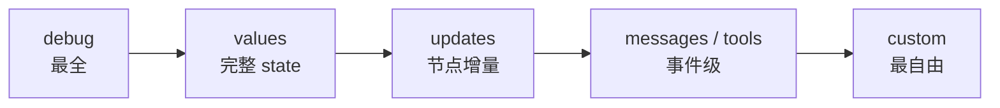

## 一句话定义

**`.stream()` 是 LangGraph 流式的底层入口，用 `streamMode` 这一个参数决定"你想看图执行的哪个切面"——`values`/`updates` 看状态、`messages` 看 LLM token、`custom` 看节点内部吐的任意数据、`tools` 看工具生命周期、`debug` 看全量调试信息。它们既能单独用，也能写成数组组合成 `[mode, chunk]` 元组流。**

本篇以官方 streaming 文档为骨架，逐个 streamMode 讲透——**官方代码大多只给片段、不给输出，本文给每个例子补上真实输出，并把官方语焉不详的反直觉点（values 首推缺字段、updates 的结构、多模式 messages 要二次解构等）展开**。最后补一节官方完全没讲、但实战必踩的"并发写同字段冲突"。

> 如果你只是想快速把 LLM token 接到前端打字机，更推荐高层 API `streamEvents(v3)`——见本专栏第 6 篇。本篇聚焦底层 `.stream()`，适合需要直接控制 streamMode、或想理解 v3 脚下地基的场景。

---

## 全貌：streamMode 全家福

LangGraph 图编译后，会暴露一个 `stream` 方法，它返回一个异步迭代器：

```ts
for await (const chunk of await graph.stream(inputs, {
  streamMode: "updates",
})) {
  console.log(chunk);
}
```

关键就是 `streamMode` 参数。官方文档列出了这些取值：

| Mode | 看到的内容 | 推送粒度 |
|---|---|---|
| **`values`** | 每步之后的**完整 state** | superstep 级 |
| **`updates`** | 每步之后的**state 增量**；同一步多个 update 分开发 | 节点级 |
| **`messages`** | LLM 调用的 **token 二元组** `(token, metadata)` | token 级 |
| **`custom`** | 节点/工具通过 `writer` **吐出的任意数据** | 自定义 |
| **`tools`** | 工具调用的**生命周期事件**（start/event/end/error） | 工具事件级 |
| **`debug`** | 图执行过程中的**全量信息**（含节点名+完整 state） | 全量 |

> 官方简介还提到 `checkpoints` / `tasks` 两个模式，但文档正文未展开，本篇聚焦上表这六个有详细说明的。

### 先记住一条粒度阶梯

从粗到细，大致是：



**越靠右粒度越细、越自由，但也越需要你自己解析**。理解这条阶梯，下面每一节就是在讲其中一个台阶。

---

## 一、Graph state：`values` vs `updates`

这是最常用、也最常被混淆的两个模式。先看官方定义：

- **`updates`**：每步之后，推送该步对 state 的**增量更新**；同一步里有多个 update 会**分别**推送。
- **`values`**：每步之后，推送 state 的**完整值**。

### 一个贯穿全文的示例图

官方用了这样一个两节点图，本文复用它并给出完整输出：

```ts
import { StateGraph, StateSchema, START, END } from "@langchain/langgraph";
import { z } from "zod/v4";

const State = new StateSchema({
  topic: z.string(),
  joke: z.string(),
});

const graph = new StateGraph(State)
  .addNode("refineTopic", (state) => ({
    topic: state.topic + " and cats",     // 改 topic
  }))
  .addNode("generateJoke", (state) => ({
    joke: `This is a joke about ${state.topic}`,  // 改 joke
  }))
  .addEdge(START, "refineTopic")
  .addEdge("refineTopic", "generateJoke")
  .addEdge("generateJoke", END)
  .compile();
```

### `updates`：增量，且 payload 是 `{ 节点名: 增量 }`

```ts
for await (const chunk of await graph.stream(
  { topic: "ice cream" },
  { streamMode: "updates" }
)) {
  for (const [nodeName, state] of Object.entries(chunk)) {
    console.log(`Node ${nodeName} updated:`, state);
  }
}
```

> ⚠️ **官方代码用 `Object.entries(chunk)` 遍历，这其实暴露了 `updates` 的关键结构——chunk 不是裸 state，而是 `{ 节点名: 该节点的增量 }`。** 官方没明说这点，很多人第一次看会困惑。下面是真实输出：

```text
Node refineTopic updated: { topic: "ice cream and cats" }
Node generateJoke updated: { joke: "This is a joke about ice cream and cats" }
```

注意每条都**只含该节点实际 return 的 key**：refineTopic 只改了 `topic`，所以增量里没有 `joke`。

### `values`：完整 state 快照

```ts
for await (const chunk of await graph.stream(
  { topic: "ice cream" },
  { streamMode: "values" }
)) {
  console.log(`topic: ${chunk.topic}, joke: ${chunk.joke}`);
}
```

真实输出：

```text
topic: ice cream and cats, joke: undefined
topic: ice cream and cats, joke: This is a joke about ice cream and cats
```

> ⚠️ **第一个反直觉点（官方完全没解释）：`values` 第一次推送时 `joke` 是 `undefined`。** 因为 `values` 推的是"累加到当前的状态快照"——refineTopic 跑完、它的增量刚合并进 state 时，`joke` 字段在初始 state 里不存在，所以是 `undefined`。**不要假设每个 `values` chunk 都含所有 key**，未出现过的 key 会缺失。

### 两者对照表

| | `values` | `updates` |
|---|---|---|
| 推送时机 | 每个 superstep 结束 | 每个节点结束 |
| payload | 完整 state（所有 key 的当前值） | 仅该节点 return 的增量 |
| 是否含节点名 | ❌（裸 state） | ✅（`{ 节点名: 增量 }`） |
| 并发节点 | 合并成一次推送 | 每个节点各推一次 |
| 适合 | UI 整体渲染、调试 state 演化 | 日志、局部 diff、审计 |

**选型直觉**：想要"当前总状态"直接覆盖渲染 → `values`；想要"谁改了什么" → `updates`。

---

## 二、LLM tokens：`messages` 模式与过滤

`messages` 模式推的是 **LLM 的 token 流**。官方定义：每条输出是一个二元组 `[messageChunk, metadata]`，其中 `messageChunk` 是 token 片段，`metadata` 含图节点和 LLM 调用信息。

```ts
for await (const [messageChunk, metadata] of await graph.stream(input, {
  streamMode: "messages",
})) {
  console.log(messageChunk.content);      // 一个 token 片段
  console.log(metadata.langgraph_node);   // 这个 token 来自哪个节点
}
```

当一个图里有多个 LLM 调用时，你往往只想看其中某一个的 token。官方提供了三种过滤手段，但解释都偏简略，下面逐一展开——尤其是 `tags`，坑最多。

### 过滤方式一：用 `tags` 按 LLM 调用过滤

官方示例：给两个 LLM 打不同 tag，流式时按 tag 筛。

```ts
import { ChatOpenAI } from "@langchain/openai";

const model1 = new ChatOpenAI({
  model: "gpt-5.4-mini",
  tags: ["joke"],   // ← 打标签
});
const model2 = new ChatOpenAI({
  model: "gpt-5.4-mini",
  tags: ["poem"],
});

// 流式时按 tag 筛
for await (const [msg, metadata] of await graph.stream(
  { topic: "cats" },
  { streamMode: "messages" }
)) {
  if (metadata.tags?.includes("joke")) {
    console.log(msg.content + "|");
  }
}
```

> ⚠️ **这里官方完全没解释 `tags` 是什么——但它有四个层次必须分清，否则一用就错：**

| | 字段名 `tags` | 数组里的值 `"joke"` |
|---|---|---|
| 谁定的 | **LangChain `RunnableConfig` 标准字段，名字固定** | **完全自定义的字符串** |
| 能不能改名 | ❌ 改了不生效 | ✅ 随便起 |
| 会去哪 | 自动沿调用链传播，最终出现在 `metadata.tags` | 原样透传，供你 `includes` |

1. **`tags` 是固定字段名，不是任意命名。** 它是 LangChain（不是 LangGraph）`RunnableConfig` 接口的内置字段，所有 `Runnable`/`ChatModel` 构造函数都接受它。你能任意命名的是**数组里的值**（`'joke'`/`'poem'`），不是字段名本身。
2. **想要"任意 key 命名"的元数据，用 `metadata` 字段，不是 `tags`。** `RunnableConfig` 另有一个标准字段 `metadata`（key-value 对象），它才是 key/value 都任意的。但做"过滤流式 token"这种事，**官方就是用 `tags`**——因为 `tags` 会平铺到 streaming metadata 顶层，`metadata` 对象不一定。
3. **`nostream` 是个保留值，有魔法语义（见下节）。**
4. **tags 会自动传播。** 你给某个 LLM 实例挂了 tag，它每次调用都会带着，最终体现在 trace 和 streaming metadata 里。

### 过滤方式二：用 `nostream` 标签彻底排除某次调用

官方：用 `nostream` 标签把某个 LLM 调用的 token 从 `messages` 流里**完全排除**。

```ts
const streamModel = new ChatAnthropic({ model: "claude-haiku-4-5-20251001" });
const internalModel = new ChatAnthropic({
  model: "claude-haiku-4-5-20251001",
}).withConfig({
  tags: ["nostream"],   // ← 保留值
});
```

> ⚠️ **关键区分：`'joke'` 这类普通标签是纯自定义，LangGraph 不管你、你自己消费；而 `'nostream'` 是 LangGraph 专门识别的暗号。** 挂了它的 LLM **照常运行、照常产出**（结果仍可用于内部处理，如结构化输出），但在 `messages` 模式里**不会发射 token**。

类比：`tags` 是块白板，你爱写啥写啥；但其中有一个词 `nostream` 是暗号，门卫（LangGraph）看到就有固定动作（不放行），其他词门卫不管。适合"需要 LLM 结果但不想让它流到前端"的场景。

### 过滤方式三：按节点 `langgraph_node` 过滤

如果你只想看某个**图节点**里的 token（而不是按 LLM 实例分类），更直接的是过滤 `metadata.langgraph_node`：

```ts
for await (const [msg, metadata] of await graph.stream(input, {
  streamMode: "messages",
})) {
  if (msg.content && metadata.langgraph_node === "writePoem") {
    console.log(msg.content + "|");
  }
}
```

> **`tags` vs `langgraph_node` 怎么选**：`tags` 适合"跨节点的逻辑分类"（比如所有"创意类" LLM，不管它在哪个节点被调），`langgraph_node` 适合"按图结构的位置筛"（我就要 writePoem 节点的东西）。两者也能组合。

---

## 三、Custom data：`custom` 模式与 `writer`

前面几个 mode 都是在"被动观察"图的状态/事件，而 `custom` 让你**从节点内部主动往外推任意数据**。官方两步走：

1. 在节点/工具里用 `LangGraphRunnableConfig` 的 `writer` 参数推数据。
2. 调用 `.stream()` 时设 `streamMode: "custom"` 接收。

### 在节点里推（官方 node 示例）

```ts
import { StateGraph, StateSchema, GraphNode, START, LangGraphRunnableConfig } from "@langchain/langgraph";
import * as z from "zod";

const State = new StateSchema({
  query: z.string(),
  answer: z.string(),
});

const node: GraphNode<typeof State> = async (state, config) => {
  config.writer({ custom_key: "Generating custom data inside node" });
  return { answer: "some data" };
};

const graph = new StateGraph(State)
  .addNode("node", node)
  .addEdge(START, "node")
  .compile();

for await (const chunk of await graph.stream(
  { query: "example" },
  { streamMode: "custom" }
)) {
  console.log(chunk);   // { custom_key: "Generating custom data inside node" }
}
```

### 在工具里推（官方 tool 示例）

```ts
import { tool } from "@langchain/core/tools";
import { LangGraphRunnableConfig } from "@langchain/langgraph";
import * as z from "zod";

const queryDatabase = tool(
  async (input, config: LangGraphRunnableConfig) => {
    config.writer({ data: "Retrieved 0/100 records", type: "progress" });
    // ...执行查询...
    config.writer({ data: "Retrieved 100/100 records", type: "progress" });
    return "some-answer";
  },
  {
    name: "query_database",
    schema: z.object({ query: z.string() }),
  }
);
```

> **为什么需要 `custom`？官方没明说，但价值在于三点：** ① 你能推**任意结构**的数据（进度、中间结果、自定义事件），不受 state schema 约束；② 数据**实时流出**，不用等节点 return；③ 能从**节点和工具**两个地方推，而 `messages` 只覆盖 LLM 调用。最典型的应用是"接入任意 LLM API"——见下方 Advanced 节。

---

## 四、Tool progress：`tools` 模式的生命周期事件

`tools` 模式专门追踪**工具调用的生命周期**，适合做进度条、部分结果展示、错误提示。官方定义了四类事件：

| 事件 | 何时触发 | payload |
|---|---|---|
| `on_tool_start` | 工具调用开始 | `name`, `input`, `toolCallId` |
| `on_tool_event` | 工具 yield 中间数据 | `name`, `data`, `toolCallId` |
| `on_tool_end` | 工具返回最终结果 | `name`, `output`, `toolCallId` |
| `on_tool_error` | 工具抛错 | `name`, `error`, `toolCallId` |

### 要 yield 中间数据，工具得写成 async generator

官方：想发 `on_tool_event`，工具函数得是 **async generator**（`async function*`），每次 `yield` 推一个中间数据，`return` 的值作为最终结果。

```ts
import { tool } from "@langchain/core/tools";
import { z } from "zod/v4";

const searchFlights = tool(
  async function* (input) {
    const airlines = ["United", "Delta", "American", "JetBlue"];
    const completed: string[] = [];

    for (let i = 0; i < airlines.length; i++) {
      await new Promise((r) => setTimeout(r, 500));
      completed.push(airlines[i]);
      // 每次 yield 都会发一个 on_tool_event
      yield {
        message: `Searching ${airlines[i]}...`,
        progress: (i + 1) / airlines.length,
        completed,
      };
    }
    // return 的值成为工具最终结果（ToolMessage.content）
    return JSON.stringify({
      flights: [
        { airline: "United", price: 450, duration: "5h 30m" },
        { airline: "Delta", price: 520, duration: "5h 15m" },
      ],
    });
  },
  {
    name: "search_flights",
    schema: z.object({ destination: z.string(), date: z.string() }),
  }
);
```

> **官方补充：现有的返回 `Promise` 的工具完全兼容**——它们只会发 `on_tool_start` 和 `on_tool_end`，没有 `on_tool_event`。所以升级老工具不用改代码，想加进度再改成 async generator。

### 服务端消费：按 event 分支

```ts
for await (const [mode, chunk] of await graph.stream(
  { messages: [{ role: "user", content: "Find flights to Tokyo" }] },
  { streamMode: ["updates", "tools"] }   // 注意这里用了数组模式，见后文
)) {
  if (mode === "tools") {
    switch (chunk.event) {
      case "on_tool_start":  console.log(`Tool started: ${chunk.name}`, chunk.input); break;
      case "on_tool_event":  console.log(`Tool progress: ${chunk.name}`, chunk.data); break;
      case "on_tool_end":    console.log(`Tool finished: ${chunk.name}`, chunk.output); break;
      case "on_tool_error":  console.error(`Tool failed: ${chunk.name}`, chunk.error); break;
    }
  }
}
```

### React 前端：`useStream` 的 `toolProgress`

官方给了 `@langchain/langgraph-sdk/react` 的 `useStream` hook，开 `"tools"` 模式后自动得到一个 `toolProgress` 数组，每项追踪一个运行中工具的状态（`starting`/`running`/`completed`/`error`，以及 `input`/`data`/`result`/`error`）。前端直接 `.filter(t => t.state === "running")` 就能渲染进度卡片，无需自己拼事件流。（完整代码见官方 Extended example，此处不赘述。）

### `tools` vs `custom`：都能推工具进度，怎么选

官方专门对比了这两个模式——这是决策难点，展开如下：

| | `tools` | `custom` |
|---|---|---|
| 数据来源 | 工具（async generator 的 yield） | 节点 + 工具（`config.writer`） |
| 数据结构 | 固定的生命周期事件（4 类） | 完全自定义 |
| 前端集成 | `useStream` 自动给 `toolProgress` | 自己解析 |
| 适合 | 工具进度条、状态机式 UI | 不映射到工具生命周期的自由数据 |

**一句话**：你的数据天然是"工具开始→进行→结束"这种生命周期 → 用 `tools`，省事且前端开箱即用；你的数据是自由格式、或来自节点而非工具 → 用 `custom`。

---

## 五、Subgraph outputs：`subgraphs: true`

设 `subgraphs: true` 后，父图和子图的输出都会进入流。官方：输出变成 **`[namespace, data]`** 二元组，其中 `namespace` 是一个元组，表示"这条数据来自哪个子图路径"，如 `["parent_node:<task_id>", "child_node:<task_id>"]`。

```ts
for await (const chunk of await graph.stream(
  { foo: "foo" },
  { subgraphs: true, streamMode: "updates" }
)) {
  console.log(chunk);
}
```

官方扩展示例的输出（父图 node1 → node2 是个子图，子图内又有 subgraphNode1/2）：

```text
[[], { node1: { foo: "hi! foo" } }]
[["node2:dfddc4ba-..."], { subgraphNode1: { bar: "bar" } }]
[["node2:dfddc4ba-..."], { subgraphNode2: { foo: "hi! foobar" } }]
[[], { node2: { foo: "hi! foobar" } }]
```

> **怎么读 `namespace`：** 空数组 `[]` 表示来自**父图**；非空数组表示来自**子图**，数组元素是从父到子的节点路径。这样多 Agent 编排时，你能精确知道"这条更新是哪个子图产生的"。注意子图的输出（如 `subgraphNode2` 改的 `foo`）和父图最终的合并输出（最后一行 `node2: { foo }`）会**分别**推送。

---

## 六、Debug：`debug` 模式

最暴力但也最全的模式——推送图执行过程中的**所有可用信息**，包括节点名和完整 state。官方代码很简单：

```ts
for await (const chunk of await graph.stream(
  { topic: "ice cream" },
  { streamMode: "debug" }
)) {
  console.log(chunk);
}
```

> **什么时候用**：线上排查问题、想看完整 state 演进轨迹、或不确定哪个 mode 够用时，先用 `debug` 全量看一遍，再降级到具体的 `values`/`updates`。它是"开关全亮"的调试模式，信息量大但噪音也大，不建议生产长期开。

---

## 七、Multiple modes：数组组合与 `[mode, chunk]`

`streamMode` 可以传数组，比如 `["updates", "custom"]`。官方定义：

> The streamed outputs will be tuples of `[mode, chunk]` where `mode` is the name of the stream mode and `chunk` is the data streamed by that mode.

```ts
for await (const [mode, chunk] of await graph.stream(inputs, {
  streamMode: ["updates", "custom"],
})) {
  console.log(chunk);
}
```

> ⚠️ **关键（官方只说了一句，但有两个大坑）：只要传数组，每条输出就统一变成 `[mode, chunk]` 元组，无论这个 mode 单独用时是什么形态。**

### 坑一：`messages` 进了数组要多解构一次

`messages` **单独用**时是 `[messageChunk, metadata]`；但**组合用**时，它被包进了 `[mode, chunk]` 的 `chunk` 槽位——也就是说 `chunk` 本身又是个 `[messageChunk, metadata]` 二元组，要**解构两次**：

```ts
for await (const [mode, chunk] of await graph.stream(input, {
  streamMode: ["values", "messages"],
})) {
  if (mode === "values") {
    console.log("[values]", chunk);           // chunk 是完整 state 对象
  } else if (mode === "messages") {
    const [msg, metadata] = chunk;            // ← 第二次解构！
    console.log("[messages]", msg.content);
  }
}
```

忘了多剥一层，`chunk.content` 就是 `undefined`（因为 `chunk` 是个数组）。

### 坑二：不同 mode 的推送节奏差异巨大

`values` 是 superstep 级（少），`messages` 是 token 级（多），组合后你会看到**大量 messages 夹杂少量 values**，这是正常的：

```text
[values]   { topic: "cats" }
[messages] Why   from writeJoke
[messages]  did  from writeJoke
[messages]  the  from writeJoke
[values]   { topic: "cats", joke: "Why did the..." }
```

所以组合模式**务必用 `mode` 字段分流处理**，别 `console.log(chunk)` 一把梭。

---

## 进阶补充：fan-out 并发写同字段的冲突与 reducer

> **这一节官方文档完全没讲，但在有 fan-out 并发的图里必踩。** 当 `START` 同时连向多个节点时，它们会被调度到**同一个 superstep 并发执行**：

```ts
const graph = new StateGraph(State)
  .addNode("writeJoke", writeJoke)
  .addNode("writePoem", writePoem)
  // 官方注释明说 "write both the joke and the poem concurrently"
  .addEdge(START, "writeJoke")
  .addEdge(START, "writePoem")
  .compile();
```

两个反直觉点（也回答两个常见疑问）：

1. **同 superstep 的并发节点彼此看不到对方本轮输出**，只能读上一轮 state。想让 writePoem 读到 writeJoke 的 joke？不能 fan-out，得改成串行 `writeJoke → writePoem`。
2. **节点无出边时自然终止，等价于连 `END`**——所以上图没显式写 `END` 也完全合法，`compile()` 不报错。

### 如果两个并发节点写同一个字段呢？

**取决于该字段有没有定义 reducer**：

| channel 类型 | 并发写同字段的行为 |
|---|---|
| **普通 channel（无 reducer）** | ❌ **报错**：`Can receive only one value per step` |
| **带 reducer 的 channel** | ✅ **自动调用 reducer 合并** |

无 reducer 时直接报错——这是 LangGraph 的**数据安全保护**，防止并发写互相覆盖而你还毫无察觉：

```text
At key 'result': Can receive only one value per step.
Use a custom reducer to combine multiple values.
```

给字段配 reducer 就能解决，reducer 会把多个值"两两归约"成一个：

```ts
const State = Annotation.Root({
  result: Annotation<string>({
    reducer: (prev, next) => prev + "\n" + next,   // 合并策略：拼接
    default: () => "",
  }),
});
```

常用的 reducer 模式：

| 场景 | reducer 写法 | 适合 |
|---|---|---|
| 字符串拼接 | `(prev, next) => prev + "\n" + next` | 多节点输出合并成文本 |
| 数组累加 | `(prev, next) => [...prev, ...next]` | 多节点结果合成列表（最常见） |
| 对象浅合并 | `(prev, next) => ({ ...prev, ...next })` | 合并字典 |

> ⚠️ **并发场景下 reducer 必须顺序无关。** 因为归约顺序取决于内部调度，像 `(prev, next) => next` 这种"后写覆盖"在并发里"谁后"是不确定的，结果会随调度变化。**需要"最后一个赢"说明你的依赖其实是串行的，那就别 fan-out，改成串行边。** 这也是 `MessagesAnnotation` 不怕并发的原因——它预置了支持追加/去重的 reducer。

---

## Advanced：接入任意 LLM API 与关闭流式

### 用 `custom` 接入任意 LLM API（streaming arbitrary chat model）

官方 Advanced 节最有价值的应用：`custom` 模式能接入**任何 LLM API**，哪怕它没实现 LangChain 的 chat model 接口。套路是——用原生客户端自己处理 SSE 流，每个 token 通过 `config.writer` 推出来：

```ts
async function* streamTokens(modelName: string, messages: any[]) {
  const response = await openaiClient.chat.completions.create({
    messages, model: modelName, stream: true,   // 原生流式
  });
  for await (const chunk of response) {
    const delta = chunk.choices[0]?.delta;
    if (delta?.content) {
      yield { role: delta.role, content: delta.content };
    }
  }
}

// 在 tool 里用原生流式客户端，边收边 writer 出去
const getItems = tool(
  async (input, config: LangGraphRunnableConfig) => {
    let response = "";
    for await (const msgChunk of streamTokens(modelName, [
      { role: "user", content: `List items in: '${input.place}'` },
    ])) {
      response += msgChunk.content;
      config.writer?.(msgChunk);    // ← 自定义数据流入 custom 流
    }
    return response;
  },
  { name: "get_items", schema: z.object({ place: z.string() }) }
);
```

> **这个套路的本质**：你的 LLM 调用不必是 `ChatOpenAI`/`ChatAnthropic` 这些"正经"封装。只要它提供了某种流式接口（私有模型、第三方 SDK、自己包的 HTTP 客户端），都能用 `writer` 把输出统一灌进 LangGraph 的流式管线，外部用 `custom` 模式无差别接收。这让 LangGraph 成了**流式协议适配层**，而不只是"LangChain 模型的运行器"。

### 关闭特定模型的流式

混合使用支持/不支持流式的模型时，可以显式关闭。设 `streaming: false`：

```ts
import { ChatOpenAI } from "@langchain/openai";

const model = new ChatOpenAI({
  model: "o1-preview",
  streaming: false,   // 关闭该模型的流式
});
```

> **官方补充**：不是所有 chat model 集成都支持 `streaming` 参数。如果你的模型不支持，改用基类提供的 `disableStreaming: true`——这个参数所有 chat model 都有。

---

## 设计规则速查

把全文浓缩成一张决策表：

| 你想要 | 用什么 |
|---|---|
| 当前完整状态做 UI 渲染 | `values`（每来一次直接覆盖渲染） |
| 谁改了什么 / 日志审计 / 局部 diff | `updates`（payload 小、带节点名） |
| LLM token 打字机效果 | `messages`（配 `tags`/`langgraph_node` 过滤） |
| 排除某次 LLM 调用的 token | `messages` + `nostream` tag |
| 工具进度条 / 生命周期 UI | `tools`（async generator + `useStream`） |
| 节点/工具吐任意数据 / 接非 LangChain 模型 | `custom` + `config.writer()` |
| 多 Agent 编排看子图输出 | `subgraphs: true` + 任意 mode |
| 全量调试 / 排查问题 | `debug` |
| 一次遍历同时拿多个视角 | 数组 `["values", "messages"]`，输出 `[mode, chunk]` |
| 更细的事件级粒度（子图、生命周期） | 放弃 `.stream`，用 `streamEvents(v3)`（见第 6 篇） |

以及六条容易忘的硬规则：

1. **`values` 第一次推送可能字段不全**——未出现的 key 会是 `undefined`，别假设每个 chunk 都齐全。
2. **`updates` 的 payload 是 `{ 节点名: 增量 }`**——所以官方代码用 `Object.entries` 遍历；增量只含该节点改动的 key。
3. **`tags` 字段名固定、值任意；`metadata` 才是任意 key；`nostream` 是保留值。**
4. **组合模式下 `messages` 要解构两次**——`[mode, chunk]` 里的 `chunk` 本身又是 `[msg, meta]`。
5. **fan-out 并发写同字段必须配 reducer**，且 reducer 要顺序无关。
6. **节点无出边 = 自然终止 = 等价连 `END`**，`compile()` 不报错。

---

## 一句话总结

官方 streaming 文档的骨架就是六个 `streamMode`——`values`/`updates` 看状态、`messages` 看 token、`custom` 看自定义数据、`tools` 看工具生命周期、`debug` 看全量，外加数组组合成 `[mode, chunk]` 元组流。但文档代码普遍只给片段不给输出、对 `values` 首推缺字段 / `updates` 的结构 / 多模式 `messages` 二次解构 / 并发写冲突这些坑都语焉不详。记住这几个反直觉点，你就能在大多数场景里替代掉更重的 `streamEvents(v3)`，直接用底层 `stream()` 把活干漂亮。
